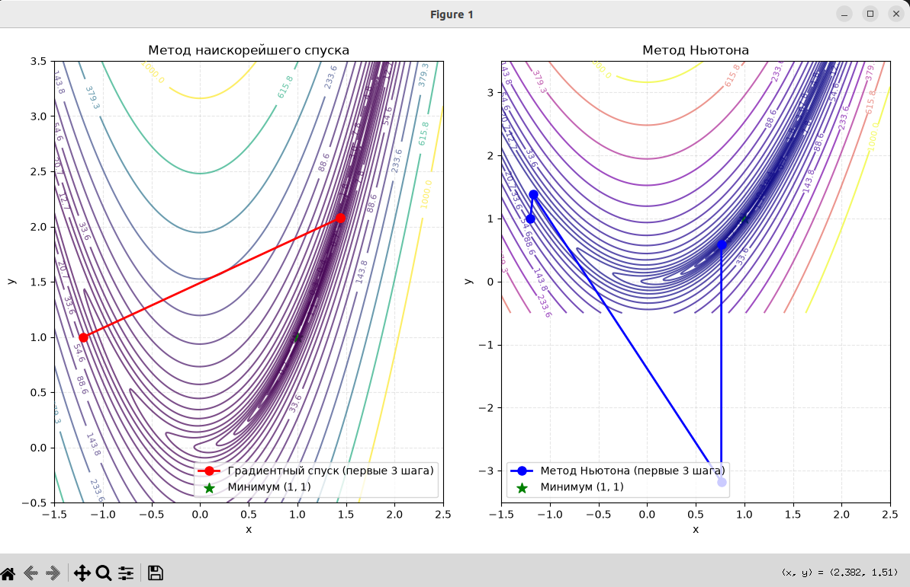

# Ответы для допуска к лабораторной работе №2

1. Виды экстремумов, выпуклые и квадратичные функции
    Виды экстремумов:

    Локальный минимум: точка x∗, в некоторой окрестности которой f(x∗)≤f(x) для всех x из этой окрестности.
    Глобальный минимум: точка x∗, для которой f(x∗)≤f(x) для всех допустимых x.
    Локальный максимум и глобальный максимум определяются аналогично, но со знаком ≥.
    Седловая точка: стационарная точка (∇f=0), не являющаяся ни минимумом, ни максимумом (в разных направлениях функция ведёт себя по‑разному).

    Графически:

    На графике одномерной функции локальный минимум — «впадина», максимум — «пик», седловая точка — точка перегиба с горизонтальной касательной.
    Для двумерной функции: минимум — «чаша», максимум — «купол», седловая точка — «перевал» (как у функции f(x,y)=x2−y2).

    Выпуклая функция: функция f(x), для которой для любых x1​,x2​ и λ∈[0,1] выполняется:

    f(λx1​+(1−λ)x2​)≤λf(x1​)+(1−λ)f(x2​).

    Геометрически: отрезок между любыми двумя точками графика лежит выше или на графике. У строго выпуклой функции — не более одного глобального минимума.

    Квадратичная функция (в двумерном случае):

    f(x)=21​xTQx+bTx+c,

    где Q — симметричная матрица вторых производных (Гессе). Если Q положительно определена, функция строго выпукла и имеет единственный глобальный минимум.

2. Овражная функция и её линии уровня

    Овражная функция — функция, у которой линии уровня сильно вытянуты и образуют «овраг»: вдоль дна оврага функция меняется слабо, а поперёк — резко. Пример: функция Розенброка f(x,y)=(1−x)2+100(y−x2)2.

    Линии уровня такой функции — сильно искривлённые и вытянутые эллипсы, сужающиеся к минимуму.    

3. Метод бисекции для минимизации функции

    Идея: для унимодальной функции на отрезке [a,b] последовательно сужают отрезок, содержащий минимум, деля его пополам и отбрасывая ту половину, 
    где минимума быть не может. На каждой итерации вычисляют значения функции в двух точках, близких к середине, и выбирают подынтервал, где функция меньше.

    Геометрический смысл: отрезок с минимумом последовательно уменьшается вдвое; минимум «зажимается» между границами отрезка.

4. Метод золотого сечения для минимизации функции

    Идея: аналогично бисекции, но точки для вычисления функции выбираются в пропорции золотого сечения (≈0.618), чтобы на каждой итерации использовать одно из ранее вычисленных значений и сократить число вычислений функции.

    Геометрический смысл: тот же «зажим» минимума, но более экономный по количеству вычислений.

5. Градиентный метод для одномерной функции

    Для одномерной функции градиент — это просто производная f′(x). Идея метода наискорейшего спуска: 
    на каждом шаге двигаться в направлении, противоположном производной: xk+1​=xk​−αk​f′(xk​), где шаг αk​ выбирается оптимально (например, методом бисекции).

    Геометрический смысл: из текущей точки спускаемся по касательной вниз до минимума вдоль прямой.

6. Градиентный метод для двумерной функции

    Идея: на каждой итерации делаем шаг в направлении антиградиента: xk+1​=xk​−αk​∇f(xk​). Шаг αk​ подбирается одномерной минимизацией.

    Геометрический смысл: на фоне линий уровня траектория спуска идёт «поперёк» линий уровня, каждый раз находя самый крутой спуск и двигаясь вдоль него до локального минимума. В овражных функциях это даёт зигзагообразную траекторию.

7. Метод Ньютона для одномерной функции

    Идея: аппроксимируем функцию квадратичной параболой в окрестности текущей точки и находим минимум этой параболы. Формула:

    xk+1​=xk​−f′′(xk​)f′(xk​)​.

    Геометрический смысл: в точке xk​ строим параболу, совпадающую с функцией по значению, первой и второй производной; её вершина даёт следующую точку.

8. Метод Ньютона для двумерной функции

    Идея: используем квадратичную аппроксимацию функции с матрицей Гессе H:

    xk+1​=xk​−H−1(xk​)∇f(xk​),

    или, что эквивалентно, решаем линейную систему H(xk​)pk​=−∇f(xk​) и делаем шаг xk+1​=xk​+pk​.

    Геометрический смысл: строим «чашу» (квадратичную модель) в окрестности точки, её дно — следующая точка. В отличие от градиентного метода, учитывает кривизну поверхности, поэтому в окрестности минимума сходится очень быстро.

9. Критерии близости к оптимуму (остановки итераций)

    На практике используют один или комбинацию критериев:

    По норме градиента: ∥∇f(xk​)∥<ε. Смысл: мы в стационарной точке, где нет направления спуска.

    По шагу: ∥xk+1​−xk​∥<ε. Смысл: дальнейшие изменения очень малы, метод «застрял» около минимума.

    По функции: ∣f(xk+1​)−f(xk​)∣<ε. Смысл: значение функции почти не меняется, достигнут «плоский» участок.

    По числу итераций: защита от бесконечного цикла.

    Комбинированные критерии: например, «остановиться, если выполнены два из трёх первых условий».

    Отчёт по лабораторной работе №2: «Экстремальные задачи нелинейного программирования»
    Цель работы

    Найти минимум целевой функции для конечномерных управлений с точностью ε=10−13 двумя методами:

        градиентным методом наискорейшего спуска;

        методом Ньютона.

    Построить линии уровня функции и отобразить первые три шага спуска для каждого метода.
    Постановка задачи

    Минимизировать функцию Розенброка:

    f(x,y)=(1−x)2+100(y−x2)2.

    Минимум достигается в точке (1,1), где f(1,1)=0.
    Методы решения
    Градиентный метод наискорейшего спуска

        Направление: dk​=−∇f(xk​).

        Шаг βk​ находится одномерной минимизацией ϕ(β)=f(xk​+βdk​) методом бисекции.

        Обновление: xk+1​=xk​+βk​dk​.

        Критерии остановки: ∥∇f∥<ε, ∥xk+1​−xk​∥<ε, ∣fk+1​−fk​∣<ε.

    Метод Ньютона

        Решаем систему H(xk​)pk​=−∇f(xk​) для направления pk​.

        Обновление: xk+1​=xk​+pk​.

        Те же критерии остановки.

    Реализация

    Код на Python реализует оба метода, строит линии уровня и рисует первые три шага траекторий. Подробности реализации — в файле lab2_optimization.py.
    Результаты

    (Здесь в отчёте размещают скриншот графиков и таблицу с результатами.)

    Пример таблицы результатов:
    Метод	Найденный минимум (x, y)	Значение f(x,y)	Итераций	Норма градиента
    Градиентный	(1.000…, 1.000…)	~0	…	< 10−13
    Ньютона	(1.000…, 1.000…)	~0	…	< 10−13

    Графики показывают:

        линии уровня функции Розенброка (логарифмическая шкала);

        первые 4 точки траектории (старт + 3 шага) для каждого метода;

        истинный минимум (1,1) отмечен зелёной звездой.

    Выводы

        Оба метода достигли заданной точности ε=10−13.

        Метод Ньютона сходится значительно быстрее (за несколько итераций), так как учитывает кривизну функции (матрицу Гессе).

        Градиентный метод в овражной функции движется зигзагами, делая много мелких шагов поперёк оврага.

        Использование одномерной оптимизации (бисекция) для выбора шага делает градиентный метод более надёжным, но увеличивает вычислительную нагрузку на каждой итерации.

        Критерии остановки по градиенту, шагу и функции дополняют друг друга и позволяют корректно завершить итерационный процесс.