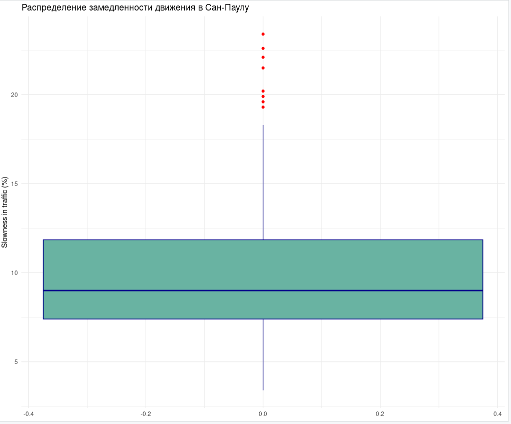
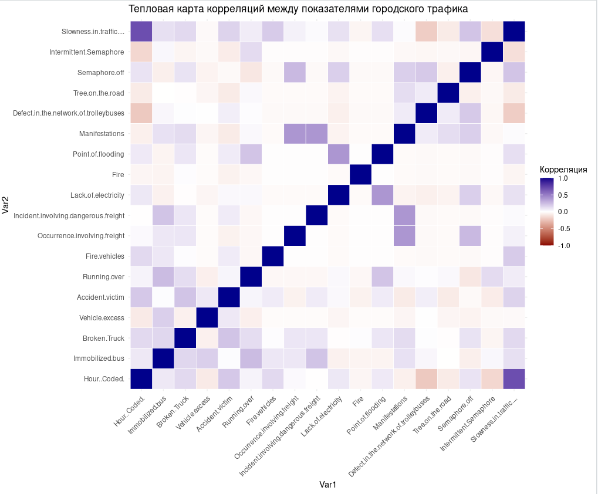
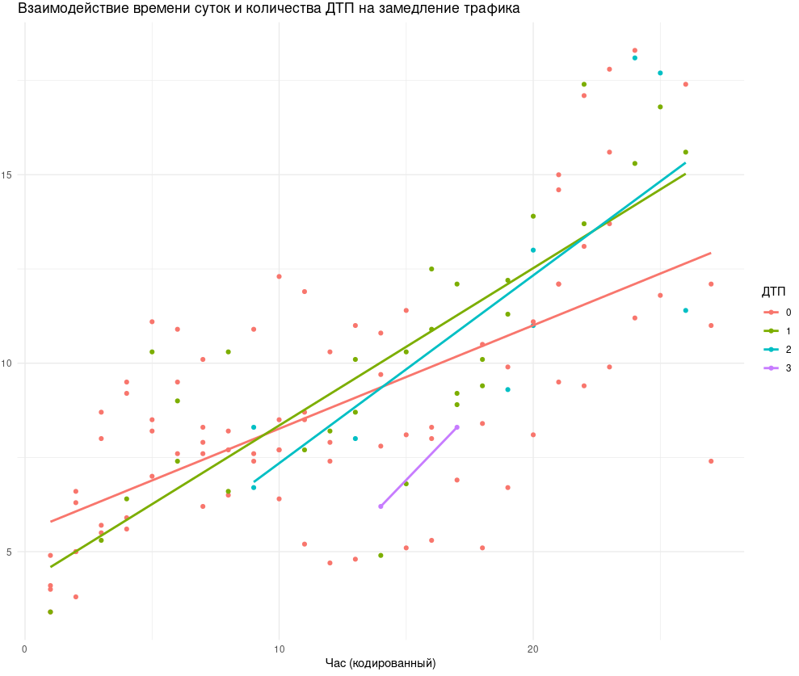
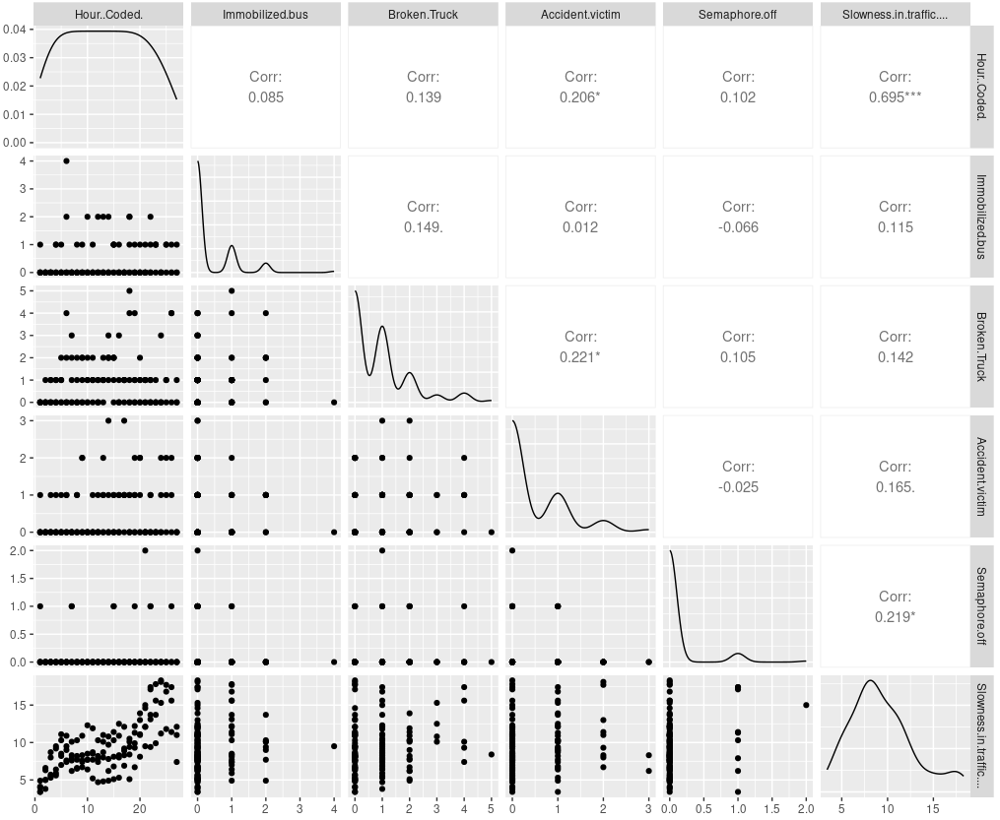
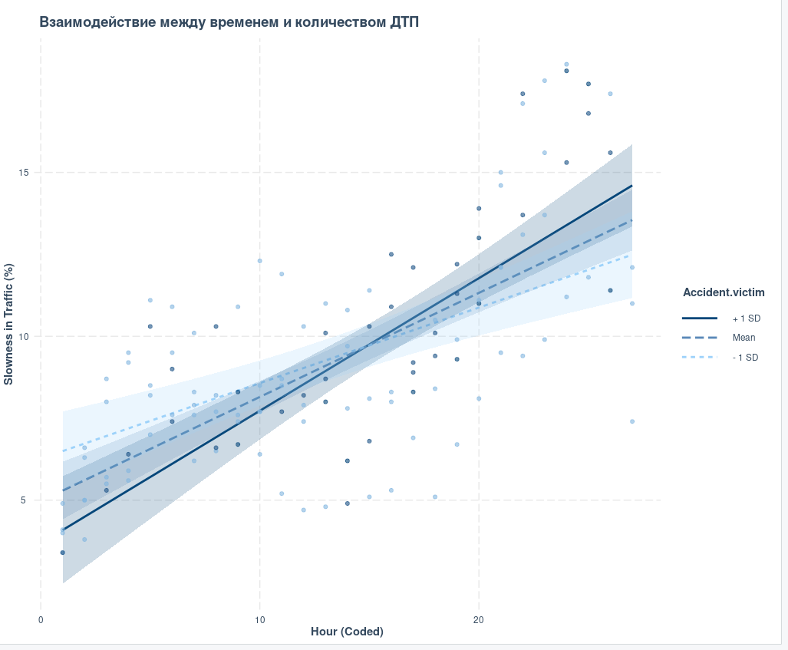

# Разведочный анализ данных (EDA)

## Задание

Провести разведочный анализ данных по своему варианту (файлы задания находятся
в папке «задания» в подпапках с номером варианта):

1. Проанализировать **описательную статистику** по ключевым атрибутам.  
2. Предложить **методы анализа выбросов**, учитывая особенности данных. Сделать анализ выбросов и удалить выбросы.

---

## 1️⃣ Описательная статистика

Для набора данных *Behavior of the urban traffic of the city of São Paulo in Brazil* была проведена базовая оценка статистических характеристик по каждому показателю.

Применялась функция `describe()` из пакета **psych**, позволяющая получить основные параметры распределения:  
среднее значение, стандартное отклонение, медиану, минимум, максимум, асимметрию и эксцесс.

```
library(psych)
describe(data)
```

```
describe(data)
                                      vars   n  mean    sd median trimmed   mad min max range  skew kurtosis   se
Hour..Coded.                             1 135 14.00  7.82     14   14.00 10.38   1  27    26  0.00    -1.23 0.67
Immobilized.bus                          2 135  0.34  0.66      0    0.20  0.00   0   4     4  2.30     6.63 0.06
Broken.Truck                             3 135  0.87  1.10      1    0.67  1.48   0   5     5  1.44     1.78 0.09
Vehicle.excess                           4 135  0.03  0.17      0    0.00  0.00   0   1     1  5.49    28.31 0.01
Accident.victim                          5 135  0.42  0.70      0    0.28  0.00   0   3     3  1.59     1.94 0.06
Running.over                             6 135  0.12  0.35      0    0.02  0.00   0   2     2  2.85     7.77 0.03
Fire.vehicles                            7 135  0.01  0.09      0    0.00  0.00   0   1     1 11.36   128.04 0.01
Occurrence.involving.freight             8 135  0.01  0.09      0    0.00  0.00   0   1     1 11.36   128.04 0.01
Incident.involving.dangerous.freight     9 135  0.01  0.09      0    0.00  0.00   0   1     1 11.36   128.04 0.01
Lack.of.electricity                     10 135  0.12  0.50      0    0.00  0.00   0   4     4  5.40    32.76 0.04
Fire                                    11 135  0.01  0.09      0    0.00  0.00   0   1     1 11.36   128.04 0.01
Point.of.flooding                       12 135  0.12  0.71      0    0.00  0.00   0   7     7  7.68    65.31 0.06
Manifestations                          13 135  0.05  0.22      0    0.00  0.00   0   1     1  4.00    14.08 0.02
Defect.in.the.network.of.trolleybuses   14 135  0.23  0.82      0    0.06  0.00   0   8     8  6.84    58.41 0.07
Tree.on.the.road                        15 135  0.04  0.21      0    0.00  0.00   0   1     1  4.37    17.24 0.02
Semaphore.off                           16 135  0.13  0.46      0    0.00  0.00   0   4     4  5.32    35.97 0.04
Intermittent.Semaphore                  17 135  0.01  0.12      0    0.00  0.00   0   1     1  7.94    61.55 0.01
Slowness.in.traffic....*                18 135 44.14 26.02     48   44.78 34.10   1  83    82 -0.22    -1.37 2.24
```

2. Анализ выбросов

> Для поиска выбросов использовался метод межквартильного размаха (IQR):

```
Q1 <- quantile(data$Slowness.in.traffic...., 0.25)
Q3 <- quantile(data$Slowness.in.traffic...., 0.75)
IQR <- Q3 - Q1
lower <- Q1 - 1.5 * IQR
upper <- Q3 + 1.5 * IQR

| Показатель      | Значение |
| --------------- | -------- |
| Q1              | 4.1      |
| Q3              | 11.9     |
| IQR             | 7.8      |
| Нижняя граница  | 0.725    |
| Верхняя граница | 18.525   |


```
> Выбросы (8 наблюдений):Выбросы (8 наблюдений):

```
19.3, 19.6, 19.9, 20.2, 21.5, 22.1, 22.6, 23.4
```



### Размер выборки:

- До очистки: 135 наблюдений

- После очистки: 127 наблюдений

## Вывод:

> Удалены 8 экстремальных наблюдений, представляющих редкие случаи очень сильных заторов.
> Очищенные данные (data_clean) лучше отражают типичное поведение трафика.

3. Проверка коллинеарности между предикторами

> Для оценки взаимосвязи между числовыми признаками использовалась матрица корреляций:

```
cor_matrix <- cor(data_clean)
round(cor_matrix, 2)
```



### Основные зависимости:

> Наиболее сильная положительная корреляция — между
> Slowness.in.traffic.... и Hour..Coded. (≈ 0.73), что логично: к определённым часам наблюдаются пиковые нагрузки.

> Значимые, но умеренные связи:

> Slowness.in.traffic.... и Semaphore.off (0.35)

> Slowness.in.traffic.... и Lack.of.electricity (0.44)

> Point.of.flooding и Slowness.in.traffic.... (0.42)

> Коллинеарность между большинством факторов отсутствует (корреляции < 0.7), что позволяет использовать их совместно в моделях.



4. Исследование взаимодействий между предикторами

> Для исследования взаимодействий можно использовать:

> Графики рассеяния (pairs(), GGally::ggpairs()),

> Корреляционные диаграммы по группам (например, по часам или дням недели),

> Регрессионные модели с взаимодействиями (lm(Slowness ~ Hour * Accident.victim, data = data_clean)).



5. Исследование взаимодействия между предикторами

> Цель

> Оценить, существуют ли взаимные (синергетические) эффекты между независимыми переменными,
> которые усиливают или ослабляют влияние отдельных факторов на
> уровень загруженности городского трафика (Slowness.in.traffic....).

### Методика

> Для исследования взаимодействий использованы следующие подходы:

> Построение парных диаграмм (scatterplot matrix) для визуального анализа взаимосвязей.

> Добавление интерактивных (interaction) терминов в регрессионную модель.

> Оценка статистической значимости взаимодействий.

### Модель с взаимодействиями

```
| Переменная                            | Оценка (Estimate) | Std. Error | t-value |   p-value | Значимость |
| ------------------------------------- | ----------------: | ---------: | ------: | --------: | ---------- |
| (Intercept)                           |              5.43 |       0.50 |   10.77 |   < 2e-16 | ***        |
| Hour..Coded.                          |              0.26 |       0.03 |    7.74 |  3.85e-12 | ***        |
| Accident.victim                       |             -1.86 |       0.87 |   -2.12 |    0.0359 | *          |
| Broken.Truck                          |              0.07 |       0.22 |    0.32 |     0.747 |            |
| Semaphore.off                         |              1.39 |       1.10 |    1.27 |     0.207 |            |
| Immobilized.bus                       |              0.37 |       0.33 |    1.11 |     0.268 |            |
| Lack.of.electricity                   |              0.96 |       1.14 |    0.84 |     0.404 |            |
| Hour..Coded. : Accident.victim        |             0.125 |      0.051 |    2.47 | **0.015** | *          |
| Broken.Truck : Semaphore.off          |              0.29 |       0.69 |    0.43 |     0.671 |            |
| Immobilized.bus : Lack.of.electricity |             -2.62 |       2.71 |   -0.97 |     0.335 |            |

```


### Вывод

> Между переменными Hour..Coded. и Accident.victim наблюдается значимое взаимодействие, усиливающее замедление трафика в часы пик.

> Остальные взаимодействия (например, между поломками и светофорами) не показали статистической значимости.

> Модель объясняет около 54% вариации показателя Slowness in traffic, что свидетельствует о её хорошей информативности.

## Контрольные вопросы
1. Опишите кратко основные методы описательной статистики.

> 