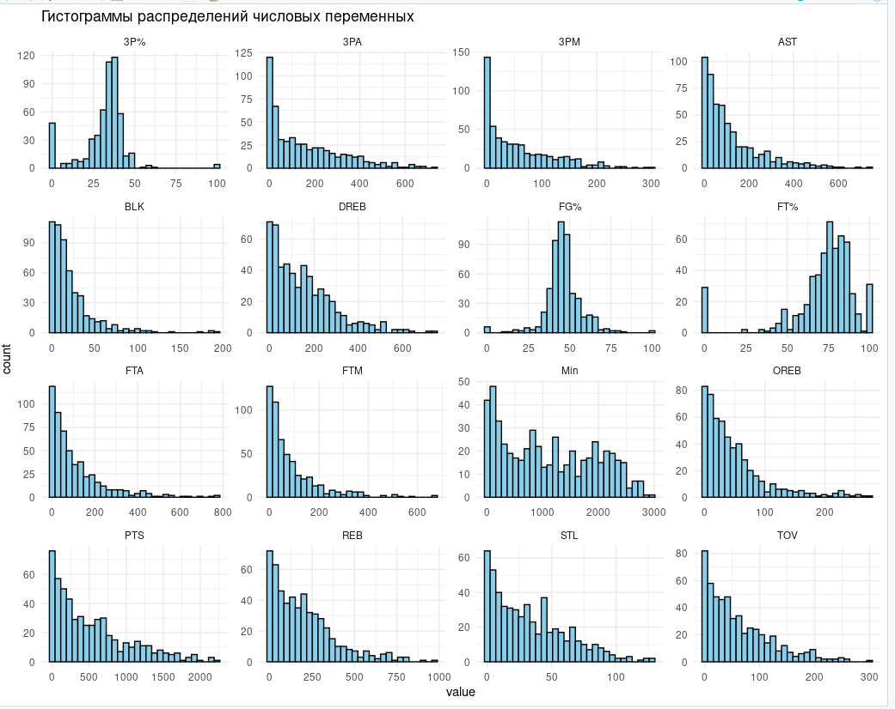
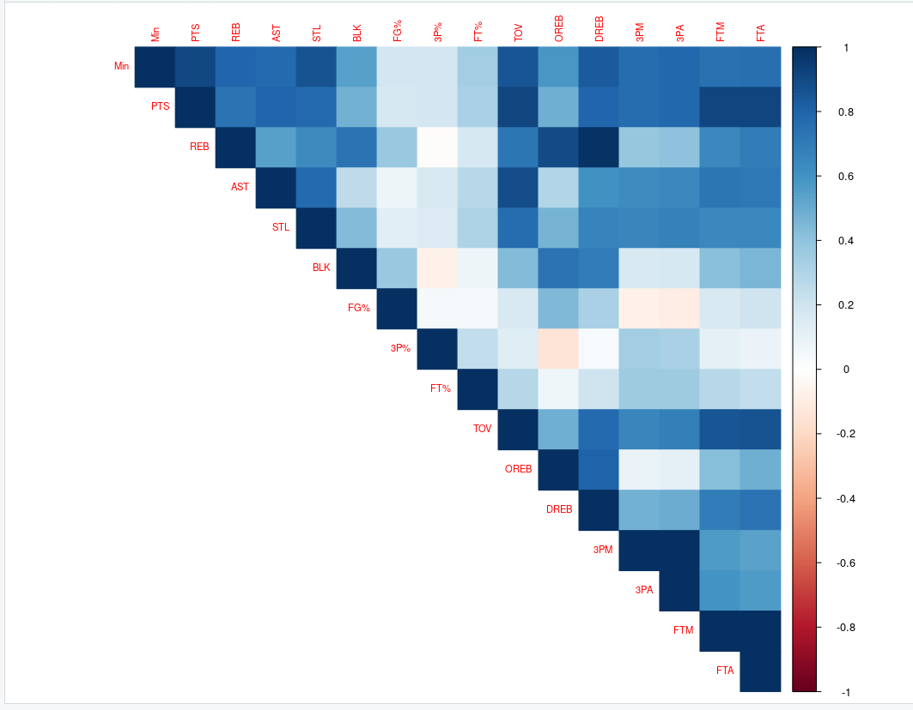
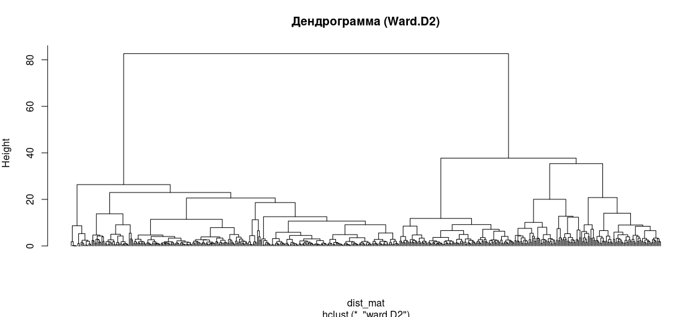
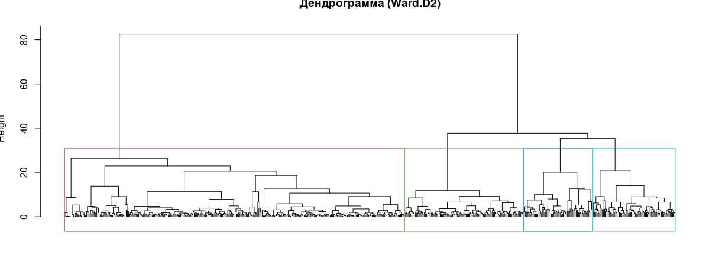
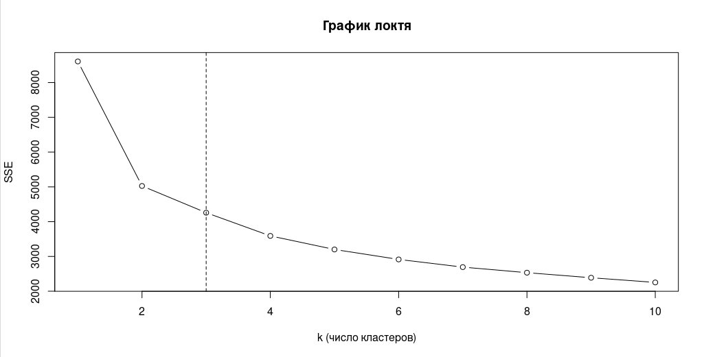
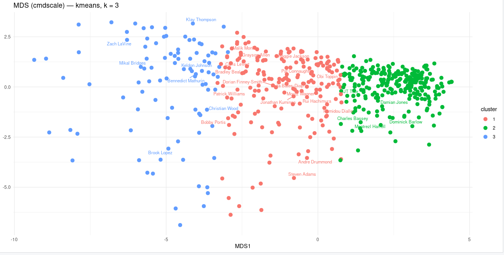

# Кластерный анализ данных NBA 2023

## Задание.

1. иерархической кластеризации;
2. метода k средних.

## Этапы работы
### Выполнить кластерный анализ

1. Отобрать необходимые переменные.
2. Выполнить стандартизацию (если это нужно).
3. Задать расстояние между объектами.
4. Задать расстояние между кластерами.
5. Визуализировать результаты при помощи дендрограммы (иерархическая кластеризация) и многомерного шкалирования (метод k средних, функция cmdscale).

###  Определить число кластеров

1. Построить график "каменистая осыпь" ("локоть").
2. Обосновать свой выбор, проверив другие варианты.
3. Интерпретировать результаты кластерного анализа: что представляют собой полученные кластеры? чем объекты в каждом из получившихся кластеров похожи друг на друга? чем объекты из разных кластеров отличаются друг от друга?

## Выполнение

### Загрузка и подготовка данных

> Данные взяты с kaggle 2023_nba_player_stats.csv

```
data
# A tibble: 539 × 30
   PName   POS   Team    Age    GP     W     L   Min   PTS   FGM   FGA `FG%` `3PM` `3PA` `3P%`   FTM   FTA `FT%`  OREB
   <chr>   <chr> <chr> <dbl> <dbl> <dbl> <dbl> <dbl> <dbl> <dbl> <dbl> <dbl> <dbl> <dbl> <dbl> <dbl> <dbl> <dbl> <dbl>
 1 Jayson… SF    BOS      25    74    52    22 2732.  2225   727  1559  46.6   240   686  35     531   622  85.4    78
 2 Joel E… C     PHI      29    66    43    23 2284.  2183   728  1328  54.8    66   200  33     661   771  85.7   113
 3 Luka D… PG    DAL      24    66    33    33 2390.  2138   719  1449  49.6   185   541  34.2   515   694  74.2    54
 4 Shai G… PG    OKC      24    68    33    35 2416   2135   704  1381  51      58   168  34.5   669   739  90.5    59
 5 Gianni… PF    MIL      28    63    47    16 2024.  1959   707  1278  55.3    47   171  27.5   498   772  64.5   137
 6 Anthon… SG    MIN      21    79    40    39 2842.  1946   707  1541  45.9   213   578  36.9   319   422  75.6    47
 7 Julius… PF    NYK      28    77    44    33 2737.  1936   658  1432  45.9   218   636  34.3   402   531  75.7   141
 8 Donova… SG    CLE      26    68    44    24 2432.  1922   679  1402  48.4   245   635  38.6   319   368  86.7    63
 9 Trae Y… PG    ATL      24    73    38    35 2541.  1914   597  1390  42.9   154   460  33.5   566   639  88.6    56
10 Zach L… SG    CHI      28    77    38    39 2768.  1913   673  1388  48.5   204   544  37.5   363   428  84.8    42
```

> Базовая статистика:

```
summary(data_clust)
      Min              PTS              REB             AST             STL              BLK              FG%              3P%              FT%        
 Min.   :   1.0   Min.   :   0.0   Min.   :  0.0   Min.   :  0.0   Min.   :  0.00   Min.   :  0.00   Min.   :  0.00   Min.   :  0.00   Min.   :  0.00  
 1st Qu.: 329.0   1st Qu.: 120.5   1st Qu.: 50.5   1st Qu.: 22.0   1st Qu.:  8.50   1st Qu.:  5.00   1st Qu.: 41.65   1st Qu.: 28.10   1st Qu.: 66.70  
 Median : 970.2   Median : 374.0   Median :159.0   Median : 69.0   Median : 28.00   Median : 13.00   Median : 45.50   Median : 34.20   Median : 76.30  
 Mean   :1103.6   Mean   : 523.4   Mean   :198.3   Mean   :115.5   Mean   : 33.27   Mean   : 21.24   Mean   : 46.33   Mean   : 31.53   Mean   : 71.99  
 3rd Qu.:1845.9   3rd Qu.: 769.5   3rd Qu.:286.0   3rd Qu.:162.5   3rd Qu.: 51.00   3rd Qu.: 28.00   3rd Qu.: 50.60   3rd Qu.: 38.50   3rd Qu.: 84.10  
 Max.   :2963.2   Max.   :2225.0   Max.   :973.0   Max.   :741.0   Max.   :128.00   Max.   :193.00   Max.   :100.00   Max.   :100.00   Max.   :100.00  
      TOV             OREB             DREB            3PM              3PA             FTM              FTA       
 Min.   :  0.0   Min.   :  0.00   Min.   :  0.0   Min.   :  0.00   Min.   :  0.0   Min.   :  0.00   Min.   :  0.0  
 1st Qu.: 14.5   1st Qu.: 10.00   1st Qu.: 36.5   1st Qu.:  5.00   1st Qu.: 17.0   1st Qu.: 13.50   1st Qu.: 18.0  
 Median : 44.0   Median : 33.00   Median :118.0   Median : 36.00   Median :109.0   Median : 42.00   Median : 60.0  
 Mean   : 61.3   Mean   : 47.62   Mean   :150.6   Mean   : 56.32   Mean   :156.1   Mean   : 83.95   Mean   :107.4  
 3rd Qu.: 92.5   3rd Qu.: 63.00   3rd Qu.:229.5   3rd Qu.: 92.00   3rd Qu.:249.5   3rd Qu.:113.50   3rd Qu.:147.0  
 Max.   :300.0   Max.   :274.00   Max.   :744.0   Max.   :301.00   Max.   :731.0   Max.   :669.00   Max.   :772.0  
```

> Гистограммы распределений




> Корреляция между переменными




> Иерархическая кластеризация



> Разделенный на 4 группы




> Определение числа кластеров для k-means



> Вывод: оптимальное число кластеров — k = 3 (по графику локтя и интерпретации).


### K-means кластеризация

```
  1   2   3 
187 259  93 
```

### MDS визуализация кластеров




### Профили кластеров

### Добавляем кластеры к таблице игроков

```
cluster mean_Min mean_PTS mean_REB mean_AST mean_STL mean_BLK `mean_FG%` `mean_3P%` `mean_FT%` mean_TOV mean_OREB mean_DREB mean_3PM
  <fct>      <dbl>    <dbl>    <dbl>    <dbl>    <dbl>    <dbl>      <dbl>      <dbl>      <dbl>    <dbl>     <dbl>     <dbl>    <dbl>
1           1532.     638.    267.     142.      47.7    28.0        48.1       33.9       76.4     73.4      66.4     200.      78.8
2            370.     131.     62.8     30.8     10.9     7.63       43.9       29.2       65.8     17.9      17.3      45.4     15.2
3          2284.    1387.    438.     298.      66.5    45.5        49.4       33.1       80.2    158.       94.3     344.     126. 
```

### Примеры игроков из каждого кластера

```
| player                  | cluster | PTS  | REB | AST | FG%  | 3P%  | FT%  |
| ----------------------- | ------- | ---- | --- | --- | ---- | ---- | ---- |
| Tyrese Maxey            | 1       | 1218 | 176 | 212 | 48.1 | 43.4 | 84.5 |
| Bradley Beal            | 1       | 1160 | 196 | 271 | 50.6 | 36.5 | 84.2 |
| Gary Trent Jr.          | 1       | 1148 | 173 | 106 | 43.3 | 36.9 | 83.9 |
| Kevin Huerter           | 1       | 1140 | 251 | 221 | 48.5 | 40.2 | 72.5 |
| Brandon Ingram          | 1       | 1112 | 246 | 262 | 48.4 | 39.0 | 88.2 |
| James Wiseman           | 2       | 450  | 267 | 30  | 55.8 | 20.0 | 70.1 |
| Jeff Green              | 2       | 437  | 144 | 69  | 48.8 | 28.8 | 74.4 |
| Jaden Hardy             | 2       | 420  | 89  | 65  | 43.8 | 40.4 | 82.3 |
| Cam Reddish             | 2       | 387  | 88  | 57  | 44.6 | 31.3 | 85.3 |
| John Wall               | 2       | 386  | 92  | 178 | 40.7 | 30.3 | 68.1 |
| Jayson Tatum            | 3       | 2225 | 649 | 342 | 46.6 | 35.0 | 85.4 |
| Joel Embiid             | 3       | 2183 | 670 | 274 | 54.8 | 33.0 | 85.7 |
| Luka Doncic             | 3       | 2138 | 569 | 529 | 49.6 | 34.2 | 74.2 |
| Shai Gilgeous-Alexander | 3       | 2135 | 329 | 371 | 51.0 | 34.5 | 90.5 |
| Giannis Antetokounmpo   | 3       | 1959 | 742 | 359 | 55.3 | 27.5 | 64.5 |

```

### Интерпретация кластеров

```
| Кластер | Характеристика                                  | Роль                             |
| ------- | ----------------------------------------------- | -------------------------------- |
| 1       | Среднее время, умеренные очки, FG% и 3P%        | Скореры / универсальные форварды |
| 2       | Малое время, низкие показатели                  | Резервы / молодые игроки         |
| 3       | Большое время, высокие очки, подборы и передачи | Звезды / лидеры команд           |
```
> Сходства внутри кластера: игроки имеют близкие MIN, PTS, REB, AST и FG%.

> Различия между кластерами:

```
Кластер 2 сильно отличается низкими значениями → резервы.

Кластер 3 доминирует по всем метрикам → лидеры команд.

Кластер 1 промежуточный → игроки основного состава.
```

## Контрольные вопросы

1. Для чего используется график «каменистая осыпь» (scree plot)?

   График "каменистая осыпь" используется для определения оптимального числа кластеров при методе k-means.
   Он показывает зависимость SSE (суммы квадратов внутри-кластерных расстояний) от числа кластеров k.

   Точка изгиба ("локоть") — место, где скорость уменьшения SSE резко падает.
   Эта точка и считается оптимальным k.

2. Как использовать дендрограмму для поиска кластеров?
   На дендрограмме можно определить количество кластеров, проведя горизонтальную линию на некоторой высоте:
   - Выбираем уровень, где вертикальные ветви длинные (наибольшее расстояние).
   - Проводим горизонтальную линию.
   - Количество пересечений линии с вертикальными ветвями = число кластеров.
   Чем выше «срез» — тем меньше кластеров, и наоборот.


3. Перечислите основные методы измерения расстояния между кластерами.
   - В иерархической кластеризации используются методы:
   - Single linkage (ближайший сосед)
   - Complete linkage (дальний сосед)
   - Average linkage (среднее расстояние)
   - Centroid linkage (расстояние между центроидами)
   - Ward’s method — минимизация внутрикластерной дисперсии


4. Что является критериями при отборе переменных для анализа?
   Переменные должны:
    - Быть информативными (вариативными, не константными)
    - Быть неколлинеарными (не сильно коррелировать друг с другом)
    - Быть значимыми для задачи (доменные знания)
    - Иметь одинаковый смысловой масштаб (иначе требуется стандартизация)
    - Не содержать большого количества пропусков


5. Перечислите основные достоинства и недостатки метода k-средних.
   Достоинства:
    - Простота и высокая скорость вычислений
    - Хорошо работает на больших выборках
    - Легко интерпретируем
    - Выдает компактные и хорошо отделимые кластеры
   Недостатки:
    - Нужно заранее задавать число кластеров k
    - Чувствителен к масштабированию данных
    - Чувствителен к выбросам
    - Работает только с числовыми данными
    - Кластеры получаются только сферические (не умеет сложные формы)


6. С помощью каких инструментов выполняется визуализация многомерного пространства?
   Основные методы:
    - MDS (Multidimensional Scaling) — классическая двумерная проекция
    - PCA (Principal Component Analysis) — главные компоненты
    - t-SNE (t-Distributed Stochastic Neighbor Embedding) — сложные нелинейные структуры
    - UMAP (Uniform Manifold Approximation and Projection) — современный алгоритм для больших данных
    - Карта Кохонена (SOM) — нейросетевой подход