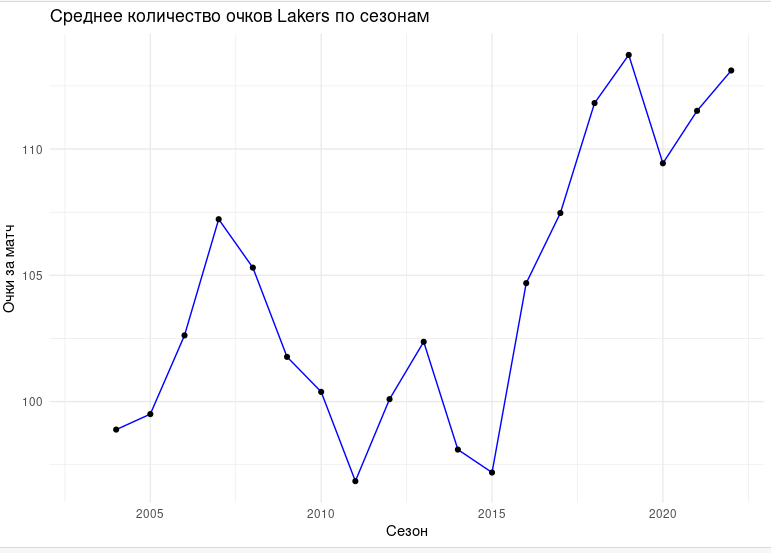

# Лабораторная работа №3  
## Прогнозирование коротких временных рядов с помощью линейного регрессионного анализа

---

## Цель работы
Изучить методы прогнозирования коротких временных рядов с использованием линейного регрессионного анализа на основе реальных данных.

---

## Исходные данные
В качестве исходных данных используется датасет, содержащий статистику матчей NBA.  
Из исходного датасета был сформирован временной ряд **среднего количества набранных очков команды Los Angeles Lakers по сезонам**.

---

## 1. Построение графика исходного временного ряда
Временной ряд представляет собой последовательность значений среднего количества очков команды за каждый сезон. На рисунке представлен график данного временного ряда.

---

## 2. Разведочный анализ временного ряда

### 2.1 Наличие тренда
По графику временного ряда наблюдается умеренно возрастающий тренд. Линейная регрессионная модель подтвердила наличие положительного тренда, что указывает на постепенное увеличение среднего количества очков команды с течением времени.

### 2.2 Наличие сезонности
Сезонные колебания отсутствуют, так как данные агрегированы по сезонам, а не по отдельным матчам или месяцам. Повторяющихся циклических изменений не выявлено.

### 2.3 Изменение характера временного ряда
Характер временного ряда меняется незначительно. Наблюдаются периоды роста и небольшого снижения показателя, что может быть связано со сменой состава команды или тренерского штаба, однако резких структурных изменений не выявлено.

### 2.4 Наличие выбросов
Явно выраженные выбросы в данных отсутствуют. Значения временного ряда изменяются плавно и находятся в разумных пределах.

---

## 3. Построение линейной регрессионной модели

Для описания динамики временного ряда была использована линейная регрессионная модель тренда следующего вида:

y_t = a + b * t + e_t,

где  
y_t — наблюдаемое значение среднего количества очков команды в момент времени t;  
t — порядковый номер сезона;  
a — свободный член модели;  
b — коэффициент линейного тренда;  
e_t — случайная ошибка, отражающая влияние неучтённых факторов.

Оценка параметров модели была выполнена методом наименьших квадратов. В результате получено следующее уравнение тренда:

y_hat_t = 97.03 + 0.66 * t.

Полученное значение коэффициента b = 0.66 является статистически значимым (p-value < 0.05), что свидетельствует о наличии положительного линейного тренда во временном ряде. Это означает, что в среднем среднее количество очков команды увеличивается примерно на 0.66 очка за сезон.

---

## 4. Прогнозирование временного ряда
С использованием построенной линейной регрессионной модели был выполнен прогноз на три будущих сезона.

---

## 5. График временного ряда с учётом прогноза
На графике представлены:
- исходные значения временного ряда;
- линия линейного тренда;
- прогнозные значения на будущие периоды.

*(Вставить график временного ряда с прогнозом)*

---

## 6. Прогнозные значения

| Период | Прогноз среднего количества очков |
|------|-----------------------------------|
| t + 1 | 110.29 |
| t + 2 | 110.95 |
| t + 3 | 111.61 |

---

## Выводы
В ходе выполнения лабораторной работы был проведён анализ короткого временного ряда среднего количества набранных очков команды Los Angeles Lakers по сезонам. В результате разведочного анализа выявлено наличие положительного тренда и отсутствие сезонности. На основе линейной регрессионной модели выполнен прогноз на три будущих периода, который показывает дальнейший рост результативности команды. Полученные результаты подтверждают применимость линейного регрессионного анализа для краткосрочного прогнозирования спортивных показателей.

---

## Список использованных источников
1. Статистика матчей NBA  
2. Методические указания по выполнению лабораторной работы

---

## Контрольные вопросы

### 1. Что такое временной ряд?
Временной ряд — это упорядоченная во времени последовательность наблюдений некоторого показателя, зафиксированных через равные или неравные промежутки времени. Основной особенностью временного ряда является зависимость значений показателя от времени.

---

### 2. Как можно определить сезонность ряда?
Сезонность временного ряда можно определить:
- визуально по графику (наличие повторяющихся колебаний);
- с помощью автокорреляционной функции (ACF);
- путём декомпозиции временного ряда на тренд, сезонную и случайную компоненты;
- с использованием спектрального анализа.

---

### 3. Какие вы знаете виды сезонности?
Основные виды сезонности:
- **внутригодовая** (по месяцам, кварталам, неделям);
- **годовая**;
- **многолетняя**;
- **аддитивная**, при которой сезонные колебания имеют постоянную амплитуду;
- **мультипликативная**, при которой амплитуда сезонных колебаний зависит от уровня ряда.

---

### 4. Для чего нужны индикаторные переменные?
Индикаторные (фиктивные) переменные используются для учёта качественных факторов и сезонных эффектов в регрессионных моделях. Они принимают значения 0 или 1 и позволяют моделировать влияние различных категорий, например месяцев, кварталов или событий, на значение временного ряда.

---

### 5. Для чего проводится логарифмирование ряда?
Логарифмирование временного ряда применяется для:
- стабилизации дисперсии;
- сглаживания резких колебаний;
- перевода мультипликативных зависимостей в аддитивные;
- улучшения качества регрессионной модели и выполнения её предпосылок.

---

### 6. Как определить достаточность данных для прогноза?
Достаточность данных для прогноза определяется:
- длиной временного ряда (количество наблюдений);
- наличием устойчивого тренда или сезонности;
- стабильностью структуры ряда;
- статистической значимостью параметров модели;
- качеством аппроксимации (значениями R², анализом остатков).

