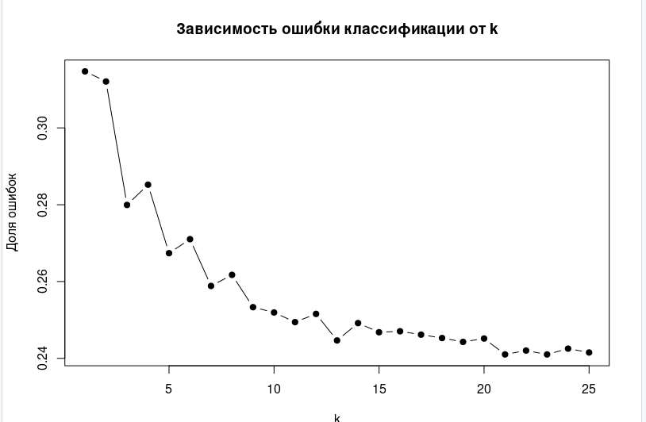

# Лабораторная работа №4  
## Классификация методом k ближайших соседей (kNN)

---

## Цель работы

Изучить метод классификации k ближайших соседей (kNN) и применить его для прогнозирования исхода баскетбольных матчей NBA на основе статистических показателей команд.

---

## Исходные данные

В качестве исходных данных использовался датасет `games.csv`, содержащий статистику матчей NBA.  
В работе рассматривалась задача бинарной классификации — прогноз победы домашней команды.

### Целевая переменная
- `HOME_TEAM_WINS` — факт победы домашней команды (1 — победа, 0 — поражение)

### Используемые признаки
- `PTS_home` — очки домашней команды  
- `FG_PCT_home` — процент попаданий с игры  
- `FT_PCT_home` — процент штрафных бросков  
- `FG3_PCT_home` — процент трёхочковых бросков  
- `AST_home` — количество результативных передач  
- `REB_home` — количество подборов  

Строки с пропущенными значениями были удалены. В результате сформирована выборка из 26 552 наблюдений.

---

## Подготовка данных

Поскольку метод kNN основан на вычислении расстояний между объектами, все числовые признаки были нормализованы методом min–max:

\[
x' = \frac{x - \min(x)}{\max(x) - \min(x)}
\]

После нормализации данные были случайным образом разделены на:
- **обучающую выборку** — 70% данных;
- **тестовую выборку** — 30% данных.

Для воспроизводимости результатов использовалась фиксация генератора случайных чисел.

---

## Выбор оптимального значения k

Для определения оптимального значения параметра k был выполнен перебор значений от 1 до 25.
Для каждого значения k вычислялась доля ошибок классификации на тестовой выборке.

На рисунке ниже представлена зависимость доли ошибок классификации от значения параметра k.
Минимальная ошибка достигается при k = 21.

---

## Оценка качества классификации

Для финальной модели с \(k = 21\) была построена таблица сопряжённости:

| Факт \\ Прогноз | 0 | 1 |
|---------------|----|----|
| **0**         | 2168 | 1093 |
| **1**         | 828  | 3877 |

Процент ошибок классификации составил:

\[
24{,}11\%
\]

Точность классификатора — **75,89%**.

---

## Выводы

В ходе выполнения лабораторной работы был реализован метод классификации k ближайших соседей для прогнозирования исхода матчей NBA.  
Была проведена подготовка данных, выполнена нормализация признаков, осуществлён подбор оптимального значения параметра \(k\).

Полученные результаты показывают, что метод kNN способен достаточно эффективно решать задачу бинарной классификации спортивных событий на основе статистических показателей.  
Точность модели составила около 76%, что является хорошим результатом для реальных данных.

Метод kNN прост в реализации и интерпретации, однако требует аккуратной подготовки данных и выбора параметра \(k\), что было продемонстрировано в данной работе.

---

## Контрольные вопросы

### 1. В чем отличие задач классификации от регрессии?

Задачи классификации и регрессии относятся к задачам машинного обучения с учителем, однако отличаются типом прогнозируемой переменной.  
В задачах **классификации** требуется отнести объект к одному из конечного числа классов (например, победа или поражение).  
В задачах **регрессии** прогнозируется непрерывная числовая величина (например, количество набранных очков).

---

### 2. Укажите преимущества и недостатки метода k-ближайшего соседа.

**Преимущества метода kNN:**
- простота реализации и интерпретации;
- отсутствие этапа обучения модели;
- возможность использования для задач классификации и регрессии;
- гибкость и способность учитывать сложные зависимости в данных.

**Недостатки метода kNN:**
- высокая вычислительная сложность при больших объёмах данных;
- чувствительность к масштабу признаков;
- необходимость хранения всей обучающей выборки;
- зависимость качества результата от выбора параметра \(k\).

---

### 3. Приведите управляющие параметры метода k-ближайшего соседа.

Основными управляющими параметрами метода kNN являются:
- \(k\) — количество ближайших соседей;
- метрика расстояния (евклидово, манхэттенское и др.);
- способ взвешивания соседей (равные веса или веса, зависящие от расстояния);
- правило принятия решения (большинство голосов).

---

### 4. Для чего используется кросс-валидация? Как именно?

Кросс-валидация используется для оценки качества модели и подбора её параметров, а также для снижения риска переобучения.  
Суть метода заключается в разбиении исходной выборки на несколько частей (фолдов), где на части данных модель обучается, а на оставшейся части — тестируется.  
Процедура повторяется несколько раз, после чего качество модели оценивается усреднением полученных результатов.

---

### 5. Приведите параметры выбора метода кросс-валидации.

При выборе метода кросс-валидации учитываются следующие параметры:
- количество фолдов (например, 5-fold или 10-fold кросс-валидация);
- размер обучающей и тестовой выборок;
- случайность или стратификация разбиения данных;
- вычислительная сложность метода;
- объём доступных данных.

На практике наиболее распространённой является k-fold кросс-валидация с числом фолдов от 5 до 10.

