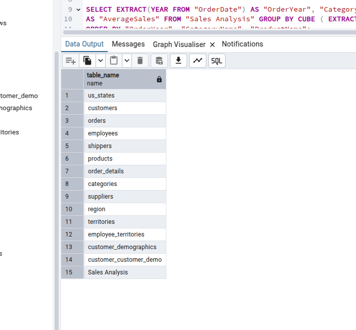
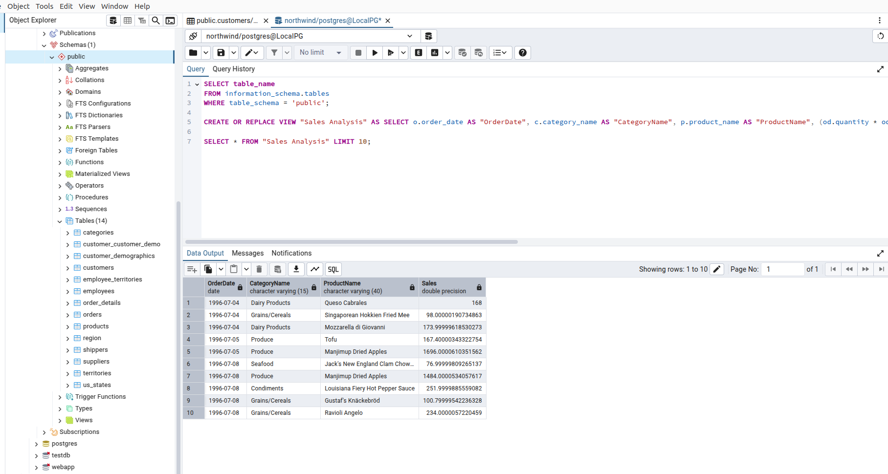
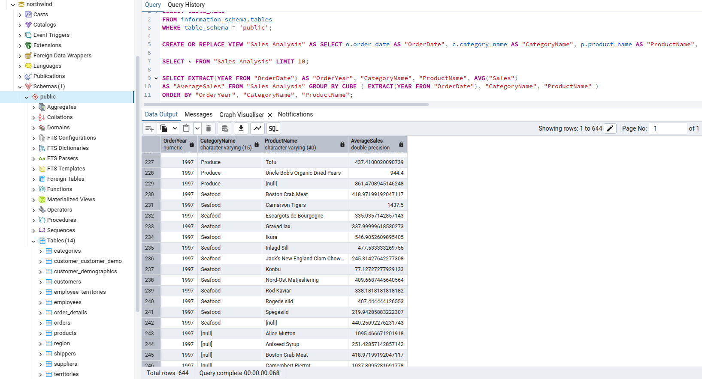
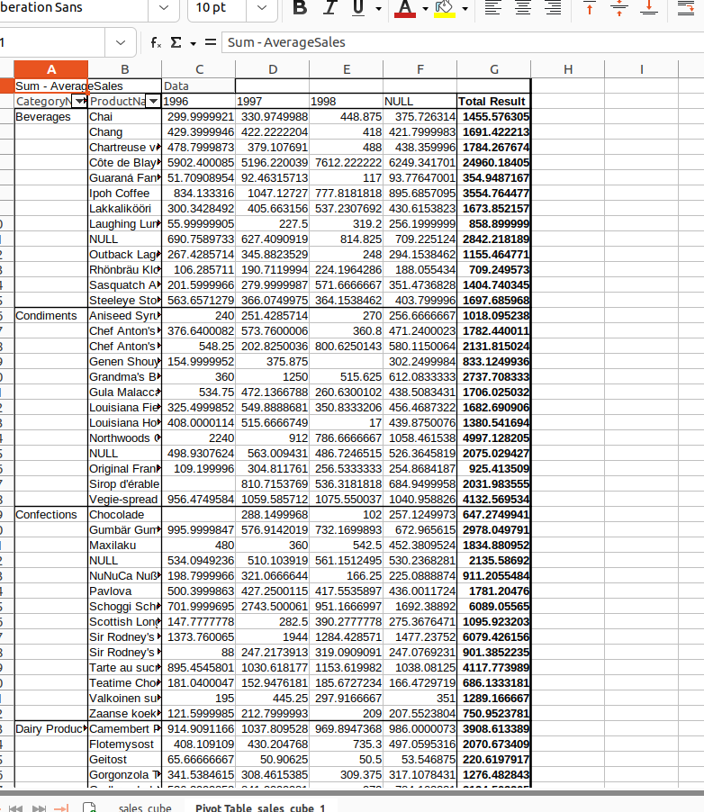
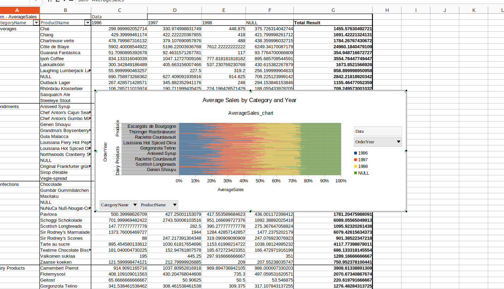

# Лабораторная работа №2

## ЗАДАНИЕ

1. Написать скрипты XSL для преобразования документов XML,
   созданных в лабораторной работе №1, к формату, используемому в
   хранилищах данных и пригодному для OLAP-анализа: реструктурировать 
   документ, автоматически заполнить нулями
   недостающие поля, удалить дублирующиеся элементы.

2. Импортировать данные в MS Office Excel. Создать и отобразить куб
   OLAP. Измерения и факты куба выбрать произвольно.

3. Импортировать данные в MS Office Excel из базы данных Microsoft
   Northwind (представление «Sales Analysis»). Создать и отобразить куб
   OLAP для измерений «Order Date», «Category», «Product Name» и
   фактов «Sales». Агрегация – Average.

4. Оформить отчет, включающий ответы на контрольные вопросы, файлы
   *.xls, тексты скриптов XSL, демонстрацию кубов OLAP.


   

### Описание XSL-скрипта:

   - Реструктуризация: Преобразует XML в формат <DataWarehouse> с вложенными <Facts>,
     содержащими элементы <Fact> для каждой записи.

   - Удаление дубликатов: Использует составной ключ (OrderID + ProductID) 
     для исключения дублирующихся записей с помощью оси preceding-sibling.

   - Заполнение недостающих полей: Если поля OrderDate, Amount или Quantity 
     отсутствуют или пустые, они заполняются значениями по умолчанию
     ("0000-00-00" для дат, 0 для числовых полей).

   - Выходной формат: Создает структурированный XML, пригодный для импорта в аналитические 
     инструменты, такие как MS Excel, для OLAP-анализа.


> структура входного XML

```
<?xml version="1.0" encoding="UTF-8"?>
<HardwareStore>
    <Products>
        <Product id="p1">
            <Name>Intel Core i9-13900K</Name>
            <Category>Процессор</Category>
            <Price>599.99</Price>
            <Stock>10</Stock>
            <Brand>Intel</Brand>
        </Product>
        <Product id="p2">
            <Name>NVIDIA RTX 4090</Name>
            <Category>Видеокарта</Category>
            <Price>1599.99</Price>
            <Stock>5</Stock>
            <Brand>NVIDIA</Brand>
        </Product>
        <Product id="p3">
            <Name>ASUS ROG Strix Z790</Name>
            <Category>Материнская плата</Category>
            <Price>429.99</Price>
            <Stock>8</Stock>
            <Brand>ASUS</Brand>
        </Product>
    </Products>
    <Clients>
        <Client id="c1">
            <Name>Иван Иванов</Name>
            <Email>ivanov@example.com</Email>
            <Phone>555-0123</Phone>
        </Client>
        <Client id="c2">
            <Name>Анна Смирнова</Name>
            <Email>smirnova@example.com</Email>
            <Phone>555-0456</Phone>
        </Client>
    </Clients>
    <Transactions>
        <Transaction id="t1">
            <ClientID>c1</ClientID>
            <ProductID>p1</ProductID>
            <Quantity>1</Quantity>
            <Date>2025-06-01</Date>
            <TotalAmount>599.99</TotalAmount>
        </Transaction>
        <Transaction id="t2">
            <ClientID>c2</ClientID>
            <ProductID>p2</ProductID>
            <Quantity>1</Quantity>
            <Date>2025-06-02</Date>
            <TotalAmount>1599.99</TotalAmount>
        </Transaction>
    </Transactions>
</HardwareStore>
```

> Структура выходного XML

```
<?xml version="1.0" encoding="UTF-8"?>
<xsl:stylesheet version="1.0" xmlns:xsl="http://www.w3.org/1999/XSL/Transform">
    <xsl:output method="xml" indent="yes"/>
    <xsl:template match="/HardwareStore">
        <DataWarehouse>
            <!-- Таблица фактов: SalesFacts -->
            <SalesFacts>
                <xsl:for-each select="Transactions/Transaction">
                    <SaleFact>
                        <SaleID><xsl:value-of select="@id"/></SaleID>
                        <ClientKey><xsl:value-of select="ClientID"/></ClientKey>
                        <ProductKey><xsl:value-of select="ProductID"/></ProductKey>
                        <Quantity><xsl:value-of select="Quantity"/></Quantity>
                        <TotalAmount><xsl:value-of select="TotalAmount"/></TotalAmount>
                        <SaleDate><xsl:value-of select="Date"/></SaleDate>
                        <!-- Добавление нулевых значений для недостающих полей -->
                        <Discount>0.00</Discount>
                    </SaleFact>
                </xsl:for-each>
            </SalesFacts>
            <!-- Таблица измерений: Products -->
            <ProductsDim>
                <xsl:for-each select="Products/Product[not(Name = preceding::Product/Name)]">
                    <ProductDim>
                        <ProductKey><xsl:value-of select="@id"/></ProductKey>
                        <ProductName><xsl:value-of select="Name"/></ProductName>
                        <Category><xsl:value-of select="Category"/></Category>
                        <Brand><xsl:value-of select="Brand"/></Brand>
                        <Price><xsl:value-of select="Price"/></Price>
                        <Stock><xsl:value-of select="Stock"/></Stock>
                    </ProductDim>
                </xsl:for-each>
            </ProductsDim>
            <!-- Таблица измерений: Clients -->
            <ClientsDim>
                <xsl:for-each select="Clients/Client[not(Name = preceding::Client/Name)]">
                    <ClientDim>
                        <ClientKey><xsl:value-of select="@id"/></ClientKey>
                        <ClientName><xsl:value-of select="Name"/></ClientName>
                        <Email><xsl:value-of select="Email"/></Email>
                        <Phone><xsl:value-of select="Phone"/></Phone>
                    </ClientDim>
                </xsl:for-each>
            </ClientsDim>
        </DataWarehouse>
    </xsl:template>
</xsl:stylesheet>
```
   
### Пояснение:

> Реструктуризация: XML преобразован в структуру хранилища данных с таблицей фактов (SalesFacts) и таблицами измерений (ProductsDim, ClientsDim).

> Удаление дубликатов: Условие not(Name = preceding::*/Name) исключает дублирующиеся товары и клиентов.

> Добавление нулевых значений: Поле Discount добавлено с значением 0.00 для полноты структуры.


## Часть 2: Импорт данных в MS Excel и создание OLAP-куба

1. Сохранение преобразованного XML:
   Примените XSLT-скрипт из Части 1 к XML-документу из лабораторной работы №1, используя XSLT-процессор (например, Saxon или встроенные средства браузера). Сохраните результат как DataWarehouse.xml.

2. Импорт в Excel: Откройте MS Excel и выберите «Данные» → «Получить данные» → «Из XML».
   Укажите путь к файлу DataWarehouse.xml. Загрузите данные в таблицу, используя Power Query (если доступно) для преобразования в плоскую таблицу.

3. Создание OLAP-куба: В Excel выберите «Вставка» → «Сводная таблица». Выберите загруженную таблицу как источник данных.
   Разместите сводную таблицу на новом листе.
   Настройте измерения и факты:
     Измерения:
      Category (из ProductsDim) — в строках.
      SaleDate (из SalesFacts) — в столбцах.
      ClientName (из ClientsDim) — в фильтрах.
     Факты:
      TotalAmount (из SalesFacts) — в значениях, агрегация: SUM.
  Включите визуализацию: «Вставка» → «Сводная диаграмма» → выберите тип (например, гистограмма).


## Результат:

> Таблица показывает сумму продаж (TotalAmount) по категориям товаров и датам, с возможностью фильтрации по клиентам.
> Диаграмма визуализирует данные, например, суммы продаж по категориям за определенные даты.

### Часть 3: Импорт данных Northwind и создание OLAP-куба

### Шаги:

1. Получение данных:
      - Используйте базу данных Northwind, доступную в Microsoft Access или SQL Server.

> Я использовал postgresql и pgmyadmin4 так как у меня OS linux

> делаем запрос, чтоб посмотреть название колонок
```
SELECT table_name
FROM information_schema.tables
WHERE table_schema = 'public';
```



> делаем запрос в базу "Create or Replace the "Sales Analysis" View"

```
CREATE OR REPLACE VIEW "Sales Analysis" AS SELECT o.order_date AS "OrderDate", c.category_name AS "CategoryName", p.product_name AS "ProductName", (od.quantity * od.unit_price) AS "Sales" FROM order_details od JOIN orders o ON od.order_id = o.order_id JOIN products p ON od.product_id = p.product_id JOIN categories c ON p.category_id = c.category_id;
```

> Проверим 

```
SELECT * FROM "Sales Analysis" LIMIT 10;
```



> Создадим OLAP Cube

```
SELECT EXTRACT(YEAR FROM "OrderDate") AS "OrderYear", "CategoryName", "ProductName", AVG("Sales") AS "AverageSales" 
FROM "Sales Analysis" GROUP BY CUBE ( EXTRACT(YEAR FROM "OrderDate"), "CategoryName", "ProductName" ) 
ORDER BY "OrderYear", "CategoryName", "ProductName";
```



> Импортируем данные в csv формате

2. Импорт в LibreOffice Calc:

      

3. Создание OLAP-куба: 
      
   

## КОНТРОЛЬНЫЕ ВОПРОСЫ:

1. Основные понятия:
      - Business Intelligence (BI): Технологии и методы анализа данных компании для поддержки принятия управленческих решений.
      - KDD (Knowledge Discovery in Databases): Процесс извлечения знаний из данных с использованием аналитических методов.
      - ETL (Extraction, Transformation, Loading): Процесс извлечения данных из источников, их преобразования и загрузки в хранилище.
      - Data Mining: Техника поиска закономерностей в данных с использованием методов искусственного интеллекта.
      - OLTP (Online Transaction Processing): Системы обработки транзакций для повседневных операций.
      - OLAP (Online Analytical Processing): Технология многомерного анализа данных для поддержки управленческих решений.

2. Классификация и примеры инструментальных средств BI:

> Предоставление информации:
  - Отчеты (форматированные, dashboards): Microsoft Power BI, Tableau.
  - Нерегламентированные запросы (ad hoc query): Microsoft Excel, QlikView.

> Интеграция: 
  - BI-инфраструктура: SAP BusinessObjects, Oracle BI.
  - Управление метаданными: Informatica.

> Анализ:
  - OLAP: Microsoft Analysis Services, IBM Cognos.
  - Продвинутая визуализация: Tableau, Power BI.
  - Предиктивное моделирование: SAS, SPSS.
  - Data Mining: RapidMiner, KNIME.

3. Цели и особенности хранилищ данных:

> Цели: Подготовка данных для анализа и принятия решений.

> Особенности:
  - Предметная ориентация.
  - Данные только для чтения, обновляются периодически.
  - Интеграция через ETL из внутренних и внешних источников.
  - Высокая скорость доступа и внутренняя непротиворечивость.

4. Архитектуры и схемы хранилищ данных:

> Архитектуры: Клиент-серверная, на базе реляционных СУБД (например, Oracle, SQL Server).

> Схемы:
  - «Звезда»: Одна таблица фактов, несколько таблиц измерений.
  - «Снежинка»: Иерархические таблицы измерений, связанные с таблицей фактов.

5. OLAP-куб:

> Определение: Многомерная структура данных для анализа, содержащая факты и измерения.

> Отличие измерений от фактов:
  - Измерения: Категории анализа (например, время, категория), задают оси куба.
  - Факты: Числовые показатели (например, сумма продаж), агрегируемые значения.

6. Действия с измерениями OLAP-куба:

> Сечение (срез данных).

> Детализация.

> Консолидация.

> Транспонирование (вращение).

> Сравнение во времени.