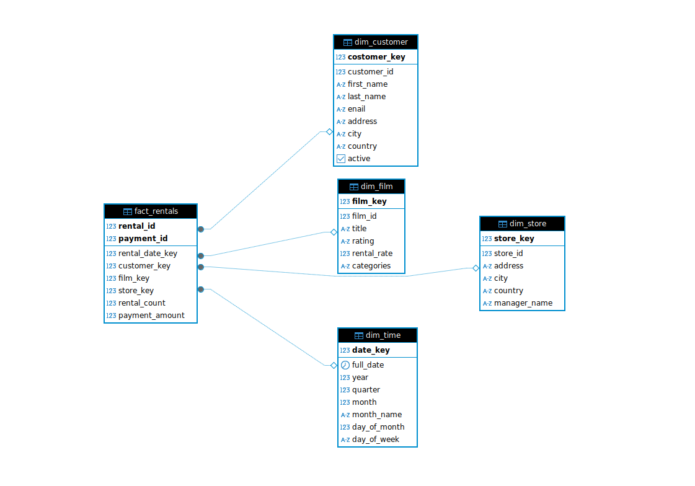
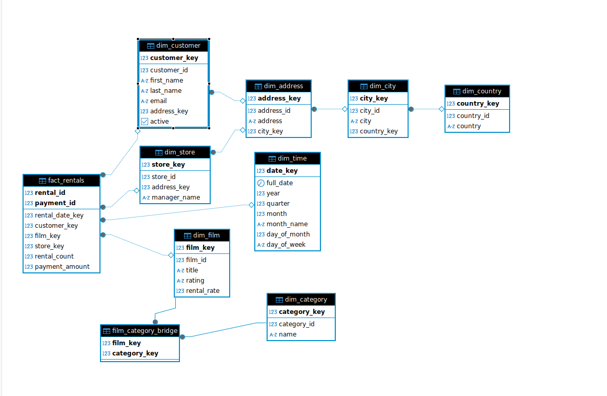

# Лабораторная работа №3

## ЗАДАНИЕ

1. Следуя образцу, создать два собственных хранилища данных в
   Microsoft SQL Server по модели «звезда» и «снежинка» [7, 8] для разных
   вариантов из приложения.

2. Наполнить хранилище открытыми данными из общедоступного
   репозитория в сети Интернет.

3. Построить не менее пяти сводных таблиц и диаграмм, связанных с
   источником данных Microsoft SQL Server в OLAP-клиенте Ms.Excel.


> Схема Звезда

```
-- Create schema for star data warehouse
DROP TABLE IF EXISTS star_dwh.fact_rentals CASCADE;
DROP TABLE IF EXISTS star_dwh.dim_time CASCADE;
DROP TABLE IF EXISTS star_dwh.dim_customer CASCADE;
DROP TABLE IF EXISTS star_dwh.dim_film CASCADE;
DROP TABLE IF EXISTS star_dwh.dim_store CASCADE;

create schema if not exists star_dwh;


-- Dimension: Time
create table star_dwh.dim_time (
	date_key SERIAL primary key,
	full_date date not null,
	year int not null,
	quarter int not null,
	month int not null,
	month_name varchar(10),
	day_of_month int not null,
	day_of_week varchar(10)
);

-- Dimension: Customer

create table star_dwh.dim_customer (
	costomer_key serial primary key,
	customer_id int not null,
	first_name varchar(50) not null,
	last_name varchar(50) not null,
	enail varchar(100),
	address varchar(100),
	city varchar(50),
	country varchar(50),
	active boolean
);

-- Dimension: Film (denormalized with category)
create table star_dwh.dim_film(
	film_key serial primary key,
	film_id int not null,
	title varchar(255),
	rating varchar(10),
	rental_rate numeric(4, 2),
	categories varchar(255)
);


-- Dimension: Store
create table star_dwh.dim_store (
	store_key serial primary key,
	store_id int not null,
	address varchar(100),
	city varchar(50),
	country varchar(50),
	manager_name varchar(100)
);


-- Fact: Rentals and Payments
CREATE table star_dwh.fact_rentals (
    rental_id INT NOT NULL,
    payment_id INT,
    rental_date_key INT REFERENCES star_dwh.dim_time(date_key),
    customer_key INT REFERENCES star_dwh.dim_customer(costomer_key),
    film_key INT REFERENCES star_dwh.dim_film(film_key),
    store_key INT REFERENCES star_dwh.dim_store(store_key),
    rental_count INT NOT NULL DEFAULT 1,
    payment_amount NUMERIC(10, 2),
    PRIMARY KEY (rental_id, payment_id)
);
```

> Диаграма




> Схема Снежинка

```
-- Create schema for snowflake data warehouse
CREATE SCHEMA IF NOT EXISTS snowflake_dwh;

-- Dimension: Time
CREATE TABLE snowflake_dwh.dim_time (
    date_key SERIAL PRIMARY KEY,
    full_date DATE NOT NULL,
    year INTEGER NOT NULL,
    quarter INTEGER NOT NULL,
    month INTEGER NOT NULL,
    month_name VARCHAR(10),
    day_of_month INTEGER NOT NULL,
    day_of_week VARCHAR(10)
);

-- Dimension: Country
CREATE TABLE snowflake_dwh.dim_country (
    country_key SERIAL PRIMARY KEY,
    country_id INTEGER NOT NULL,
    country VARCHAR(50) NOT NULL
);

-- Dimension: City
CREATE TABLE snowflake_dwh.dim_city (
    city_key SERIAL PRIMARY KEY,
    city_id INTEGER NOT NULL,
    city VARCHAR(50) NOT NULL,
    country_key INTEGER REFERENCES snowflake_dwh.dim_country(country_key)
);

-- Dimension: Address
CREATE TABLE snowflake_dwh.dim_address (
    address_key SERIAL PRIMARY KEY,
    address_id INTEGER NOT NULL,
    address VARCHAR(100) NOT NULL,
    city_key INTEGER REFERENCES snowflake_dwh.dim_city(city_key)
);

-- Dimension: Customer
CREATE TABLE snowflake_dwh.dim_customer (
    customer_key SERIAL PRIMARY KEY,
    customer_id INTEGER NOT NULL,
    first_name VARCHAR(50) NOT NULL,
    last_name VARCHAR(50) NOT NULL,
    email VARCHAR(100),
    address_key INTEGER REFERENCES snowflake_dwh.dim_address(address_key),
    active BOOLEAN
);

-- Dimension: Category
CREATE TABLE snowflake_dwh.dim_category (
    category_key SERIAL PRIMARY KEY,
    category_id INTEGER NOT NULL,
    name VARCHAR(50) NOT NULL
);

-- Dimension: Film
CREATE TABLE snowflake_dwh.dim_film (
    film_key SERIAL PRIMARY KEY,
    film_id INTEGER NOT NULL,
    title VARCHAR(255) NOT NULL,
    rating VARCHAR(10),
    rental_rate NUMERIC(4,2)
);

-- Bridge Table: Film-Category
CREATE TABLE snowflake_dwh.film_category_bridge (
    film_key INTEGER REFERENCES snowflake_dwh.dim_film(film_key),
    category_key INTEGER REFERENCES snowflake_dwh.dim_category(category_key),
    PRIMARY KEY (film_key, category_key)
);

-- Dimension: Store
CREATE TABLE snowflake_dwh.dim_store (
    store_key SERIAL PRIMARY KEY,
    store_id INTEGER NOT NULL,
    address_key INTEGER REFERENCES snowflake_dwh.dim_address(address_key),
    manager_name VARCHAR(100)
);

-- Fact: Rentals and Payments
CREATE TABLE snowflake_dwh.fact_rentals (
    rental_id INTEGER NOT NULL,
    payment_id INTEGER,
    rental_date_key INTEGER REFERENCES snowflake_dwh.dim_time(date_key),
    customer_key INTEGER REFERENCES snowflake_dwh.dim_customer(customer_key),
    film_key INTEGER REFERENCES snowflake_dwh.dim_film(film_key),
    store_key INTEGER REFERENCES snowflake_dwh.dim_store(store_key),
    rental_count INTEGER NOT NULL DEFAULT 1,
    payment_amount NUMERIC(10,2),
    PRIMARY KEY (rental_id, payment_id)
);

```

> Диаграма

