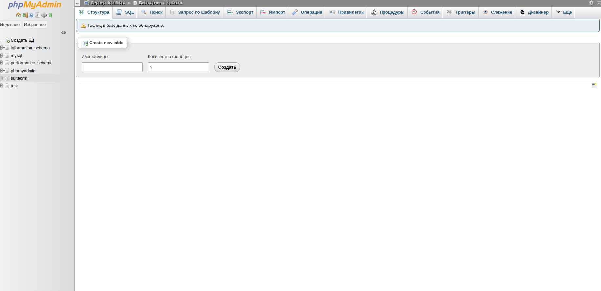

# Лабораторная работа №4

## Тема: Работа с системой CRM SuiteCRM (аналог Quick Sales).

## Цель:
> Научиться работать с системами управления отношениями с клиентами на примере SuiteCRM (аналог Quick Sales).

## ЗАДАНИЕ

1. В общих настройках SuiteCRM (аналог Quick Sales) задать параметры (валюта, код страны и др.).

2. Скопировать данные из соответствующего XML-документа, созданного в лабораторной работе №1, в справочник по ассортименту
   продукции предприятия (как минимум, 10 артикулов).
3. В модуле «Клиенты» создать карточки клиентов (минимум, 7).

4. В модуле «Клиенты» занести информацию по сделкам (минимум, 10).

5. Продемонстировать работу модулей «Календарь» и «Воронка».

6. В модуле «Отчеты» сформировать отчет по продажам товаров клиентам из разных регионов.

7. В модуле «База знаний» создать три пары «Вопрос-Ответ», касающиеся деятельности данного торгового предприятия.

8. Оформить отчет, включающий ответы на контрольные вопросы, скриншоты экранных форм SuiteCRM (аналог Quick Sales).


> Установим необходимые пакеты

```
wget https://sourceforge.net/projects/xampp/files/XAMPP%20Linux/8.2.12/xampp-linux-x64-8.2.12-0-installer.run
chmod +x xampp-linux-x64-8.2.12-0-installer.run
sudo ./xampp-linux-x64-8.2.12-0-installer.run
sudo /opt/lampp/lampp start
```

> Проверим http://localhost/phpmyadmin




### Задание 2: Импорт ассортимента продукции

```
<products>
    <product>
        <id>1</id>
        <name>Ноутбук Lenovo IdeaPad</name>
        <price>50000</price>
        <category>Электроника</category>
    </product>
    <product>
        <id>2</id>
        <name>Смартфон Xiaomi Redmi</name>
        <price>15000</price>
        <category>Электроника</category>
    </product>
    <product>
        <id>3</id>
        <name>Планшет Samsung Galaxy</name>
        <price>25000</price>
        <category>Электроника</category>
    </product>
    <product>
        <id>4</id>
        <name>Монитор LG 24"</name>
        <price>12000</price>
        <category>Электроника</category>
    </product>
    <product>
        <id>5</id>
        <name>Клавиатура Logitech</name>
        <price>3000</price>
        <category>Аксессуары</category>
    </product>
    <product>
        <id>6</id>
        <name>Мышь Microsoft</name>
        <price>1500</price>
        <category>Аксессуары</category>
    </product>
    <product>
        <id>7</id>
        <name>Принтер HP LaserJet</name>
        <price>20000</price>
        <category>Офисная техника</category>
    </product>
    <product>
        <id>8</id>
        <name>Сканер Canon</name>
        <price>8000</price>
        <category>Офисная техника</category>
    </product>
    <product>
        <id>9</id>
        <name>Веб-камера Logitech</name>
        <price>4000</price>
        <category>Аксессуары</category>
    </product>
    <product>
        <id>10</id>
        <name>Наушники Sony</name>
        <price>7000</price>
        <category>Аксессуары</category>
    </product>
</products>
```

> реобразуйте XML в CSV для импорта в SuiteCRM

```
import xmltodict
import pandas as pd

with open('products.xml') as xml_file:
    data = xmltodict.parse(xml_file.read())
    products = data['products']['product']
    df = pd.DataFrame(products)
    df.to_csv('products.csv', index=False)
_________________________________________
python3 convert_xml_to_csv.py
```

### КОНТРОЛЬНЫЕ ВОПРОСЫ:

1. Назначение и возможности систем CRM, примеры платных и бесплатных систем:
> Назначение: Автоматизация взаимодействия с клиентами для повышения продаж, 
> оптимизации маркетинга и улучшения обслуживания. CRM собирает данные о клиентах, 
> хранит историю взаимодействий, анализирует результаты.

> Возможности: Ведение клиентской базы, управление сделками, планирование задач, 
> аналитика, рассылки, интеграция с другими системами.

> Примеры:
> Платные: Salesforce, Microsoft Dynamics 365, HubSpot.
> Бесплатные: SuiteCRM, EspoCRM, Vtiger.

2. Классификация CRM-систем: 
> По функционалу:
> Операционные (автоматизация продаж, маркетинга, поддержки).
> Аналитические (анализ данных, отчеты).
> Коллаборативные (взаимодействие между отделами).
> По модели развертывания:
> Локальные (on-premise).
> Облачные (SaaS).
> По целевой аудитории:
> Для малого бизнеса.
> Для крупных корпораций.


3. Что такое SaaS-модель?
> SaaS (Software as a Service) — модель предоставления ПО через интернет, 
> где поставщик управляет приложением, а клиент получает доступ через браузер. 
> Преимущества: отсутствие затрат на установку и обслуживание, оплата по подписке, автоматические обновления.

4. Параметры в настройках CRM Quick Sales (аналог SuiteCRM):
> Валюта (например, RUB).
> Код страны (например, +7).
> Формат даты и времени.
> Язык интерфейса.
> Настройки справочников (продукты, категории, этапы сделок).


5. Основные термины CRM Quick Sales (аналог SuiteCRM):
> Карточка клиента: Хранит данные о клиенте (название, адрес, контакты, история взаимодействий).
> Работа (сделка): Взаимодействие с клиентом для достижения цели (продажа, договор).
> План: Запланированные действия (звонки, встречи, рассылки).
> Заметка: Записи о ходе работы (проблемы, успехи).
> Группа: Набор клиентов, объединенных по признаку (например, «потенциальные клиенты»).
> Пакет: Набор материалов для email-рассылки (прайс-листы, буклеты).


