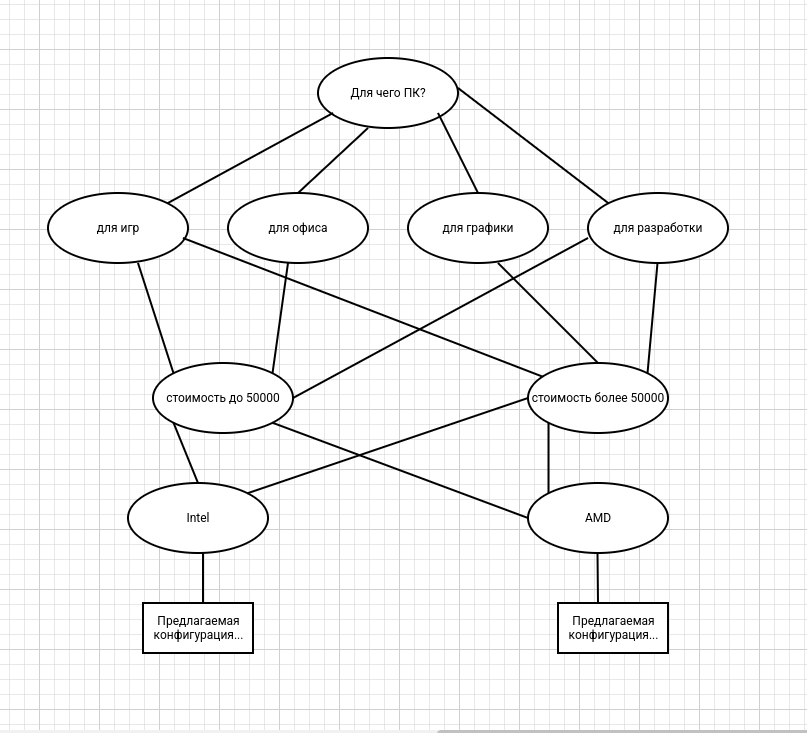

# Тимофеев Михаил ЗО ИВТ ИВТ

# Лабораторная работа №1. Разработка консультирующей или диагностической экспертной системы

## Тема: разработка консультирующей или диагностической экспертной системы.

> Цель: изучить технические
> аспекты реализации продукционной модели представления знаний экспертной системы,
> приобрести практические навыки реализации пополняемой динамической базы знаний, 
> не включаемой непосредственно в текст программы.

## Задание на лабораторную работу

1. Выбрать предметную область. Примерные темы даны в
   подразделе «Варианты заданий». Можно дополнять набор входных
   данных и результатов работы экспертной системы из соображений
   целесообразности, согласовывая изменения в постановке задачи с
   преподавателем.

2. Разработать базу правил, представленных в форме правил
    вида «ЕСЛИ-ТО». Для синтаксического представления продукций в
    модели использовать язык исчисления предикатов первого порядка,
    то есть основными формализмами представления продукций
    должны быть:
      - терм, устанавливающий соответствие знаковых символов описываемому объекту;
      - предикат для описания отношения сущностей в виде реляционной формулы, 
         содержащей в себе термы.
    Термы должны быть двух видов: терм-переменная и термконстанта.
    В записи условной части должна быть предусмотрена
    возможность наличия логических связок «И» и «ИЛИ».

3. Реализовать продукционную систему со следующей структурой:
      - база правил: область памяти, которая содержит базу знаний;
      - глобальная база данных - область памяти, содержащая
         факты, которые описывают вводимые данные и состояния системы;
      - интерпретатор правил (механизм логического вывода) -
         компонент системы, который формирует заключения, используя
         базу правил и базу данных.

    Система должна удовлетворять требованиям:
      - наличие механизма заполнения базы правил и
         глобальной базы данных, а также отображение результата
         логического вывода (интерфейс с пользователем);
      - механизм логического вывода выбрать в зависимости от
         номера варианта: нечетные номера - прямой вывод, четные номера
          обратный вывод;
      - представление системы продукций графом «И/ИЛИ»;
      - предусмотреть механизм разрешения конфликта на
         этапе вывода;
      - обнаружение ошибочных правил в случае, когда либо
         доказательство заключения закончилось неуспехом, либо получено
         неверное заключение;
      - протоколирование поиска на графе: описать процесс
         вывода в системе, используя частичный граф; в случае
         неуспешного вывода указать невыполнимое условие.

4. Оформить отчет по лабораторной работе.


## Содержание отчета

> Отчет должен содержать:
1. Описание предметной области.
2. Конфигурацию системы продукций.
3. Описание способа организации поиска на графе.
4. Описание конфликтного набора и алгоритм разрешения
   конфликта при логическом выводе.
5. Тестовый набор правил - база правил и база данных.
6. Протокол тестового вычисления: обход по графу.

###  Описание предметной области

> Экспертная система предназначена для подбора оптимальной конфигурации 
> персонального компьютера в зависимости от потребностей пользователя, 
> его бюджета и предпочтений по производителю комплектующих. Система анализирует 
> входные параметры и предлагает соответствующую конфигурацию ПК.

### Конфигурация системы продукций

> Система использует продукционные правила, представленные в виде "ЕСЛИ-ТО":

  - ЕСЛИ цель = "Игры" И бюджет = "50-100 тыс." И бренд CPU = "Intel", ТО процессор = "Intel i5-12400F", видеокарта = "RTX 3060".

  - ЕСЛИ цель = "Офисная работа" И бюджет = "до 50 тыс.", ТО процессор = "Intel i3-10105", SSD = "256 ГБ".

### Описание способа организации поиска на графе

> Процесс выбора конфигурации можно представить в виде графа решений, где:

 - Узлы представляют состояния системы (разные комбинации входных данных).

 - Ребра обозначают переход между состояниями в зависимости от пользовательского ввода.

 - Поиск производится в глубину (DFS) или в ширину (BFS) для нахождения подходящей конфигурации.

### Описание конфликтного набора и алгоритм разрешения конфликта при логическом выводе

> Конфликтный набор включает все правила, условия которых соответствуют текущим входным данным. Разрешение конфликта выполняется по стратегии:

  - Если несколько правил подходят, выбирается наиболее специфичное.

  - Если специфичность одинаковая, выбирается первое найденное правило.

### Тестовый набор правил - база правил и база данных
```
{
    ("Игры", "до 50 тыс.", "Intel"): "Intel i3-12100F, GTX 1650, 16GB RAM, SSD 512GB",
    ("Игры", "50-100 тыс.", "Intel"): "Intel i5-12400F, RTX 3060, 16GB RAM, SSD 1TB",
    ("Офис", "до 50 тыс.", "Intel"): "Intel i3-10105, 8GB RAM, SSD 256GB"
}
```
> База данных:
   - Пользователь вводит:
   - Цель использования: Игры
   - Бюджет: 50-100 тыс.
   - Производитель: Intel

### Дерево принятия решений 


### Протокол тестового вычисления: обход по графу

1. Пользователь вводит цель использования ПК и бюджет.
2. Система анализирует данные и ищет совпадение в базе правил.
3. Если найдено совпадение, выводится соответствующая конфигурация.
4. В случае отсутствия совпадения система сообщает, что подходящая конфигурация не найдена.


### Вывод 
> В ходе лабораторной работы была разработана консультирующая экспертная система для выбора оптимальной конфигурации ПК. 
> Система успешно анализирует входные данные пользователя и на их основе предлагает подходящий вариант. 
> Разработанная система может быть расширена дополнительными параметрами, такими как выбор производителя комплектующих, 
> объем видеопамяти и другие технические характеристики.


## Контрольные вопросы

1. Структура ЭС, ее основные компоненты и их назначение.

> Экспертная система (ЭС) состоит из нескольких основных компонентов, каждый из которых играет важную роль в ее функционировании:
- База знаний (БЗ): Хранит долгосрочные данные и правила, описывающие предметную область4. 
  БЗ содержит факты и правила, применяя которые к известным фактам можно получать новые

> Рабочая память
- Предназначена для хранения исходных и промежуточных данных решаемой задачи. 
  Отличается от баз данных в информационно-поисковых системах тем, 
  что хранит текущие, а не долгосрочные данные

 > Решатель
 - Формирует последовательность правил, которые, применяясь к исходным данным из 
   рабочей памяти и знаниям из БЗ, позволяют решить поставленную задачу

> Компонент приобретения знаний
- Автоматизирует процесс наполнения ЭС знаниями, осуществляемый экспертом

> Объяснительный компонент
- Объясняет, как система получила решение задачи и какие знания она при этом использовала

> Диалоговый компонент
- Обеспечивает взаимодействие с пользователем

2. Структура продукционной ЭС
> Продукционная экспертная система основана на правилах вида "ЕСЛИ → ТО", 
> которые используются для логического вывода новых фактов из имеющихся данных. 

3. Понятие «конфликтного множества».
> В продукционных экспертных системах может возникнуть ситуация, когда несколько 
> правил удовлетворяют текущему состоянию рабочей памяти и могут быть выполнены одновременно. 
> Эти правила образуют конфликтное множество
> Конфликтное множество — это набор всех продукционных правил, которые могут быть применены на текущем шаге логического вывода

4. Характеристики (признаки описываемого объекта). Описание правил и фактов на основе характеристик. Привести пример.

> В экспертных системах объект описывается набором характеристик (атрибутов, параметров),
> которые отражают его свойства и используются для логического вывода.

> Типы характеристик:
> Качественные (дискретные) - принимают фиксированные значения (категории).
> Количественные (непрерывные) - выражаются числовыми значениями.


> Описание правил и фактов на основе характеристик
> Факт - это конкретное значение характеристики объекта, которое является исходными данными системы.
> Правила используются для логического вывода новых фактов на основе уже имеющихся данных.

> Пример правил для подбора ПК:

   - ЕСЛИ цель = "гейминг" И бюджет = 800-1000$
   - ТО процессор = "AMD Ryzen 5", видеокарта = "NVIDIA GTX 1660", ОЗУ = "16ГБ".

   - ЕСЛИ цель = "офисная работа" И бюджет = 500-800$
   - ТО процессор = "Intel Core i3", ОЗУ = "8ГБ", SSD = "256ГБ".

   - ЕСЛИ цель = "разработка ПО" И бюджет = 1000$+
   - ТО процессор = "Intel Core i7", ОЗУ = "32ГБ", SSD = "1ТБ", видеокарта = "RTX 4060".


5. Механизм прямого вывода продукционной ЭС. Привести пример.
> Прямой вывод (data-driven reasoning) - это метод логического вывода, 
> при котором система начинает с известных фактов и применяет правила, 
> чтобы получить новые факты или окончательное решение

> Применение прямого вывода:

> Подходит для задач, где известны начальные условия, и нужно вывести результат.
> Используется в консультирующих и диагностических экспертных системах.

> Примеры использования:
   - Определение конфигурации ПК по требованиям пользователя.
   - Медицинская диагностика (если есть симптомы → диагноз).
   - Рекомендация тарифного плана на основе потребностей.

> Вывод: Прямой вывод работает по принципу «от фактов к решению», автоматически применяя продукционные правила

6. Механизм обратного вывода продукционной ЭС. Привести пример
> Механизм обратного вывода продукционной экспертной системы (ЭС) — это процесс, 
> при котором система используется для того, чтобы на основе заранее заданных 
> выводов (выводов на основе фактов) и продукционных правил найти объяснение 
> или доказательство этих выводов. Это противоположно прямому выводу, 
> где система использует правила и факты для того, чтобы сделать заключение.

> Пример:

> Предположим, что у нас есть экспертная система для диагностики заболеваний, 
> которая использует продукционные правила. В этом примере с обратным выводом, 
> система начинает с гипотезы (например, что у пациента есть какое-то заболевание) 
> и пытается найти факты и правила, которые подтверждают или опровергают эту гипотезу.

1. Продукционные правила:
   Правило 1: Если у пациента кашель и температура выше 38°C, то у него грипп.
   Правило 2: Если у пациента болит горло и кашель, то у него ангина.
   Правило 3: Если у пациента температура выше 38°C и болит голова, то у него грипп.
2. Действия системы:
   Предположим, что система делает вывод, что у пациента грипп, но она не знает, 
   какие именно факты это подтверждают. Для того чтобы найти объяснение, 
   она будет "обратно" искать факты, которые могли бы привести к этому заключению.

> Шаги:

   - Система начинает с гипотезы: "У пациента грипп."
   - Она проверяет, какие правила могут привести к такому выводу, и находит два возможных пути:
      1. Правило 1 (кашель и температура выше 38°C).
      2. Правило 3 (температура выше 38°C и головная боль).
   - Затем система проверяет, есть ли у пациента факты, которые соответствуют этим правилам 
     (например, кашель, высокая температура, головная боль).
> Таким образом, система анализирует гипотезу, используя обратный вывод, и находит, 
> какие факты подтверждают ее правильность. Этот процесс позволяет системе объяснить,
> почему был сделан тот или иной вывод.