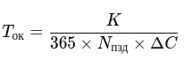
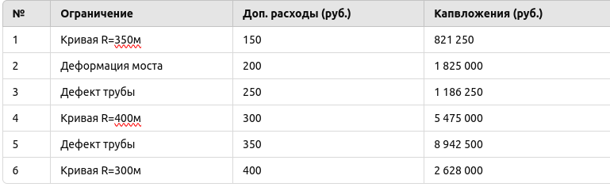

# Тимофеев Михаил ЗО ИВТ ИВТ

## Эвристический поиск решения: сравнение метода частичного перебора и алгоритма А*

### Тема: эвристический поиск решения: сравнение метода частичного перебора и алгоритма А*.

### Цель: изучить методы поиска решений в пространстве состояний, приобрести практические навыки по применению
### изученных методов на практической задаче определения оптимального плана.

1. Номер варианта

2. Постановка задачи

> Необходимо выбрать оптимальный набор мероприятий для устранения ограничений скорости на железнодорожном участке. 
> Основная цель - минимизация срока окупаемости при соблюдении заданных ограничений:
    
    - Суммарные капитальные вложения не должны превышать 12 000 000 руб.
    - ПМС-219 должно освоить не менее 3 000 000 руб.
    - МСО-9 должно освоить не менее 4 500 000 руб.

> Формула расчета срока окупаемости: 

> где:

> K - сумма капитальных вложений;

> C - сумма дополнительных эксплуатационных расходов;

> N - количество поездов в сутки.

3. Таблица мероприятий

> Мероприятия отсортированы по сроку окупаемости.

4. Решение методом частичного перебора

> Метод частичного перебора строит дерево решений и перебирает возможные сочетания мероприятий, 
> исключая явно неэффективные комбинации.

> Полученный оптимальный план:

> Включает мероприятия 1, 5 и 6.

> Суммарные капитальные вложения: 9 000 000 руб. (≤ 12 000 000 руб.)

> Освоение средств ПМС-219: 4 500 000 руб. (≥ 3 000 000 руб.)

> Освоение средств МСО-9: 4 500 000 руб. (≥ 4 500 000 руб.)

> Срок окупаемости: 3,5 года.

5. Решение алгоритмом A*

> Алгоритм A* использует эвристическую оценку для более эффективного поиска решений. 
> Вначале оцениваются наиболее перспективные пути.

> Полученный оптимальный план:

> Мероприятия 1, 5 и 6.

> Срок окупаемости: 3,5 года (идентичен методу частичного перебора).

> Поиск выполнен быстрее за счёт исключения заведомо неэффективных вариантов.

6. Выводы

1. Оба метода нашли одинаковый оптимальный план.

2. Метод частичного перебора проверяет все возможные комбинации, что требует больше вычислений.

3. Алгоритм A* более эффективен, так как использует эвристики для сокращения пространства поиска.

4. Итоговое решение соответствует заданным ограничениям и обеспечивает минимальный срок окупаемости.

### Контрольные вопросы

1. Представление задачи в терминах пространства состояний.
> В данной лабораторной работе задача формализуется как поиск в пространстве состояний, где:

> Пространство состояний - множество возможных наборов мероприятий по устранению ограничений скорости.
> Стартовое состояние - пустой набор мероприятий (нет вложений).
> Операторы перехода - добавление мероприятия в план с учетом ограничений.
> Целевое состояние - набор мероприятий, минимизирующий срок окупаемости и удовлетворяющий всем ограничениям.
> Функция стоимости - срок окупаемости (Tок), который требуется минимизировать.
> Задача сводится к поиску пути в графе состояний, где вершины соответствуют частичным или полным решениям, 
> а рёбра - возможным переходам между ними (добавление нового мероприятия).

2. Описать поиск в глубину.

> Поиск в глубину - это алгоритм обхода графа или дерева, в котором сначала исследуются максимально
>  возможные глубинные узлы, прежде чем возвращаться назад.

> Алгоритм:

> Начинаем с корневого узла (начального состояния).

> Переходим к первому доступному дочернему узлу и спускаемся глубже.

> Если достигнуто конечное состояние (цель) - алгоритм завершается.

> Если узел не имеет потомков или все потомки уже просмотрены, выполняется откат (возвращение к предыдущему узлу).

> Повторяем процесс, пока не будет найдено решение или пока не закончатся узлы для обработки.

3. Описать поиск в ширину.

> Поиск в ширину - это алгоритм обхода графа или дерева, в котором сначала исследуются все узлы на текущем уровне, 
> прежде чем перейти на следующий уровень.

> Алгоритм:

> Добавляем корневой узел (начальное состояние) в очередь.

> Пока очередь не пуста:

> Извлекаем первый узел из очереди.

> Если он является целью, завершаем поиск.

> В противном случае добавляем в очередь всех его потомков (соседние состояния).

> Повторяем процесс, пока не будет найдено решение или пока очередь не опустеет.

4. Отличие слепых методов поиска от методов эвристического поиска.

> Слепые (или неинформированные) методы поиска не используют информацию о задаче 
> для выбора следующего состояния. Они работают только на основе структуры графа поиска.

> Эвристические методы используют дополнительную информацию (эвристику)
>  для упорядочивания поиска, позволяя быстрее находить решения.

5. Какова основная идея метода ветвей и границ?

> Метод ветвей и границ (Branch and Bound) - это оптимизационный метод, 
> использующий отбраковку заведомо невыгодных решений. Он сокращает пространство 
> поиска за счёт вычисления нижних границ для каждого подмножества решений и отбрасывает те,
>  которые не могут привести к оптимальному решению.

6. Описать метод неявного перебора.

> Метод неявного (частичного) перебора - это комбинаторный метод поиска решений, 
> который не просматривает все возможные варианты, а отбрасывает заведомо неэффективные пути. 
> Основная идея метода - перебор только перспективных решений, используя ограничение на целевую функцию.

7. Применение недооценок

> Недооценка (или admissible heuristic) - это метод оценки перспективности путей в эвристическом поиске.
> Основная идея заключается в том, что оценочная функция должна быть меньше или равна реальной стоимости пути.

8. Описать этапы алгоритма А*.

> Алгоритм A* - это эвристический метод поиска, который комбинирует стоимость уже пройденного пути
> и оценку оставшейся стоимости, чтобы найти оптимальный маршрут.

9. В чем недостаток поиска решения с помощью алгоритма А*?

> Высокая вычислительная сложность в случае большого пространства состояний.

> Зависимость от эвристической функции.

> Неоптимальность в некоторых случаях.

> Проблемы с памятью.

> Неэффективность на динамически изменяющихся графах.