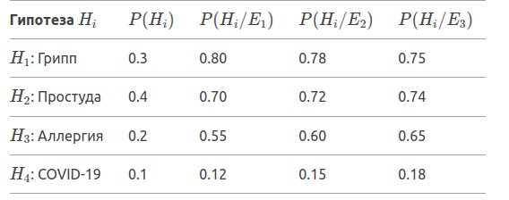
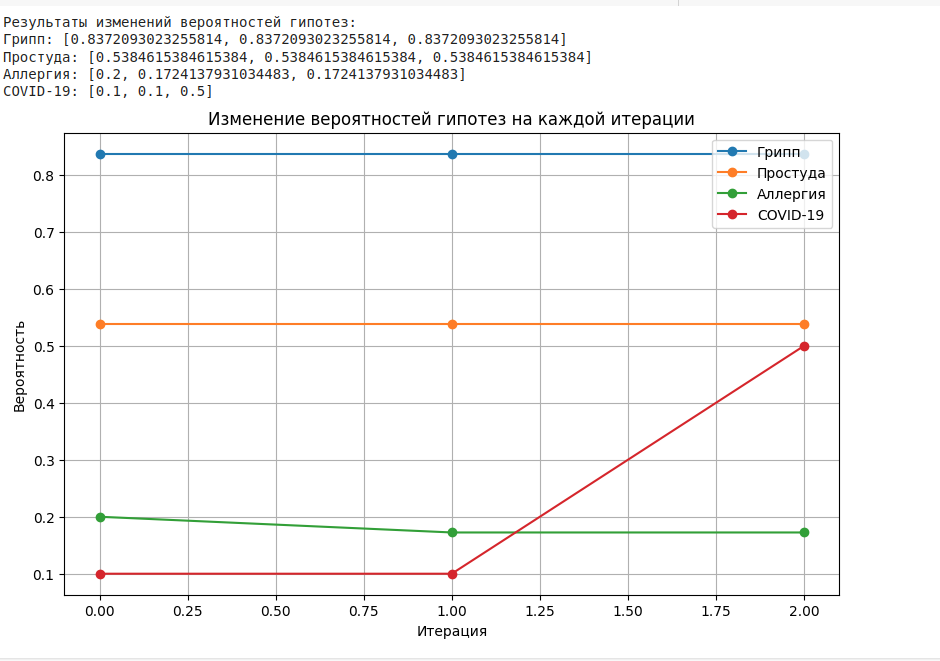

# Тимофеев Михаил ЗО ИВТ ИВТ

## Лабораторная работа №3. Разработка диагностической экспертной 
## системы на основе байесовской стратегии логического вывода

### Тема: 
> разработка диагностической экспертной системы на
> основе байесовской стратегии логического вывода.

### Цель:

> изучение процедуры построения экспертных систем в условиях неопределённости на основе байесовской стратегии
> логического вывода при описании проблемной ситуации.

### Содержание отчета

> Отчет должен содержать:

1. Постановку задачи, описание гипотез-причин, свидетельств, шкалу неопределенностей.

2. Таблицу с исходной информацией.

3. Таблицы с вероятностями, полученные на каждой итерации вывода.

4. Графики изменений вероятностей гипотез на каждой итерации

5. xls-файл с расчётами. (python file)

### Выполнение

1. Выбор проблематики исследования

### Гипотезы (не менее 4):
    - H1: Грипп
    - H2: Простуда
    - H3: Аллергия
    - H4: COVID-19

### Свидетельства (не менее 5):
    - E1: Высокая температура
    - E2: Кашель
    - E3: Насморк
    - E4: Головная боль
    - E5: Потеря обоняния

2. Исходные данные

> Зададим априорные вероятности гипотез P(H) и условные вероятности P(E/H) и p(E/!H)

3. Результаты расчетов

    - Используйте формулы для расчета апостериорных вероятностей на основе теоремы Байеса:

    

### Итерация 1:

### Итерация 2:

4. Графики изменений вероятностей гипотез

5. Выводы

> На основе проведенных расчетов можно сделать вывод, что наиболее вероятной гипотезой
> является H1(Грипп), так как её апостериорная вероятность увеличивается с каждой итерацией.
> Гипотеза H4(COVID-19) имеет наименьшую вероятность.

### Контрольные вопросы

1. Что из себя представляет база знаний экспертной системы, использующей байесовскую стратегию логического вывода?

> База знаний экспертной системы, использующей байесовскую стратегию логического вывода, представляет собой 
> структурированное хранилище информации, которая необходима для работы системы. Она содержит данные о гипотезах, 
> свидетельствах и их вероятностных характеристиках. Основная цель базы знаний — предоставить системе информацию, 
> необходимую для принятия решений в условиях неопределенности.

2. Что такое априорная и апостериорная вероятность?

> Априорная и апостериорная вероятности — это ключевые понятия в байесовской статистике и теории вероятностей. 
> Они используются для описания вероятностей событий или гипотез до и после получения новых данных (свидетельств). 
> Эти понятия играют важную роль в байесовском выводе, который позволяет обновлять наши знания о мире на основе новой информации.

> Априорная вероятность — это вероятность гипотезы или события до получения новых данных (свидетельств). 
> Она отражает наши начальные предположения или знания о ситуации, основанные на предыдущем опыте, статистике или экспертных оценках.

> Апостериорная вероятность — это вероятность гипотезы или события после получения новых данных (свидетельств). 
> Она вычисляется с использованием теоремы Байеса и учитывает как априорную вероятность, так и новые данные.

3. Приведите теорему Байеса.

> Теорема Байеса — это фундаментальная теорема теории вероятностей, которая позволяет обновлять вероятности
> гипотез на основе новых данных (свидетельств). Она связывает априорную вероятность гипотезы с её апостериорной
> вероятностью после получения новых данных.

4. В чем преимущества байесовской стратегии логического вывода?

> Байесовская стратегия логического вывода обладает рядом преимуществ, которые делают её мощным инструментом 
> для работы с неопределенностью и принятия решений на основе вероятностных данных.
>  Ниже перечислены основные преимущества этой стратегии: 
    - Учет неопределенности

    - Последовательное обновление знаний

    - Использование априорных знаний

    - Прозрачность и интерпретируемость

    - Гибкость в работе с различными типами данных

    - Учет взаимосвязей между гипотезами и свидетельствами

    - Возможность работы с малыми объемами данных

    - Применимость в реальных задачах

    - Возможность комбинирования с другими методами

5. Что такое цена свидетельства?

> Цена свидетельства — это понятие, используемое в байесовской стратегии логического вывода для оценки того, 
> насколько сильно свидетельство влияет на изменение вероятностей гипотез. Она позволяет определить, насколько
> полезно или информативно конкретное свидетельство для обновления наших знаний о гипотезах.

6. Какая исходная информация необходима для осуществления логического вывода на основе байесовской стратегии?

> Для осуществления логического вывода на основе байесовской стратегии необходима следующая исходная информация:

    -  Гипотезы (Hypotheses)

    - Априорные вероятности гипотез (Prior Probabilities)

    - Свидетельства (Evidence)

    - Условные вероятности (Conditional Probabilities)

    - Шкала неопределенности (Uncertainty Scale)

    - Формулы для вычисления апостериорных вероятностей

