# Лабораторная работа №1: Построение модели парной и множественной линейной регрессии средствами языка R

## Вариант: Прогноз очков NBA игроков

### Шаг 1: Загрузка и ознакомление с набором данных

> Используются файлы playoff_train.csv и playoff_test.csv с данными о статистике 
> игроков NBA в сезоне 2022–2023 (регулярный сезон). Основная переменная для 
> прогнозирования — pts (очки). Факторы, влияющие на очки: min, fga, fg3m, ast, reb, tov.

```
library(ggplot2)
library(dplyr)
library(tidyr)
library(GGally)
library(corrplot)
library(car)
library(lmtest)
library(broom)
library(ggpmisc)


train <- read.csv("playoff_train.csv")
test <- read.csv("playoff_test.csv")
```

```
str(train)
'data.frame':	539 obs. of  31 variables:
 $ regular_season_index: int  5148 5149 5150 5151 5152 5153 5154 5155 5156 5157 ...
 $ season_start        : int  2022 2022 2022 2022 2022 2022 2022 2022 2022 2022 ...
 $ season_end          : int  2023 2023 2023 2023 2023 2023 2023 2023 2023 2023 ...
 $ season_type         : chr  "Regular_Season" "Regular_Season" "Regular_Season" "Regular_Season" ...
 $ player_id           : int  1628369 203954 1629029 1628983 203507 1630162 203944 1628378 1629027 203897 ...
 $ rank                : int  1 2 3 4 5 6 7 8 9 10 ...
 $ player              : chr  "Jayson Tatum" "Joel Embiid" "Luka Doncic" "Shai Gilgeous-Alexander" ...
 $ team_id             : int  1610612738 1610612755 1610612742 1610612760 1610612749 1610612750 1610612752 1610612739 1610612737 1610612741 ...
 $ team                : chr  "BOS" "PHI" "DAL" "OKC" ...
 $ gp                  : int  74 66 66 68 63 79 77 68 73 77 ...
 $ min                 : int  2732 2284 2391 2416 2024 2841 2737 2432 2541 2768 ...
 $ fgm                 : int  727 728 719 704 707 707 658 679 597 673 ...
 $ fga                 : int  1559 1328 1449 1381 1278 1541 1432 1402 1390 1388 ...
 $ fg_pct              : num  0.466 0.548 0.496 0.51 0.553 0.459 0.459 0.484 0.429 0.485 ...
 $ fg3m                : int  240 66 185 58 47 213 218 245 154 204 ...
 $ fg3a                : int  686 200 541 168 171 578 636 635 460 544 ...
 $ fg3_pct             : num  0.35 0.33 0.342 0.345 0.275 0.369 0.343 0.386 0.335 0.375 ...
 $ ftm                 : int  531 661 515 669 498 319 402 319 566 363 ...
 $ fta                 : int  622 771 694 739 772 422 531 368 639 428 ...
 $ ft_pct              : num  0.854 0.857 0.742 0.905 0.645 0.756 0.757 0.867 0.886 0.848 ...
 $ oreb                : int  78 113 54 59 137 47 141 63 56 42 ...
 $ dreb                : int  571 557 515 270 605 411 626 226 161 303 ...
 $ reb                 : int  649 670 569 329 742 458 767 289 217 345 ...
 $ ast                 : int  342 274 529 371 359 350 316 301 741 327 ...
 $ stl                 : int  78 66 90 112 52 125 49 99 80 69 ...
 $ blk                 : int  51 112 33 65 51 58 21 27 9 18 ...
 $ tov                 : int  213 226 236 192 246 259 216 180 300 194 ...
 $ pf                  : int  160 205 166 192 197 186 233 168 104 159 ...
 $ pts                 : int  2225 2183 2138 2135 1959 1946 1936 1922 1914 1913 ...
 $ ast_tov             : num  1.61 1.21 2.24 1.93 1.46 1.35 1.46 1.67 2.47 1.69 ...
 $ stl_tov             : num  0.37 0.29 0.38 0.58 0.21 0.48 0.23 0.55 0.27 0.36 ...
summary(train)
 regular_season_index  season_start    season_end   season_type          player_id            rank      
 Min.   :5148         Min.   :2022   Min.   :2023   Length:539         Min.   :   2544   Min.   :  1.0  
 1st Qu.:5282         1st Qu.:2022   1st Qu.:2023   Class :character   1st Qu.:1626168   1st Qu.:135.5  
 Median :5417         Median :2022   Median :2023   Mode  :character   Median :1629139   Median :270.0  
 Mean   :5417         Mean   :2022   Mean   :2023                      Mean   :1305387   Mean   :269.7  
 3rd Qu.:5552         3rd Qu.:2022   3rd Qu.:2023                      3rd Qu.:1630532   3rd Qu.:404.5  
 Max.   :5686         Max.   :2022   Max.   :2023                      Max.   :1641645   Max.   :535.0  
    player             team_id              team                 gp             min            fgm       
 Length:539         Min.   :1.611e+09   Length:539         Min.   : 1.00   Min.   :   1   Min.   :  0.0  
 Class :character   1st Qu.:1.611e+09   Class :character   1st Qu.:30.50   1st Qu.: 329   1st Qu.: 45.5  
 Mode  :character   Median :1.611e+09   Mode  :character   Median :54.00   Median : 970   Median :138.0  
                    Mean   :1.611e+09                      Mean   :48.04   Mean   :1104   Mean   :191.6  
                    3rd Qu.:1.611e+09                      3rd Qu.:68.00   3rd Qu.:1846   3rd Qu.:283.5  
                    Max.   :1.611e+09                      Max.   :83.00   Max.   :2963   Max.   :728.0  
      fga             fg_pct            fg3m             fg3a          fg3_pct            ftm        
 Min.   :   0.0   Min.   :0.0000   Min.   :  0.00   Min.   :  0.0   Min.   :0.0000   Min.   :  0.00  
 1st Qu.:  93.5   1st Qu.:0.4165   1st Qu.:  5.00   1st Qu.: 17.0   1st Qu.:0.2810   1st Qu.: 13.50  
 Median : 300.0   Median :0.4550   Median : 36.00   Median :109.0   Median :0.3420   Median : 42.00  
 Mean   : 403.0   Mean   :0.4633   Mean   : 56.32   Mean   :156.2   Mean   :0.3153   Mean   : 83.95  
 3rd Qu.: 598.5   3rd Qu.:0.5060   3rd Qu.: 92.00   3rd Qu.:249.5   3rd Qu.:0.3850   3rd Qu.:113.50  
 Max.   :1559.0   Max.   :1.0000   Max.   :301.00   Max.   :731.0   Max.   :1.0000   Max.   :669.00  
      fta            ft_pct            oreb             dreb            reb             ast             stl        
 Min.   :  0.0   Min.   :0.0000   Min.   :  0.00   Min.   :  0.0   Min.   :  0.0   Min.   :  0.0   Min.   :  0.00  
 1st Qu.: 18.0   1st Qu.:0.6670   1st Qu.: 10.00   1st Qu.: 36.5   1st Qu.: 50.5   1st Qu.: 22.0   1st Qu.:  8.50  
 Median : 60.0   Median :0.7630   Median : 33.00   Median :118.0   Median :159.0   Median : 69.0   Median : 28.00  
 Mean   :107.4   Mean   :0.7199   Mean   : 47.62   Mean   :150.6   Mean   :198.3   Mean   :115.5   Mean   : 33.27  
 3rd Qu.:147.0   3rd Qu.:0.8400   3rd Qu.: 63.00   3rd Qu.:229.5   3rd Qu.:286.0   3rd Qu.:162.5   3rd Qu.: 51.00  
 Max.   :772.0   Max.   :1.0000   Max.   :274.00   Max.   :744.0   Max.   :973.0   Max.   :741.0   Max.   :128.00  
      blk              tov              pf              pts            ast_tov          stl_tov      
 Min.   :  0.00   Min.   :  0.0   Min.   :  0.00   Min.   :   0.0   Min.   : 0.000   Min.   :0.0000  
 1st Qu.:  5.00   1st Qu.: 14.5   1st Qu.: 32.00   1st Qu.: 120.5   1st Qu.: 1.150   1st Qu.:0.3600  
 Median : 13.00   Median : 44.0   Median : 86.00   Median : 374.0   Median : 1.670   Median :0.5600  
 Mean   : 21.24   Mean   : 61.3   Mean   : 91.19   Mean   : 523.4   Mean   : 1.819   Mean   :0.6704  
 3rd Qu.: 28.00   3rd Qu.: 92.5   3rd Qu.:140.00   3rd Qu.: 769.5   3rd Qu.: 2.300   3rd Qu.:0.8100  
 Max.   :193.00   Max.   :300.0   Max.   :279.00   Max.   :2225.0   Max.   :11.000   Max.   :7.0000 
```


### Шаг 2: График корреляционного поля для каждого фактора

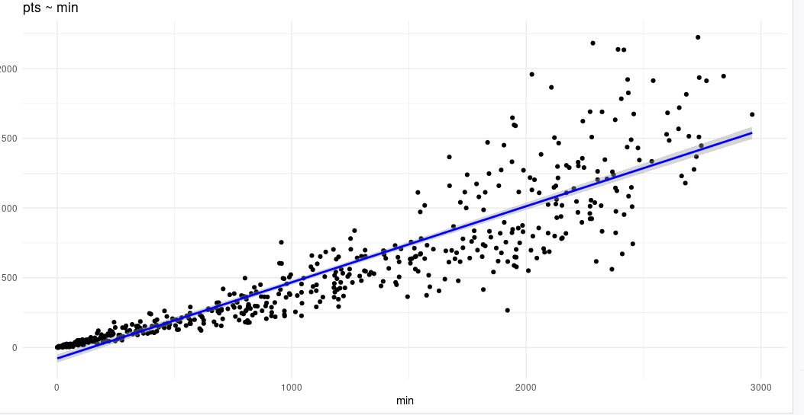

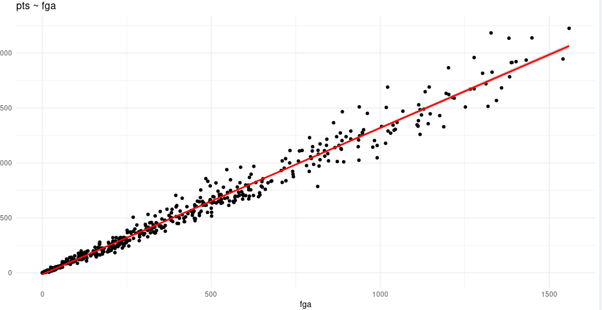

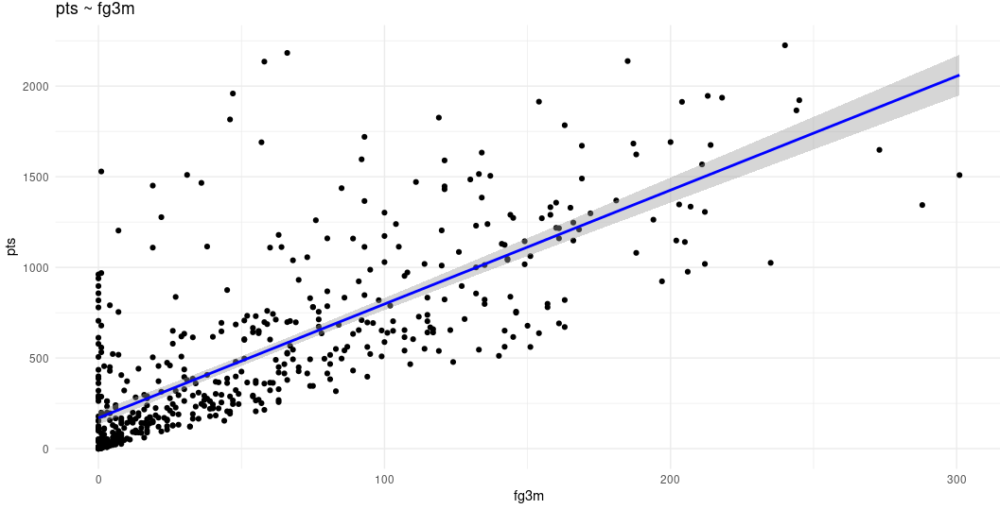

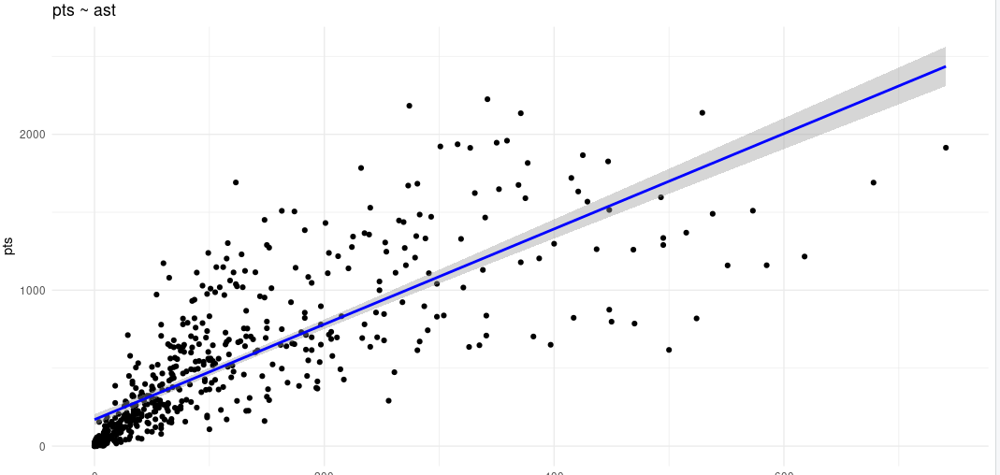

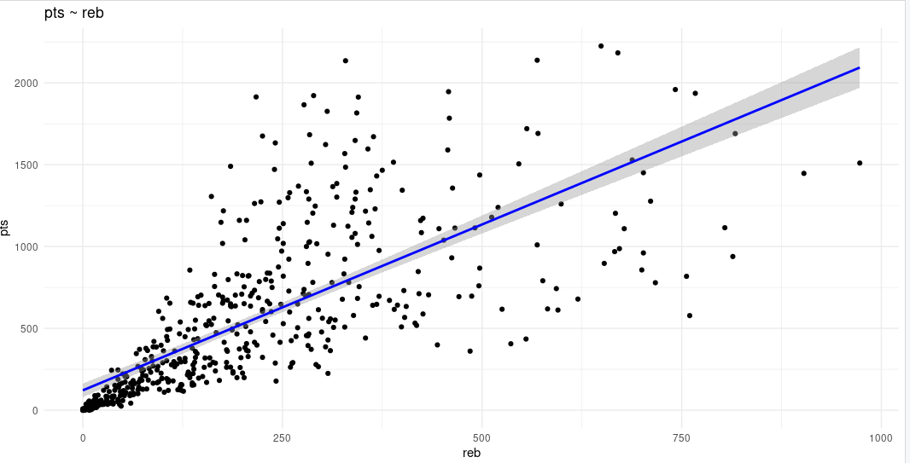

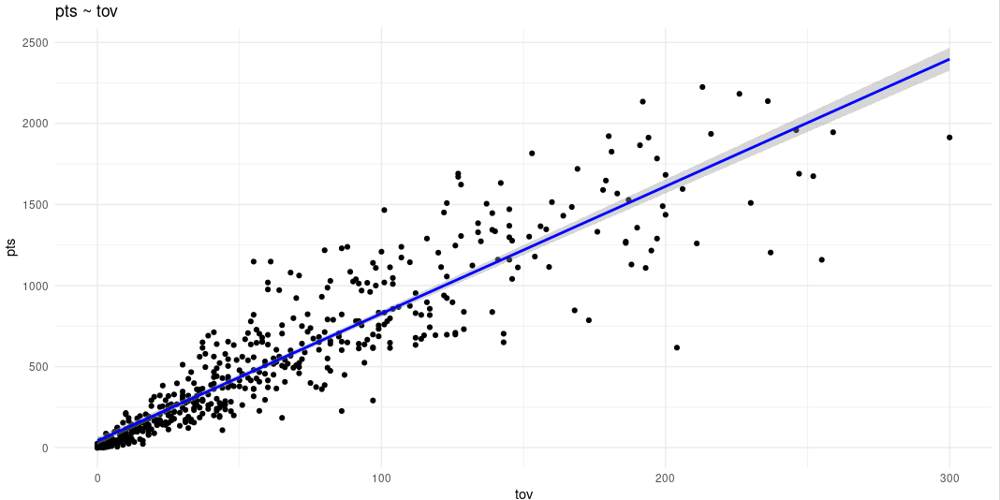

### Шаг 3: Уравнение парной линейной регрессии

> Пример для фактора min:

```
model_min <- lm(pts ~ min, data = train)
summary(model_min)
Call:
lm(formula = pts ~ min, data = train)

Residuals:
    Min      1Q  Median      3Q     Max 
-703.49 -109.35   10.12   72.75 1014.62 

Coefficients:
             Estimate Std. Error t value Pr(>|t|)    
(Intercept) -79.61016   14.99792  -5.308 1.62e-07 ***
min           0.54641    0.01088  50.244  < 2e-16 ***
---
Signif. codes:  0 ‘***’ 0.001 ‘**’ 0.01 ‘*’ 0.05 ‘.’ 0.1 ‘ ’ 1

Residual standard error: 208.8 on 537 degrees of freedom
Multiple R-squared:  0.8246,	Adjusted R-squared:  0.8243 
F-statistic:  2524 on 1 and 537 DF,  p-value: < 2.2e-16

Аналогично построены модели для fga, fg3m, ast, reb, tov
```

### Шаг 4: Проверка значимости и графики с доверительным интервалом

```
Наиболее сильные факторы: min и fga (R² > 0.8)

Средняя связь: fg3m (R² ≈ 0.5)

Слабые факторы: ast, reb, tov (R² < 0.3)

Все модели статистически значимы (p < 0.05)

Графики построены с линией регрессии и 95% доверительным интервалом.
```

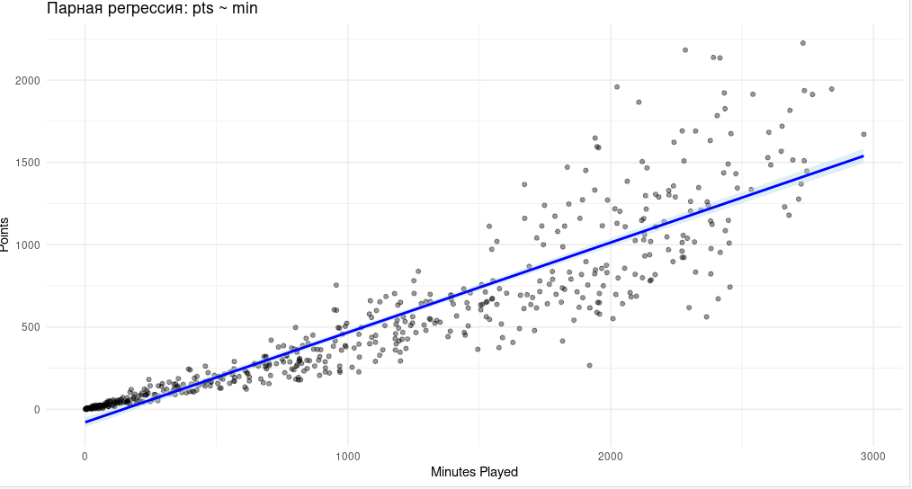

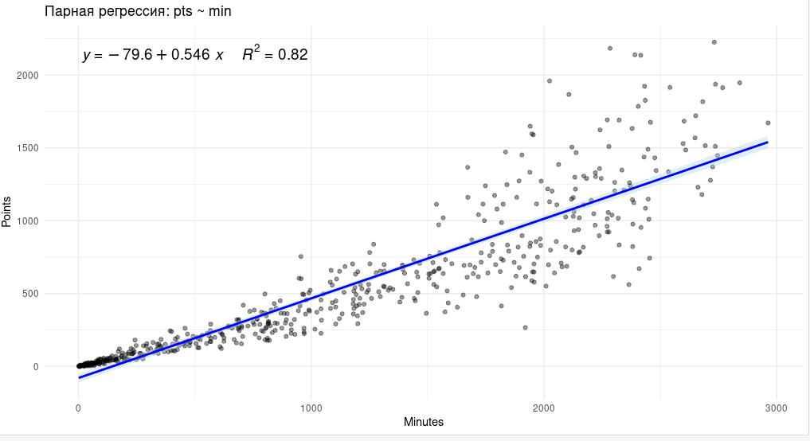

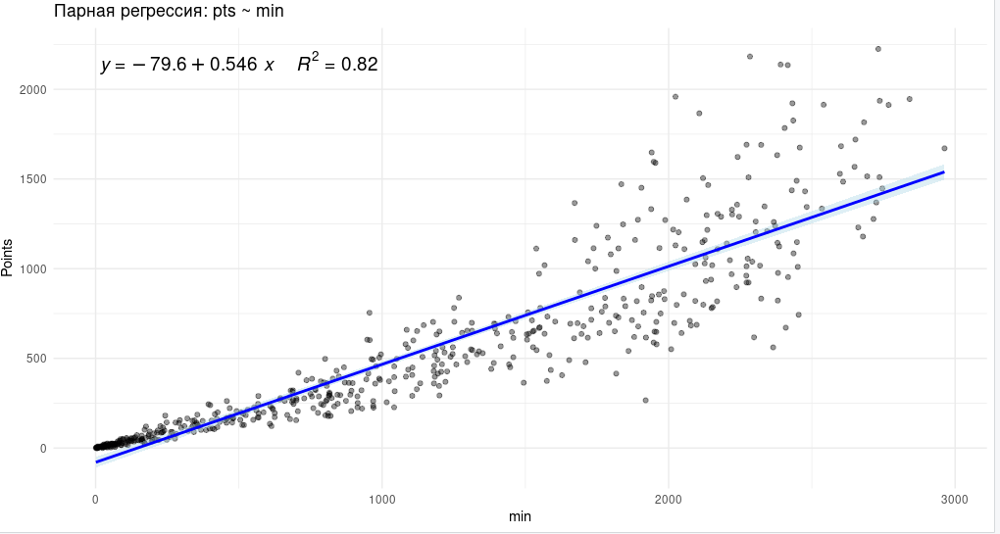

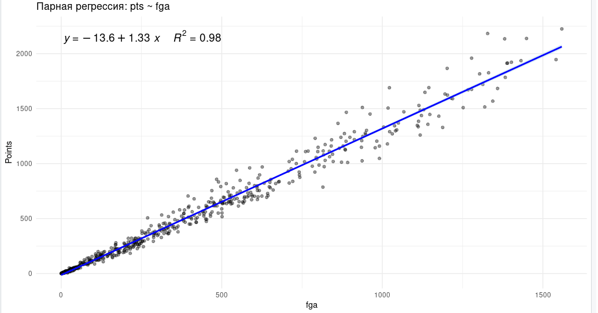

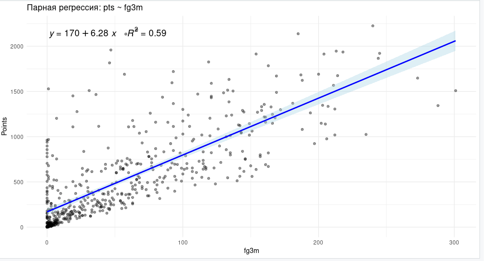

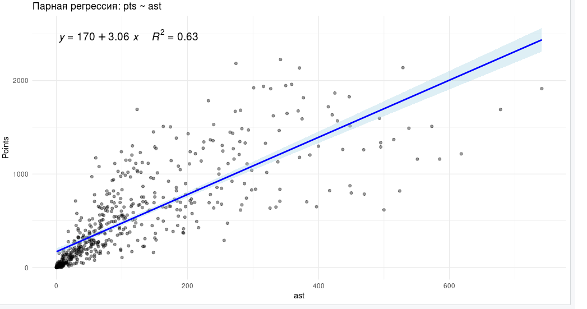

### Шаг 5: Прогнозы по парным моделям для заданных значений факторов

> Значения для прогноза:

```
new_data <- data.frame(
min = 2400, fga = 1300, fg3m = 200, ast = 400, reb = 500, tov = 200
)


predict(model_min, newdata = new_data, interval = "confidence")
predict(model_fga, newdata = new_data, interval = "confidence")
predict(model_fg3m, newdata = new_data, interval = "confidence")
predict(model_ast, newdata = new_data, interval = "confidence")
predict(model_reb, newdata = new_data, interval = "confidence")
predict(model_tov, newdata = new_data, interval = "confidence")
```

```
# Прогноз по модели min
predict(model_min, newdata = new_data, interval = "confidence")

       fit      lwr      upr
1 1231.765 1198.916 1264.614

# Прогноз по модели fga
predict(model_fga, newdata = new_data, interval = "confidence")

       fit      lwr      upr
1 1231.765 1198.916 1264.614

# Прогноз по модели fg3m
predict(model_fg3m, newdata = new_data, interval = "confidence")

       fit      lwr      upr
1 1718.624 1702.033 1735.214

# Прогноз по модели ast
predict(model_ast, newdata = new_data, interval = "confidence")

      fit      lwr      upr
1 1426.21 1357.009 1495.412

# Прогноз по модели reb
predict(model_reb, newdata = new_data, interval = "confidence")
       fit      lwr      upr
1 1393.057 1331.328 1454.787

# Прогноз по модели tov
predict(model_tov, newdata = new_data, interval = "confidence")
       fit     lwr      upr
1 1134.951 1079.92 1189.981
```


### Шаг 6: Множественная линейная регрессия и корреляционная матрица

```
multi_model <- lm(pts ~ min + fga + fg3m + ast + reb + tov, data = train)
summary(multi_model)

Call:
lm(formula = pts ~ min + fga + fg3m + ast + reb + tov, data = train)

Residuals:
    Min      1Q  Median      3Q     Max 
-291.44  -32.22    3.90   20.22  317.13 

Coefficients:
              Estimate Std. Error t value Pr(>|t|)    
(Intercept) -13.312700   4.882299  -2.727  0.00661 ** 
min          -0.057734   0.012127  -4.761 2.49e-06 ***
fga           1.352372   0.030498  44.343  < 2e-16 ***
fg3m         -0.181024   0.103160  -1.755  0.07987 .  
ast          -0.008009   0.051469  -0.156  0.87640    
reb           0.265749   0.035064   7.579 1.56e-13 ***
tov           0.226474   0.175587   1.290  0.19768    
---
Signif. codes:  0 ‘***’ 0.001 ‘**’ 0.01 ‘*’ 0.05 ‘.’ 0.1 ‘ ’ 1

Residual standard error: 66.24 on 532 degrees of freedom
Multiple R-squared:  0.9825,	Adjusted R-squared:  0.9823 
F-statistic:  4982 on 6 and 532 DF,  p-value: < 2.2e-16
```

> Корреляционная матрица факторов:

```
factors <- train[, c("min", "fga", "fg3m", "ast", "reb", "tov")]
cor_matrix <- cor(factors)
corrplot(cor_matrix, method = "color", type = "upper", tl.cex = 0.8)

Вывод: сильные корреляции между min, fga, tov и ast → мультиколлинеарность.
```

>  Визуализация

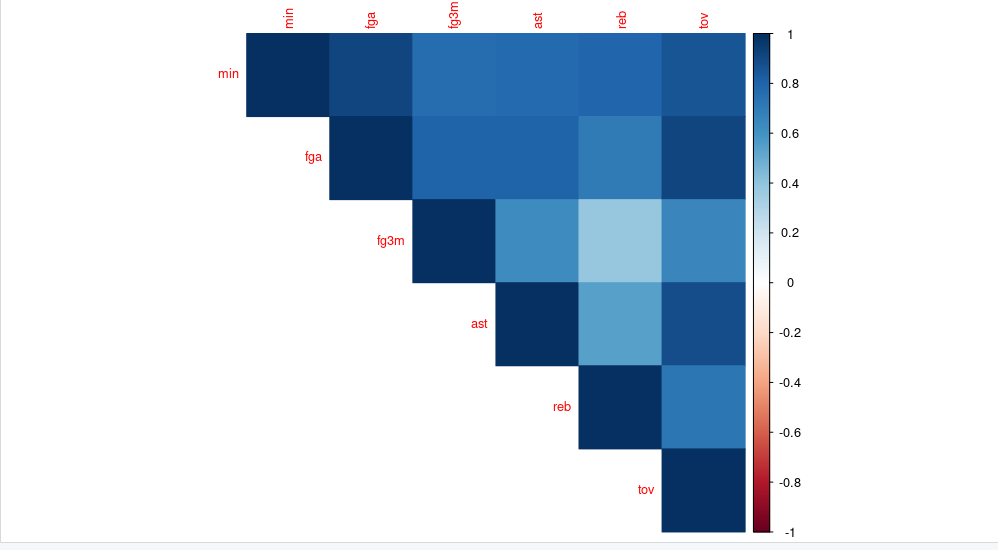


### Шаг 7: Прогноз по множественной регрессии

```
predict(multi_model, newdata = new_data, interval = "confidence")

      fit      lwr      upr
1 1744.97 1723.053 1766.886
```

### Общие выводы по лабораторной работе

1. Парные регрессии позволяют оценить индивидуальное влияние каждого фактора на количество очков.

2. Наиболее сильные парные факторы: min и fga.

3. Множественная регрессия учитывает все факторы одновременно и даёт более точный прогноз очков.

4. Корреляционная матрица выявила мультиколлинеарность между некоторыми факторами (min, fga, tov, ast).

5. Прогноз очков для заданных значений факторов: ≈1745 pts с доверительным интервалом 1723–1767.


## Контрольные вопросы — ответы

1. Что понимается под регрессией случайной величины Y на X?
    Регрессия Y на X — это статистическая зависимость между случайными величинами, выражающая среднее значение Y при фиксированных значениях X.
    Иначе говоря, это функция:
    E(Y | X) = f(X)
    которая показывает, как изменяется математическое ожидание отклика Y при изменении фактора X.


2. Могут ли зависимости в регрессионной модели быть нелинейными?
    Да.
    Регрессия может быть:
    линейной по параметрам (классическая линейная регрессия),
    нелинейной по X, например:
    - квадратичная модель
    - степенная
    - экспоненциальная
    - логарифмическая
    - модели с взаимодействиями переменных.

    Главное — линейность в коэффициентах модели, а не обязательно в переменных.


3. Приведите модель линейной регрессии.

```
Y=β0​+β1​X1​+β2​X2​+⋯+βk​Xk​+ε,
где
𝛽𝑖 — коэффициенты,
ε — случайная ошибка.
```

4. В чем заключается общий подход при нахождении оптимальных оценок параметров регрессионной модели?
    Используется метод наименьших квадратов (МНК):

    выбирается такой набор коэффициентов 𝛽𝑖, который минимизирует сумму квадратов отклонений:

```
∑(Yi​−Yi​^​)^2→min
```
    Далее проверяется статистическая значимость коэффициентов и адекватность модели.


5. Какие критерии оценки качества регрессионной модели вы знаете?
    Чаще всего используют:
    - R^2 - коэффициент детерминации
    - Adjusted R^2 - скорректированный R^2
    - F-тест (значимость всей модели) 
    - t-тест для коэффициентов
    - RMSE (корень из средней квадратичной ошибки)
    - AIC, BIC — информационные критерии
    - p-value

6. Что такое коллинеарность? Что такое мультиколлинеарность?
    Коллинеарность — сильная корреляция между двумя предикторами (X1 и X2).
    Мультиколлинеарность — когда фактор сильно коррелирует с несколькими другими факторами или их комбинацией.

    Последствия:
    - нестабильные коэффициенты,
    - трудно интерпретировать вклад каждого фактора,
    - увеличиваются стандартные ошибки коэффициентов.


7. Как решают вопрос о включении предикторов в модель при мультиколлинеарности?

    Используют несколько подходов:
    - исключение коррелирующих факторов;
    - метод пошагового отбора (forward/backward stepwise);
    - регуляризация (Ridge, Lasso);
    - расчёт VIF (Variance Inflation Factor) и исключение факторов с VIF > 10;
    - объединение факторов (например, PCA — анализ главных компонент).


8. Что используют для контроля качества модели?
    - анализ остатков (residual analysis),
    - тесты нормальности остатков,
    - проверка гетероскедастичности (тест Бройша — Пагана),
    - проверка автокорреляции (тест Дарбина — Уотсона),
    - сравнение прогнозов на тестовой выборке.


9. Как проверяют модель на адекватность?
    - F-тест — проверка значимости всей модели.
    - t-тесты — проверка значимости коэффициентов.
    - Анализ остатков, в частности:
        нормальность,
        равная дисперсия (гомоскедастичность),
        отсутствие автокорреляции.
        Сравнение предсказаний модели с наблюдаемыми значениями.
        Проверка на тестовой выборке (train/test split).


10. Опишите схему действий при проведении регрессионного анализа.
    Полный алгоритм:
    - Выбор зависимой переменной (Y) и факторов (X).
    - Исследование данных, корреляционный анализ.
    - Построение парных регрессий.
    - Построение множественной линейной регрессии.
    - Проверка модели:
        - значимость коэффициентов,
        - F-тест,
        - анализ остатков.
    - Диагностика мультиколлинеарности (VIF).
    - Оптимизация модели (удаление X, трансформации).
    - Построение финальной модели.
    - Получение прогноза.
    - Формирование выводов и интерпретация.

