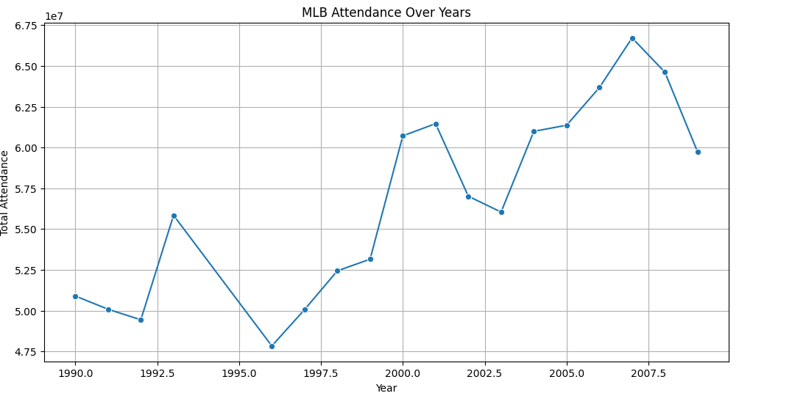
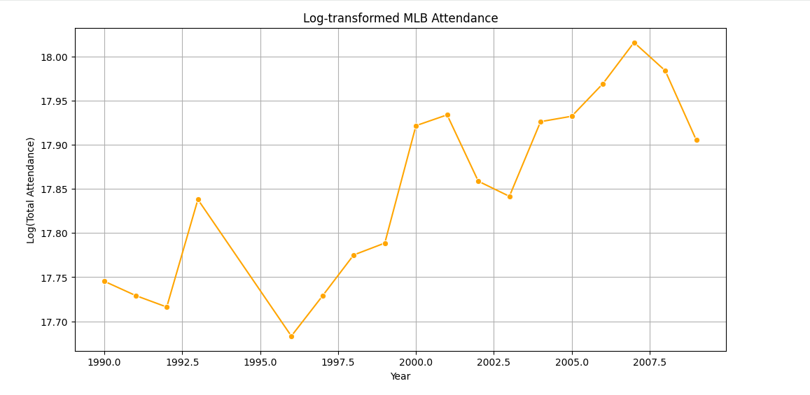
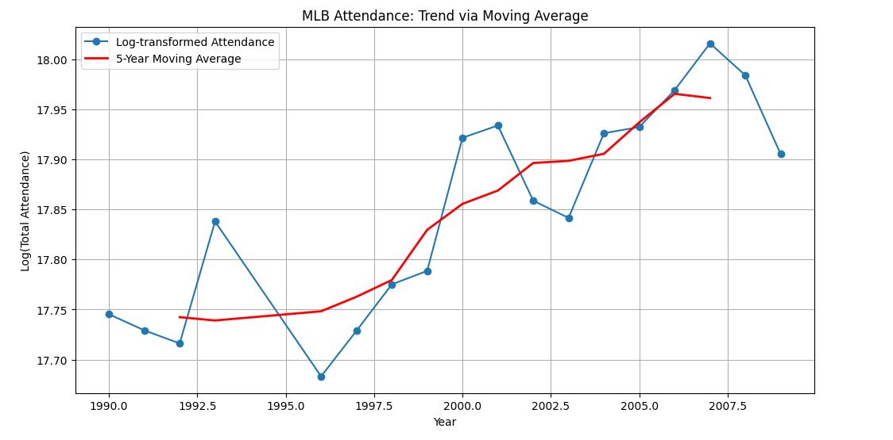
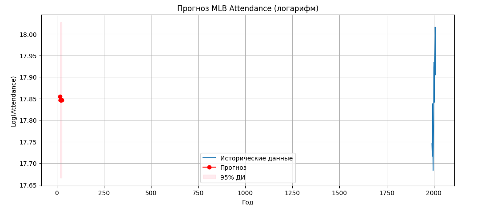
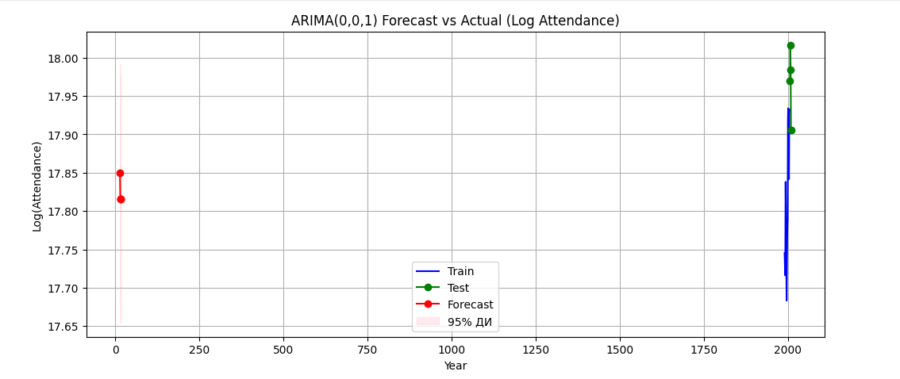

# Лабораторная работа: Анализ временных рядов MLB Attendance

## Цель работы
Изучение временных рядов на примере посещаемости матчей MLB. Построение моделей ARIMA, проверка стационарности, выделение тренда и сезонности, прогнозирование и оценка качества модели.

---

## 1. Подготовка данных
- Импортированы данные из `mlb_final.xlsx`.
- Удалены пропуски (`NaN`), переименован столбец `Unnamed: 0` в `Index`.
- Преобразован индекс в формат времени (Year).

---

## 2. Временной ряд посещаемости
- Построен график посещаемости по годам.  
- Наблюдения:
  - Имеется тенденция изменения тренда.
  - Сезонность явно выражена (годовая цикличность).  
  - Дисперсия увеличивается со временем, что требует логарифмирования.

---

## 3. Трансформация данных
- Для стабилизации дисперсии применено логарифмирование.
- Построен график логарифмированного ряда.

---

## 4. Выделение тренда и сезонности
- Тренд выделен методом скользящего среднего.
- Декомпозиция временного ряда показала:
  - Трендовую компоненту.
  - Сезонную компоненту.
  - Остатки.

---

## 5. ACF и PACF
- Построены автокорреляционная функция (ACF) и частичная автокорреляция (PACF).  
- Значимые коэффициенты:
  - MA(1) предполагается на основании ACF.
  - AR компонента отсутствует (PACF незначима после 1 лага).  
- Определён порядок разности для ARIMA: d = 1.

---

## 6. Стационарность
- Проверка на стационарность:
  - Ljung-Box test: lb_pvalue < 0.05 → остатки не являются белым шумом.
  - ADF test: p-value < 0.05 → ряд стационарен после дифференцирования.
  - KPSS test: p-value > 0.05 → ряд стационарен.  
- Применена последовательная разность до достижения стационарности.

---

## 7. Построение модели ARIMA
- Лучшая модель: **ARIMA(0,0,1)** с AICc = -40.09.
- Остатки модели:
  - Проверены на белый шум.
  - Критерий Шапиро-Уилка: p-value = 0.1724 → остатки распределены нормально.
- Построен график ACF остатков.

---

## 8. Прогнозирование
- Прогноз построен на 10 шагов вперёд с доверительным интервалом 95%.  
- График прогноза:

---

## 9. Проверка прогноза на отложенном наборе
- Разделение ряда на train/test (80/20).
- Построена модель на train, прогноз на test.
- Визуальная оценка прогноза:

- RMSE прогноза: 0.05 (логарифмированное значение).

---

## Контрольные вопросы

1. **Что такое временной ряд? Каковы его составляющие?**  
   Временной ряд – это последовательность наблюдений, упорядоченных по времени. Составляющие: тренд, сезонность, циклические колебания, случайная компонента.

2. **Модель временного ряда? Назовите типы моделей временного ряда.**  
   Модель временного ряда – математическое описание зависимостей между наблюдениями. Типы: AR, MA, ARMA, ARIMA, SARIMA, экспоненциальное сглаживание.

3. **В каком случае применяют трансформацию данных ряда? Какие виды трансформации данных вам известны?**  
   Для стабилизации дисперсии или линейзации тренда. Виды: логарифмирование, Box-Cox преобразование, корень квадратный, дифференцирование.

4. **Что такое стационарный временной ряд и коэффициент автокорреляции? Что является его статистической оценкой?**  
   Стационарный ряд – ряд с постоянными средним и дисперсией. Коэффициент автокорреляции оценивает зависимость между текущим и лагированным значением.

5. **Что такое коррелограмма? Какие выводы можно сделать после ее анализа?**  
   Коррелограмма – график автокорреляционной функции. Позволяет выявить сезонность, тренд и порядок AR/MA модели.

6. **Что такое частичная автокорреляция?**  
   ЧАФ показывает зависимость между текущим и лагированным значением, исключая влияние промежуточных лагов.

7. **Какие тесты вы знаете для определения стационарности временного ряда?**  
   ADF (Augmented Dickey-Fuller), KPSS, Phillips-Perron, Ljung-Box.

8. **Что такое единичный корень и как проверить его отсутствие?**  
   Единичный корень – характеристика нестационарного ряда. Проверяется тестами ADF, PP.

9. **Какие наиболее часто используемые на практике критерии проверки «наличия-отсутствия» тренда?**  
   KPSS, визуальный анализ графика, ADF тест.

10. **В чём заключается сглаживание ряда? Какие методы сглаживания вам известны?**  
    Сглаживание устраняет шум, выявляя тренд. Методы: скользящее среднее, экспоненциальное сглаживание, медианное сглаживание.

11. **В чём суть метода экспоненциального скользящего среднего?**  
    Присваивает больший вес более свежим наблюдениям, уменьшая влияние старых данных.

12. **Как по значениям автокорреляционной функции можно судить о наличии таких компонент ряда как тренд или сезонная компонента? Каким способом её можно выделить в случае её наличия?**  
    Медленно убывающая ACF → тренд, циклические пики → сезонность. Выделяется декомпозицией или скользящим средним.

13. **Приведите линейную авторегрессионную модель p-го порядка? Как определить порядок авторегрессионной модели?**  
    Линейная авторегрессионная модель p-го порядка:
$$
X_t = c + \sum_{i=1}^{p} \varphi_i X_{t-i} + \varepsilon_t
$$
 Порядок p определяется по PACF.

14. **Приведите модель скользящего среднего q-го порядка? Как определить порядок модели скользящего среднего?**  
    $$
    X_t = \mu + \varepsilon_t + \sum_{i=1}^{q} \theta_i \varepsilon_{t-i}
    $$
> Порядок q определяется по ACF.

15. **Что из себя представляют модель ARMA и ARIMA?**  
    ARMA(p,q) – сочетание AR и MA для стационарного ряда. ARIMA(p,d,q) – ARMA с учётом разности d для нестационарного ряда.

16. **Какие критерии используются для выбора наиболее информативной модели?**  
    AIC, BIC, AICc, RMSE на тестовой выборке.

17. **Зачем проверяют остатки ряда на белый шум?**  
    Для подтверждения качества модели и отсутствия автокорреляции в остатках.

18. **Опишите алгоритм исследования временного ряда.**  
    1. Подготовка данных.  
    2. Построение графика ряда.  
    3. Стабилизация дисперсии (если требуется).  
    4. Выделение тренда и сезонности.  
    5. Проверка стационарности.  
    6. Определение модели (AR, MA, ARIMA, SARIMA).  
    7. Построение модели и прогноз.  
    8. Проверка остатков.  
    9. Оценка качества прогноза.

---
