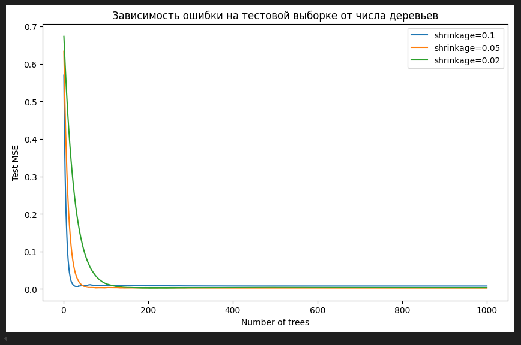
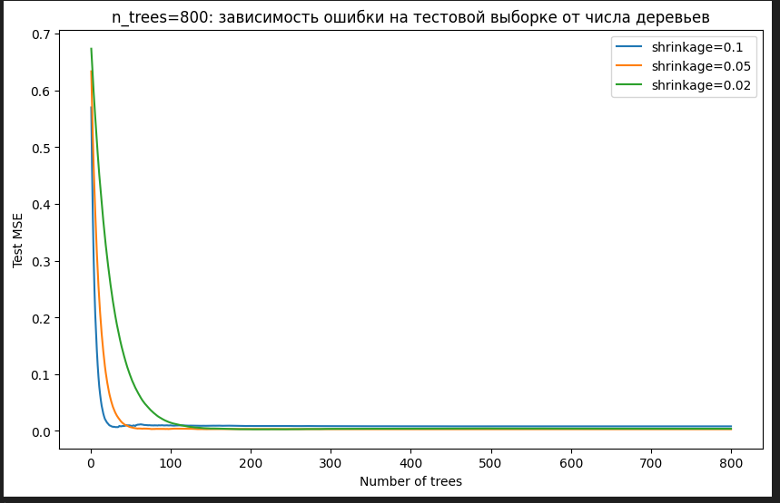
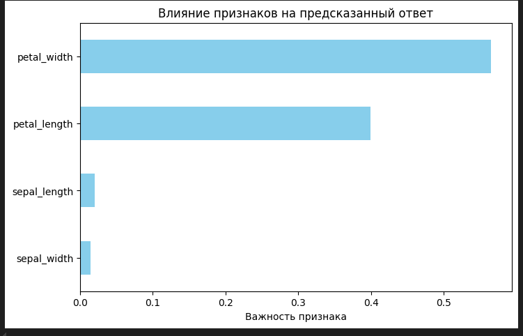

# Лабораторная работа: Градиентный бустинг на данных Iris

## 1. Разведывательный анализ (EDA)

### 1.1 Базовая информация

- Датасет Iris содержит 150 объектов и 5 колонок: `sepal_length`, `sepal_width`, `petal_length`, `petal_width`, `species`.
- Целевая переменная: `species` (три класса: `Iris-setosa`, `Iris-versicolor`, `Iris-virginica`).
- Все признаки числовые.

### 1.2 Распределение признаков

- Гистограммы показывают, что `petal_length` и `petal_width` лучше разделяют классы.
- Диаграммы рассеяния (pairplot) подтверждают, что лепестки более информативны для классификации.

### 1.3 Корреляция признаков

- `petal_length` и `petal_width` сильно коррелируют.
- Сепальные признаки менее информативны для разделения классов.

## 2. Обучение моделей градиентного бустинга

### 2.1 Подготовка данных

- Признаки: `sepal_length`, `sepal_width`, `petal_length`, `petal_width`
- Целевая переменная: закодированные числовые метки `species`.
- Train/test split: 80%/20%.

### 2.2 Настройка параметров

- `n_trees = 1000`, `max_depth = 3`, `learning_rate = 0.25`, `bag_fraction = 1.0`
- Функции потерь: `squared_error` (Gaussian) и `absolute_error` (Laplace)

### 2.3 Ошибки на тестовой выборке

```
squared_error: 0.0036
absolute_error: 0.3667
```
- Gaussian дает лучшую точность.

## 3. Зависимость ошибки от числа деревьев

- Проверены значения `shrinkage`: 0.1, 0.05, 0.02
- `bag_fraction = 0.65`
- Построены графики зависимости тестовой ошибки от числа деревьев.
- Меньший `shrinkage` → более стабильная ошибка, но медленнее обучение.

### 3.1 n_trees = 1000



### 3.2 n_trees = 800



- Уменьшение числа деревьев слегка увеличивает ошибку.

## 4. Выводы по влиянию параметров

- **Лучшая функция потерь:** `squared_error` (Gaussian)
- Оптимальные параметры: `n_trees ≈ 800–1000`, `max_depth = 3`, `learning_rate = 0.05–0.1`, `subsample = 0.65`
- Меньший `learning_rate` → более стабильное обобщение.
- `bag_fraction` < 1.0 помогает регуляризации.

## 5. Влияние признаков (Feature Importance)



- Наиболее важные признаки: `petal_length`, `petal_width`
- Менее важные: `sepal_length`, `sepal_width`

## Контрольные вопросы

1. **Постановка задачи общего метода бустинга:**
   - Бустинг строит последовательность слабых моделей, каждая из которых исправляет ошибки предыдущих, с целью улучшения точности.

2. **Алгоритм градиентного бустинга:**
   - Инициализация предсказания константой.
   - Вычисление градиента функции потерь.
   - Обучение новой модели на градиенте.
   - Обновление предсказания с шагом learning_rate.
   - Повторение для заданного числа деревьев.

3. **Преимущества бустинга:**
   - Высокая точность предсказания.
   - Возможность работать с различными функциями потерь.
   - Снижает смещение слабых моделей.

4. **Недостатки бустинга:**
   - Чувствителен к шуму в данных.
   - Долго обучается на больших датасетах.
   - Возможность переобучения при слишком большом числе деревьев.

5. **Преимущества деревьев решений в бустинге:**
   - Простота и интерпретируемость.
   - Хорошо справляются с нелинейными зависимостями.
   - Не требуют масштабирования признаков.

6. **Квадратичный штраф и штраф по абсолютной величине отклонения:**
   - Квадратичный штраф (`squared_error`) penalизирует большие ошибки сильнее.
   - Абсолютная величина отклонения (`absolute_error`) одинаково penalизирует все ошибки.

7. **Функция `gbm.more` пакета gbm:**
   - Позволяет дополнительно увеличить число итераций (деревьев) для уже обученной модели без повторного обучения с нуля.

