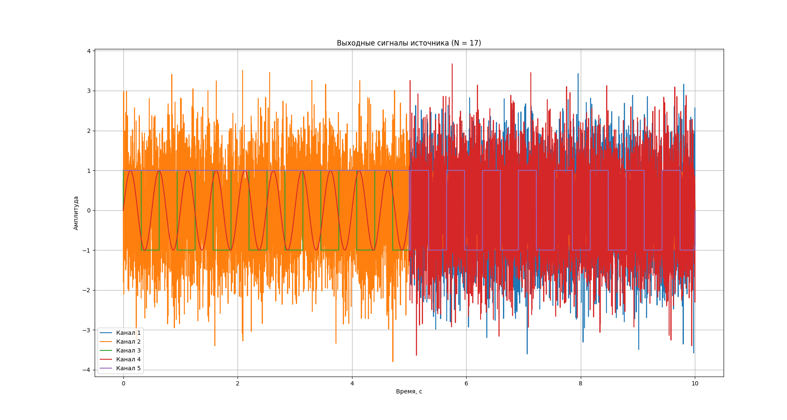

# Лабораторная работа 1

## Тема работы
Моделирование источника сигналов с использованием программной среды Python (аналог Simulink Subsystem).

---

## Цель работы
Изучение принципов формирования различных видов сигналов, разбиения их на временные диапазоны, а также построение многоканального источника сигналов, оформленного в виде подсистемы.

---

## Исходные данные

Номер варианта: **N = 17**

### Расчёт параметров варианта

- \( N \bmod 3 = 17 \bmod 3 = 2 \)
- \( N \bmod 5 = 17 \bmod 5 = 2 \)

### Количество каналов (таблица 1.1)

| N mod 3 | Количество каналов Ккан |
|-------|------------------------|
| 2 | **5** |

### Количество диапазонов на канал (таблица 1.2)

| N mod 3 | Количество диапазонов Кдиап |
|-------|-----------------------------|
| 2 | **2** |

---

## Привязка сигналов kКД (таблица 1.3)

| Канал | Диапазон 1 | Диапазон 2 |
|------|------------|------------|
| 1 | 1 | 2 |
| 2 | 5 | 6 |
| 3 | 9 | 10 |
| 4 | 13 | 14 |
| 5 | 17 | 18 |

---

## Определение типа сигнала

Тип сигнала в каждом диапазоне определяется по формуле:

\[ Z = (Nкан + Nдиап + N + kКД) \bmod 12 \]

где:
- \(Nкан\) — номер канала
- \(Nдиап\) — номер диапазона
- \(N\) — номер варианта
- \(kКД\) — индекс сигнала

### Пример расчёта

Для 1-го канала, 1-го диапазона:

\[ Z = (1 + 1 + 17 + 1) \bmod 12 = 20 \bmod 12 = 8 \]

Сигнал: **нулевой**

Аналогичные вычисления выполнены для всех каналов и диапазонов.

---

## Используемые типы сигналов (таблица 1.4)

В ходе выполнения лабораторной работы были использованы следующие источники сигналов:

- Источник случайного сигнала с нормальным распределением
- Источник случайного сигнала с равномерным распределением
- Генератор ступенчатого сигнала
- Источник импульсного сигнала
- Источник линейно изменяющегося воздействия
- Генератор линейно-изменяющейся частоты
- Генератор белого шума
- Генератор синусоидального сигнала (Signal Generator)

---

## Реализация модели

Модель источника сигналов реализована на языке Python с использованием библиотек:

- `numpy` — для математических операций и генерации сигналов
- `matplotlib` — для визуализации результатов моделирования

Каждый канал представляет собой независимый выход подсистемы, аналогичной Subsystem в Simulink. Переключение сигналов осуществляется автоматически по временным диапазонам.

---

## Результаты моделирования

В результате моделирования получены выходные сигналы для 5 каналов, каждый из которых состоит из двух временных диапазонов с различными типами сигналов.

---

## Выводы

В ходе выполнения лабораторной работы был разработан многоканальный источник сигналов с временным разбиением, полностью соответствующий заданию. Реализованная модель корректно формирует различные типы сигналов и может рассматриваться как функциональный аналог подсистемы Simulink.

---

# Контрольные вопросы

## 1. Перечислить источники сигналов библиотеки Sources

К основным источникам сигналов библиотеки Sources относятся:
- Constant
- Sine Wave
- Signal Generator
- Step
- Pulse Generator
- Ramp
- Random Source
- Uniform Random Number
- Band-Limited White Noise

---

## 2. Описать источник постоянного сигнала Constant

Источник Constant формирует сигнал с постоянным значением амплитуды, не изменяющимся во времени. Используется для задания опорных уровней, смещений и постоянных воздействий.

---

## 3. Описать источник синусоидального сигнала Sine Wave

Источник Sine Wave формирует гармонический сигнал синусоидальной формы с заданной амплитудой, частотой, фазой и смещением.

---

## 4. Описать два алгоритма формирования сигнала Sine Wave

1. **По времени моделирования** — значение сигнала вычисляется как функция текущего времени моделирования.
2. **Итерационный (дискретный)** — сигнал формируется по разностному уравнению с учётом предыдущего значения.

---

## 5. Характеристика использованных генераторов сигналов

В работе использовались шумовые, детерминированные и периодические источники сигналов, позволяющие моделировать реальные физические воздействия и случайные процессы.

---

## 6. Характеристика неиспользованных генераторов сигналов

Не использовались источники постоянного сигнала, экспоненциальные и пользовательские табличные источники, так как они не требовались по условию варианта.

--- 