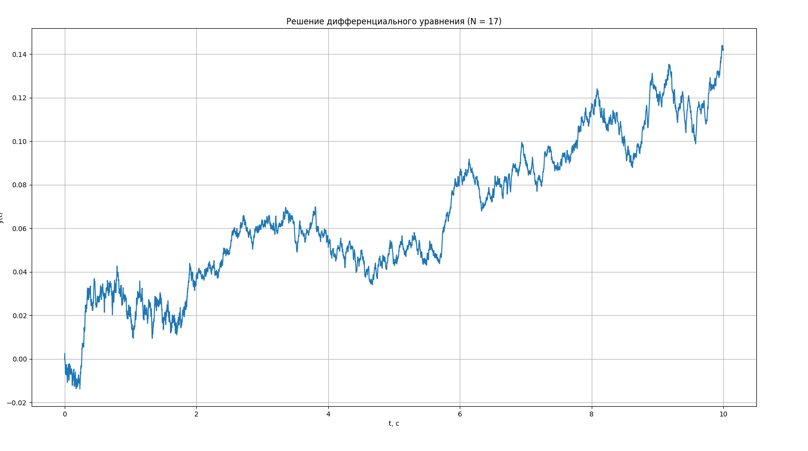

# Лабораторная работа № 2

## Решение дифференциальных уравнений и систем дифференциальных уравнений

---

### Цель работы

Приобретение навыков построения математических моделей дифференциальных уравнений и получения их решений с использованием средств численного моделирования на языке программирования **Python**.

---

## 1. Исходные данные

Номер варианта: **N = 17**
Количество каналов (из лабораторной работы №1):

[
K_{кан} = N \bmod 3 = 17 \bmod 3 = 2 \Rightarrow K_{кан} = 5
]

---

## 2. Определение вида уравнения

Согласно заданию, вид уравнения определяется по формуле:

[
N \bmod 3 = 2
]

Для данного значения используется **дифференциальное уравнение первого порядка**:

[
f(t),y'(t) + a(t),y(t) = c(t)
]

где коэффициенты ( f(t), a(t), c(t) ) являются функциями времени и формируются на основе источников сигналов.

---

## 3. Выбор коэффициентов уравнения

Коэффициенты уравнения определяются на основе каналов источника сигналов:

| Коэффициент | Формула выбора канала | Номер канала |
| ----------- | --------------------- | ------------ |
| (f(t))      | (N \bmod K_{кан})     | 3 канал      |
| (a(t))      | ((N+1) \bmod K_{кан}) | 4 канал      |
| (c(t))      | ((N+2) \bmod K_{кан}) | 5 канал      |

Диапазоны сигналов определяются по формуле:

[
((N+i) \bmod 4) + 1
]

---

## 4. Математическая модель

Приведём уравнение к виду, удобному для численного решения:

[
y'(t) = \frac{c(t) - a(t),y(t)}{f(t)}
]

Для получения решения используется численный метод, реализованный в функции `solve_ivp` библиотеки **SciPy**, который является аналогом интегрирующего блока Simulink.

---

## 5. Реализация модели в Python

Модель реализована в виде отдельных модулей:

* модуль источников сигналов (коэффициентов),
* модуль дифференциального уравнения,
* основной файл запуска и визуализации результатов.

Коэффициенты уравнения задаются как функции времени, что соответствует использованию блоков Sources и Fcn в Simulink.

---

## 6. Результаты моделирования

По полученному графику можно проанализировать поведение решения во времени и влияние изменяющихся коэффициентов на динамику системы.

---

## 7. Выводы

В ходе выполнения лабораторной работы было построено дифференциальное уравнение первого порядка с коэффициентами, зависящими от времени. Уравнение было реализовано и решено численно с использованием языка программирования Python.

В результате работы были получены навыки:

* построения математической модели дифференциального уравнения;
* задания коэффициентов в виде временных функций;
* применения численных методов решения дифференциальных уравнений;
* анализа полученных результатов моделирования.

Поставленная цель лабораторной работы была достигнута.

---

## Контрольные вопросы

### 1. Основные функциональные возможности блока задания функции **Fcn**

Блок **Fcn** предназначен для задания произвольной аналитической зависимости выходного сигнала от входных переменных. Он позволяет реализовывать математические выражения любой сложности, включая алгебраические операции и элементарные функции.

---

### 2. Способы подключения библиотеки функции MATLAB **Fcn**

Блок **Fcn** доступен в библиотеке Simulink *Math Operations*. Он может быть добавлен в модель через окно Library Browser либо путём поиска по названию блока. Также возможно использование пользовательских функций MATLAB через блоки MATLAB Function.

---

### 3. Основные возможности блоков выполнения арифметических функций

Арифметические блоки предназначены для выполнения операций сложения, вычитания, умножения, деления, возведения в степень и других математических преобразований сигналов. Они позволяют формировать сложные вычислительные цепочки и используются при построении математических моделей.

---

### 4. Способы использования интегрирующего и дифференцирующего блоков

Интегрирующий блок используется для численного интегрирования входного сигнала и широко применяется при моделировании дифференциальных уравнений. Дифференцирующий блок предназначен для вычисления производной сигнала, однако на практике применяется реже из-за чувствительности к шумам.

В данной работе интегрирование реализовано численным методом, что является аналогом интегрирующего блока Simulink.
