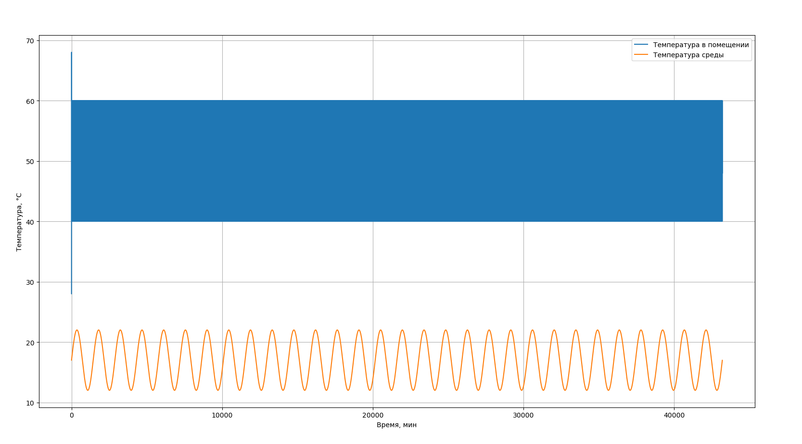
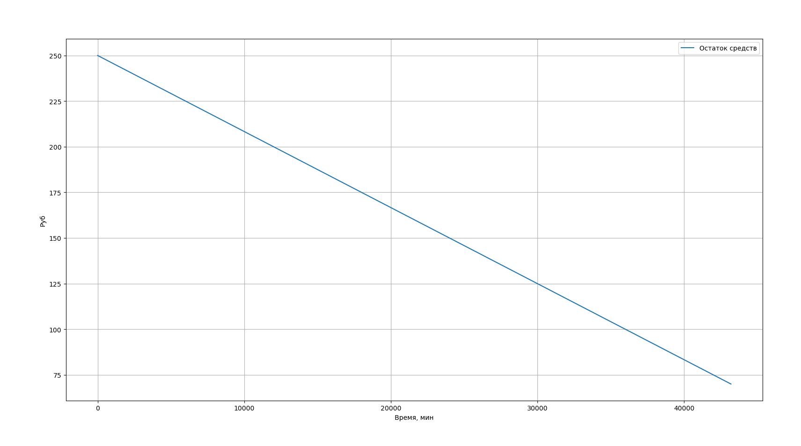

# Лабораторная работа №4

## Построение сложных систем моделирования термодинамических процессов

---

## Цель работы

Приобретение навыков построения объектно-ориентированных моделей термодинамических процессов и проведения вычислительных экспериментов по моделированию системы терморегулирования дома с использованием языка программирования **Python**.

---

## 1. Исходные данные

Номер варианта: **17**

Параметры варианта:

| Параметр | Значение |
|--------|---------|
| Максимальная температура в помещении, °C | 22 |
| Минимальная температура в помещении, °C | 16 |
| Закон изменения температуры среды | Sin |
| Максимальная температура среды, °C | 22 |
| Минимальная температура среды, °C | 12 |
| Температура выключения калорифера, °C | 60 |
| Температура включения калорифера, °C | 40 |
| Коэффициент нагревания, °C/мин | 10 |
| Коэффициент охлаждения, °C/мин | 4 |
| Мощность калорифера, кВт | 3.5 |
| Максимальная стоимость отопления, грн | 250 |

Дополнительные условия моделирования:

- длительность отопительного сезона — **30 суток**;
- дискретность моделирования — **1 минута**;
- общее время моделирования:

\[
T = 60 \cdot 60 \cdot 24 \cdot 30 = 43\,200 \text{ минут}
\]

- стоимость электроэнергии: **0.25 грн за 1 кВт·ч**.

---

## 2. Описание математической модели

Система терморегулирования состоит из следующих компонентов:

- окружающая среда;
- помещение;
- калорифер;
- термостат;
- блок расчёта энергопотребления и стоимости.

Температура окружающей среды моделируется по синусоидальному закону:

\[
T_{env}(t) = \frac{T_{max}+T_{min}}{2} + 
\frac{T_{max}-T_{min}}{2} \cdot \sin\left(\frac{2\pi t}{1440}\right)
\]

где \(t\) — время в минутах.

Логика управления калорифером:

- если \(T_{room} \leq T_{on}\) — калорифер включается;
- если \(T_{room} \geq T_{off}\) — калорифер выключается.

Изменение температуры помещения:

- при включённом калорифере:

\[
T_{room}(t+1) = T_{room}(t) + K_n
\]

- при выключённом калорифере:

\[
T_{room}(t+1) = T_{room}(t) - K_o
\]

---

## 3. Расчёт энергопотребления

Мощность калорифера указана в кВт и соответствует потреблению за 1 час непрерывной работы.

Энергопотребление за одну минуту:

\[
E_{1min} = \frac{P}{60}
\]

Стоимость одной минуты работы калорифера:

\[
C_{1min} = \frac{P}{60} \cdot 0.25
\]

Для варианта 17:

\[
C_{1min} = \frac{3.5}{60} \cdot 0.25 \approx 0.0146 \text{ руб}
\]

---

## 4. Реализация модели в Python

Модель реализована в виде объектно-ориентированной структуры и разбита на отдельные модули:

- `environment.py` — температура окружающей среды;
- `room.py` — модель помещения;
- `heater.py` — калорифер и расчёт энергопотребления;
- `thermostat.py` — логика управления;
- `simulation.py` — основной цикл моделирования;
- `main.py` — запуск и визуализация результатов.

Такой подход соответствует иерархической структуре моделей Simulink и Stateflow.

---

## 5. Результаты моделирования

