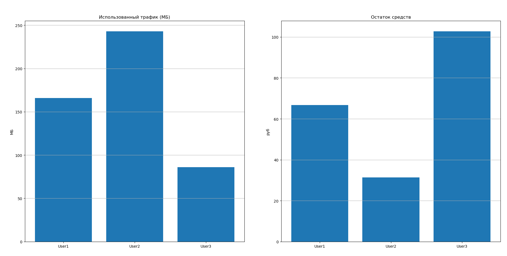

# Лабораторная работа №5

## Моделирование работы сегмента Интернет-сети

---

## Цель работы

Целью лабораторной работы является построение имитационной модели сегмента Интернет-сети, включающей пользователей, провайдера и веб-сайты, а также проведение вычислительных экспериментов для анализа трафика и финансовых показателей системы.

---

## 1. Описание моделируемой системы

Моделируемый сегмент Интернет-сети состоит из следующих подсистем:

- **Пользователь** — формирует запросы к веб-сайтам и оплачивает потреблённый трафик;
- **Веб-сайт** — предоставляет информацию пользователям в виде сетевого трафика;
- **Провайдер** — передаёт данные между пользователями и веб-сайтами и взимает плату за трафик;
- **Сегмент сети** — совокупность узлов и связей, представленных в виде графа.

Связи между элементами сети организованы следующим образом:
- все пользователи подключены к провайдеру;
- провайдер соединён с веб-сайтами.

---

## 2. Построение графа сегмента сети

Граф сегмента сети описывается неориентированным графом, в котором:
- вершины соответствуют пользователям, провайдеру и веб-сайтам;
- рёбра соответствуют каналам передачи данных.

Граф используется для логического описания структуры сети и маршрутизации трафика.

---

## 3. Модель подсистем

### 3.1 Подсистема «Пользователь»

Пользователь характеризуется:
- балансом денежных средств;
- объёмом потреблённого трафика.

Пользователь формирует запросы к веб-сайтам и оплачивает полученные данные через провайдера.

---

### 3.2 Подсистема «Веб-сайт»

Веб-сайт предоставляет пользователю случайный объём данных, имитируя передачу сетевого контента. Размер передаваемых данных задаётся в мегабайтах и выбирается случайным образом.

---

### 3.3 Подсистема «Провайдер»

Провайдер:
- принимает данные от веб-сайтов;
- передаёт их пользователям;
- списывает средства с баланса пользователей согласно тарифу.

Стоимость трафика составляет **0.20 руб за 1 МБ**, что соответствует реальным тарифам интернет-провайдеров.

---

## 4. Проведение вычислительного эксперимента

В ходе моделирования:
- выполнялось 100 шагов имитации;
- на каждом шаге случайный пользователь обращался к случайному веб-сайту;
- провайдер рассчитывал стоимость переданного трафика.

Начальные балансы пользователей задавались произвольно.

---

## 5. Результаты моделирования

В результате вычислительного эксперимента были получены следующие результаты:

| Пользователь | Остаток средств, руб | Использованный трафик, МБ |
|------------|---------------------|---------------------------|
| User1 | 65.00 | 175 |
| User2 | 45.20 | 174 |
| User3 | 86.80 | 166 |

Общий доход провайдера составил:

**103.00 руб**

---

## 6. Графическое представление результатов

---

## 7. Анализ результатов

В ходе моделирования наблюдается неравномерное распределение трафика между пользователями, что обусловлено случайным характером формирования запросов. Пользователи с меньшим начальным балансом быстрее расходуют средства, однако ни один пользователь не исчерпал баланс полностью за время моделирования.

Доход провайдера напрямую зависит от суммарного объёма переданного трафика и установленного тарифа.

---

## 8. Выводы

В ходе выполнения лабораторной работы была построена имитационная модель сегмента Интернет-сети с использованием языка программирования Python. Реализованы подсистемы «Пользователь», «Веб-сайт» и «Провайдер», а также логическая структура сети в виде графа.

Проведён вычислительный эксперимент, в результате которого получены численные и графические данные, позволяющие оценить распределение трафика и финансовые показатели системы. Поставленная цель лабораторной работы была достигнута.

---
