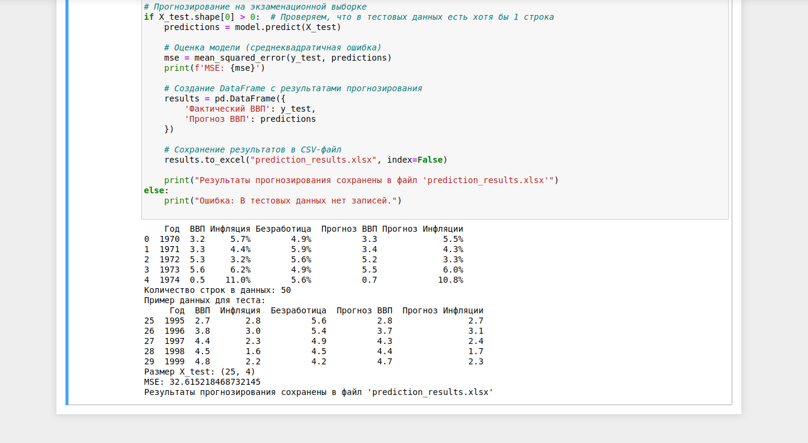

# Лабораторная работа № 1

## Применение метода группового учета аргументов к анализу сложных процессов

### Цель работы: изучить метод группового учета аргументов, применить его к построению прогнозных моделей сложной системы (процесса).

### Задание

1. Выбрать в Интернете данные для выполнения лабораторной работы (см. Образец данных). Обьем данных не менее 50 объектов×5÷7 
   показателей для двух периодов времени.

2. Разделить данные на две одинаковых выборки – обучающую и экзаменационную. 

3. По обучающей выборке построить множество различных моделей вида:

4. Используя критерий минимума смещения (3) и данные экзаменационной выборки, выбрать оптимальную модель среди множества полученных моделей.

5. На основе оптимальной модели осуществить прогноз развития процесса или функционирования объекта.

6. Можно использовать любые языки программирования и программные продукты. 

## План выполнения работы

1. Первое занятие. Построение множества моделей.

2. Второе занятие. Выбор оптимального вида модели. Осуществление прогнозных расчетов. Защита лабораторной работы.

> Для данные по прогнозам ВВП, инфляции, безработицы
> с помощью python обработал данные, очистил их и разделил на обучающую и
> экзаменационную выборки.
> Используя критерий минимума смещения и данные экзаменационной выборки,
> выбрал оптимальную модель среди множества полученных моделей.
> На основе оптимальной модели осуществил прогноз развития процесса.
> Файл с результатами прикреплен. 