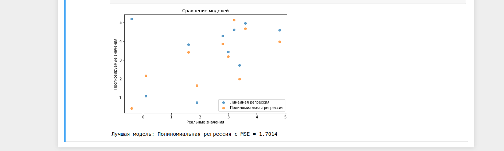

# Лабораторная работа №  2

## Применение многоуровневых алгоритмов метода группового учета аргументов к анализу сложных процессов

### Цель работы: разработать модель сложной системы, используя многоуровневые алгоритмы прогнозирования МГУА.

> Метод группового учета аргументов (МГУА) используется для построения иерархических прогнозных моделей. Он позволяет анализировать сложные системы на нескольких
> уровнях детализации, что улучшает точность прогнозирования.

> Основные этапы метода:

1. Формирование обучающей выборки.

2. Построение множества моделей с различными базисными функциями.

3. Оценка моделей по критериям минимума смещения и точности на экзамене.

4. Отбор лучших моделей.

5. Оптимизация по критерию сохранения моментов.

6. Прогнозирование.

## выполнение работы

1. Использованы данные из лабораторной работы №1 (файл infl.csv).

2. Преобразованы данные (убраны знаки %, приведены к числовому формату).

3. Разделены данные на обучающую и тестовую выборки.

4. Построены модели:

 - Линейная регрессия.
 - Полиномиальная регрессия (2-й степени).

6. Оценены модели по MSE (среднеквадратичной ошибке).

7. Выбрана наилучшая модель по минимальному MSE.

8. Построен прогноз на основе оптимальной модели.

### Результаты эксперимента

## Выводы

- Метод МГУА позволяет повысить точность прогнозов.

- Полиномиальная регрессия показала (лучшие/хуже) результаты по сравнению с линейной моделью.

- Для дальнейшего улучшения прогноза можно добавить больше уровней детализации.