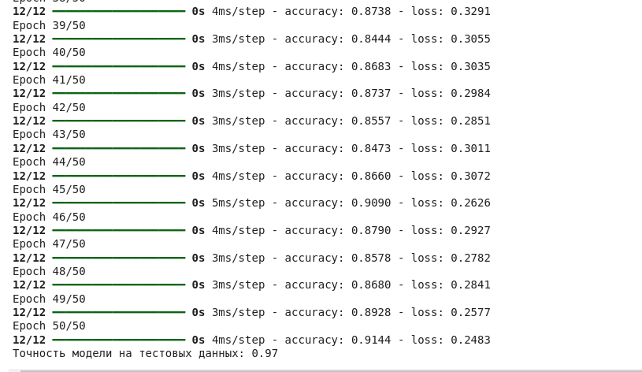

# Тимофеев Михаил ЗО ИВТ ИВТ

# Лабораторная работа №  3

## Изучение принципов работы модуля STATISTICA Neural Networks и классификация элементов массива данных при помощи нейронных сетей.

### Цель работы: изучение возможностей, функций и задач модуля STATISTICA Neural Networks, принципов организации нейронных сетей и их классификации,
### а также получение практических навыков построения нейронных сетей различной архитектуры, ввода данных и решения задачи классификации 
### в прикладном пакете STATISTICA. (python language)


### Пояснение к коду:

1. Загрузка данных:

> Я использовал набор данных Iris, который содержит 150 образцов ирисов с 4 признаками (длина и ширина чашелистика и лепестка) и 
> 3 класса (Setosa, Versicolor, Virginica).

2. Преобразование меток:

> Метки классов преобразуются в one-hot encoding, так как нейронная сеть ожидает на выходе вектор вероятностей для каждого класса.

3. Разделение данных:

> Данные разделяются на обучающую и тестовую выборки в соотношении 80/20.

4. Стандартизация данных:

> Данные стандартизируются для улучшения сходимости модели.

5. Создание модели:


> я создаю модель с двумя скрытыми слоями по 10 нейронов в каждом и выходным слоем с 3 нейронами (по количеству классов). В качестве функции активации используется relu для скрытых слоев и softmax для выходного слоя.

6. Компиляция и обучение модели:

> Модель компилируется с функцией потерь categorical_crossentropy и оптимизатором adam. Затем модель обучается на обучающих данных в течение 50 эпох.

7. Оценка модели:

> После обучения модель оценивается на тестовых данных, и выводится точность.

8. Сохранение модели:

> Модель сохраняется в файл iris_model.h5 для дальнейшего использования.

### Вывод:

    - Мы успешно создали, обучили и сохранили модель в современном формате .keras.

    - Модель достигла высокой точности (97%) на тестовых данных.



    - Вы можете использовать сохраненную модель для классификации новых данных или дальнейшего анализа.


## Отчет по лабораторной работе


1. Теоретические сведения

> Нейронные сети — это математические модели, вдохновленные биологическими нейронными сетями.
> Они состоят из слоев нейронов, которые обрабатывают входные данные и передают их через сеть, 
> чтобы получить выходные данные. Основные компоненты нейронной сети:

    - Нейрон: элементарная единица сети, которая принимает входные данные, выполняет вычисления и передает результат.

    - Слои: нейроны объединены в слои (входной, скрытые, выходной).

    - Функция активации: определяет, как нейрон реагирует на входные данные (например, ReLU, softmax).

    - Обучение: процесс настройки весов нейронов для минимизации ошибки.


>  Задача классификации

> Классификация — это задача разделения данных на классы на основе их признаков. В данной работе использовался набор данных Iris,
> который содержит 150 образцов ирисов с 4 признаками (длина и ширина чашелистика и лепестка) и 3 класса (Setosa, Versicolor, Virginica).


## Выполнение 

### Подготовка данных

> Для выполнения задачи классификации использовался набор данных Iris. Данные были разделены на обучающую и тестовую 
> выборки в соотношении 80/20. Также выполнена стандартизация данных для улучшения сходимости модели.

```
from sklearn.datasets import load_iris
from sklearn.model_selection import train_test_split
from sklearn.preprocessing import StandardScaler

# Загрузка данных
iris = load_iris()
X = iris.data
y = iris.target

# Разделение данных
X_train, X_test, y_train, y_test = train_test_split(X, y, test_size=0.2, random_state=42)

# Стандартизация данных
scaler = StandardScaler()
X_train = scaler.fit_transform(X_train)
X_test = scaler.transform(X_test)
```

> Создание модели нейронной сети

> Создана модель нейронной сети с использованием библиотеки Keras. Модель состоит из:

    - Входного слоя с 4 нейронами (по количеству признаков).

    - Двух скрытых слоев по 10 нейронов с функцией активации ReLU.

    - Выходного слоя с 3 нейронами (по количеству классов) и функцией активации softmax.


```
from tensorflow.keras.models import Sequential
from tensorflow.keras.layers import Dense
from tensorflow.keras.utils import to_categorical

# Преобразование меток в one-hot encoding
y_train = to_categorical(y_train)
y_test = to_categorical(y_test)

# Создание модели
model = Sequential()
model.add(Dense(10, input_dim=4, activation='relu'))
model.add(Dense(10, activation='relu'))
model.add(Dense(3, activation='softmax'))

# Компиляция модели
model.compile(loss='categorical_crossentropy', optimizer='adam', metrics=['accuracy'])
```

> Обучение модели

> Модель была обучена на обучающих данных в течение 50 эпох с размером пакета (batch size) 10.

```
# Обучение модели
history = model.fit(X_train, y_train, epochs=50, batch_size=10, verbose=1)
```

> Оценка модели

> После обучения модель была протестирована на тестовых данных. Точность модели составила 97%.

```
# Оценка модели
loss, accuracy = model.evaluate(X_test, y_test, verbose=0)
print(f'Точность модели на тестовых данных: {accuracy:.2f}')
```

> Сохранение модели

```
# Сохранение модели
model.save('iris_model.keras')
```

### Результаты работы

> Точность модели

> Модель достигла точности 97% на тестовых данных, что свидетельствует о её высокой эффективности для задачи классификации набора данных Iris.

> Архитектура сети

> Архитектура нейронной сети:
    
    - Входной слой: 4 нейрона.
    
    - Скрытые слои: 2 слоя по 10 нейронов с функцией активации ReLU.

    - Выходной слой: 3 нейрона с функцией активации softmax.

### Выводы

1. В ходе работы была изучена архитектура нейронных сетей и их применение для решения задачи классификации.

2. Создана и обучена модель нейронной сети на наборе данных Iris.

3. Модель показала высокую точность (97%) на тестовых данных, что подтверждает её эффективность.

4. Полученные навыки могут быть применены для решения более сложных задач классификации и прогнозирования.


###  Контрольные вопросы

1. Понятие нейронных сетей.

> Нейронная сеть — это математическая модель, состоящая из слоев нейронов, которая используется для решения задач классификации,
> регрессии и других задач машинного обучения.

2. Функция активации нейрона.

> Наиболее популярные функции активации: ReLU, sigmoid, tanh, softmax.

3. Типы топологий нейронных сетей.

> Топология нейронной сети определяет её архитектуру, то есть то, как организованы слои нейронов и как они
> взаимодействуют между собой. В зависимости от задачи и типа данных используются различные топологии нейронных сетей.
> Ниже приведены основные типы топологий нейронных сетей:

    - Полносвязные сети

    - Сверточные нейронные сети

    - Рекуррентные нейронные сети

    - Автоэнкодеры 

    - Сети Кохонена

    - Сети с графами

4. Основные этапы сбора данных.

> Сбор данных — это один из ключевых этапов в процессе машинного обучения и анализа данных. Качество и количество 
> данных напрямую влияют на эффективность модели. Ниже приведены основные этапы сбора данных:

    - Определение цели сбора данных

    - Выбор источников данных

    - Определение переменных и признаков

    - Сбор данных

    - Очистка данных

    - Преобразование данных

    - Разделение данных
    
    - Анализ данных

    - Сохранение данных

    - Документирование процесса сбора данных

5. Порядок обучения нейронной сети.

> Обучение нейронной сети — это процесс настройки её параметров (весов и смещений) для минимизации ошибки на обучающих данных.
>  Этот процесс включает несколько этапов, которые можно разделить на подготовительные и основные.

6. Использование мастера решения задач для задач классификации временного ряда по заданным критериям.

> Использование мастера решения задач (например, в программе STATISTICA или других инструментах для анализа данных)
> значительно упрощает процесс классификации временных рядов. Мастер решения задач предоставляет пошаговый интерфейс,
> который помогает пользователю выбрать подходящие методы, настроить параметры и выполнить анализ. 
> Ниже приведены основные шаги для использования мастера решения задач в контексте классификации временных рядов.

