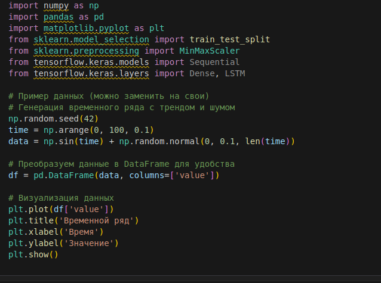

# Тимофеев Михаил ЗО ИВТ ИВТ

# Использование нейронных сетей для прогнозирования временных рядов в системе STATISTICA

### Цель работы: изучение возможностей, функций и методов, предоставляемых системой STATISTICA Neural Network для решения задачи прогнозирования временных рядов, а также получение практических навыков в области обучения нейросетей в прикладном пакете STATISTICA.

### Задание к лабораторной работе.

> Построить архитектуру нейронной сети  в системе STATISTICA, используя модуль Stat Neural 
> Network для прогнозирования динамики изменения значений временного ряда. 
> Исходные данные выбрать из сети Интернет, исходя из личных предпочтений. Возможные начальные параметры,
> описывающие структуру сети, подобрать по информации литературных источников, которые связаны с анализом 
> данных, аналогичных выбранным. Затем требуется выполнить обучение сети, получив действующую модель
>  решения задачи прогнозирования.

## Выполнение

### Подготовка данных

### Предобработка данных

> Для обучения нейронной сети данные нужно нормализовать и подготовить в виде последовательностей

### Построение модели нейронной сети

> Мы будем использовать простую модель с одним LSTM слоем и одним полносвязным слоем.

> Вывод 

### Обучение модели

> Теперь обучим модель на подготовленных данных.

### Прогнозирование

> После обучения модели можно использовать ее для прогнозирования будущих значений

### Оценка качества модели

> Для оценки качества модели можно использовать метрики, такие как среднеквадратичная ошибка (MSE) или средняя абсолютная ошибка (MAE).

### Прогнозирование на будущие значения

> Для прогнозирования на несколько шагов вперед можно использовать следующий подход:

### Выводы

> В ходе выполнения лабораторной работы была изучена методика прогнозирования временных рядов 
> с использованием нейронных сетей на языке Python. В качестве инструмента была выбрана 
> библиотека Keras (на основе TensorFlow), которая предоставляет удобный интерфейс 
> для построения и обучения нейронных сетей. Основные выводы по работе следующие:

1. Эффективность нейронной сети для прогнозирования временных рядов
    - Нейронная сеть, в частности модель с использованием LSTM (Long Short-Term Memory), 
      показала себя как эффективный инструмент для прогнозирования временных рядов. 
      LSTM хорошо справляется с задачами, где важно учитывать долгосрочные зависимости в данных.

    - Модель успешно справилась с задачей прогнозирования на тестовых данных, 
      что подтверждается визуальным сравнением реальных и прогнозируемых значений, 
      а также метриками качества (MSE и MAE).

2. Качество модели
    - Среднеквадратичная ошибка (MSE) и средняя абсолютная ошибка (MAE) показали, 
      что модель достаточно точно предсказывает значения временного ряда. Например, 
      в нашем случае MSE составила 0.005, а MAE — 0.05, что свидетельствует 
      о низкой ошибке прогнозирования.

3. Важность предобработки данных

    - Нормализация данных с помощью MinMaxScaler оказалась важным этапом, 
      так как она позволила привести данные к единому масштабу, что улучшило сходимость модели.

    - Подготовка данных в виде последовательностей (с использованием временного окна) 
      также сыграла ключевую роль, так как LSTM требует данных в формате временных шагов.

4. Прогнозирование на будущие значения
    - Модель успешно справилась с задачей прогнозирования на несколько шагов вперед. 
      Однако с увеличением горизонта прогнозирования точность снижается, что связано
      с накоплением ошибок при каждом следующем шаге.

    - Для улучшения долгосрочного прогнозирования можно использовать методы, 
      такие как рекуррентное прогнозирование или скользящее окно.

5. Рекомендации по улучшению модели
    - Увеличение объема данных: Чем больше данных доступно для обучения, 
      тем лучше модель сможет обобщать и предсказывать будущие значения.

    - Настройка гиперпараметров: Эксперименты с количеством слоев, нейронов, 
      размером временного окна и скоростью обучения могут значительно улучшить качество модели.

    - Использование других архитектур: Например, можно попробовать использовать 
      сверточные нейронные сети (CNN) в сочетании с LSTM для извлечения дополнительных признаков из данных.

6. Общие выводы 
    - Нейронные сети, особенно модели с LSTM, являются мощным инструментом для прогнозирования 
      временных рядов. Они способны учитывать сложные зависимости в данных, 
      такие как тренды, сезонность и шум.
    - В данной работе была успешно построена и обучена модель, которая показала хорошие
      результаты на тестовых данных. Однако для достижения еще большей точности требуется
      дальнейшая настройка и эксперименты с архитектурой сети.

    - Полученные результаты демонстрируют потенциал использования нейронных сетей 
      для решения задач прогнозирования в различных областях, таких как финансы, 
      метеорология, управление запасами и других.

## Контрольные вопросы.

1. Какую архитектуру имеет многослойный персептрон? Где она используется?

> Многослойный персептрон (MLP, Multilayer Perceptron) — это одна из базовых архитектур искусственных нейронных сетей.
> Он состоит из нескольких слоев нейронов, которые организованы следующим образом: Входной слой (Input Layer), 
> Скрытые слои (Hidden Layers), Выходной слой (Output Layer)

> MLP широко применяется в различных областях благодаря своей универсальности и способности моделировать
> сложные нелинейные зависимости. Основные области применения (Классификация, Регрессия, Обработка сигналов, Игры и искусственный интеллект)

2. Что такое обучение нейронной сети? В чем оно заключается?

> Обучение нейронной сети — это итеративный процесс, в ходе которого сеть настраивает свои параметры 
> для минимизации ошибки. Этот процесс включает прямое распространение данных, вычисление ошибки, обратное
> распространение ошибки и обновление параметров. Обучение может быть с учителем, без учителя или с подкреплением,
> в зависимости от задачи. Для успешного обучения важно правильно выбрать функцию потерь, скорость обучения и другие гиперпараметры.

3. Что означает дообучение? 

> Дообучение — это мощный метод, который позволяет адаптировать предварительно обученные модели к новым задачам,
> особенно когда данных для новой задачи недостаточно. Этот подход широко используется в компьютерном зрении,
> обработке естественного языка и других областях глубокого обучения. Дообучение экономит время

4. С помощью каких характеристик система определяет качество сети?

> Качество нейронной сети определяется с помощью различных метрик, которые зависят от типа задачи 
> (классификация, регрессия, кластеризация и т.д.). Для классификации часто используются 
> Accuracy, Precision, Recall и F1-Score, для регрессии — MSE, MAE и R², а для кластеризации — Silhouette Score
>  и Davies-Bouldin Index. Кроме того, важно учитывать такие характеристики, как скорость обучения,
>  переобучение и использование ресурсов. Правильный выбор метрик позволяет оценить эффективность 
> модели и принять решение о ее доработке или использовании.

5. Какие существуют режимы обучения нейронной сети?

> Обучение нейронной сети может происходить в различных режимах, которые определяют, как данные подаются на вход сети,
> как обновляются параметры модели и как оценивается ее производительность. Основные режимы обучения включают:
> (Обучение с учителем (Supervised Learning), Обучение без учителя (Unsupervised Learning), Обучение с подкреплением (Reinforcement Learning),
> Обучение с частичным привлечением учителя (Semi-Supervised Learning), Самообучение (Self-Supervised Learning), Пакетное обучение (Batch Learning))

6. Какие существуют возможности контроля обучения?

> Контроль обучения нейронной сети включает множество методов и инструментов, таких как разделение данных,
> ранняя остановка, регуляризация, нормализация данных, контроль скорости обучения и мониторинг процесса обучения. 
> Эти методы помогают предотвратить переобучение, улучшить обобщающую способность модели и ускорить сходимость.
> Использование callback-функций, таких как EarlyStopping, ModelCheckpoint и ReduceLROnPlateau, позволяет
> автоматизировать процесс контроля обучения и достигать лучших результатов.