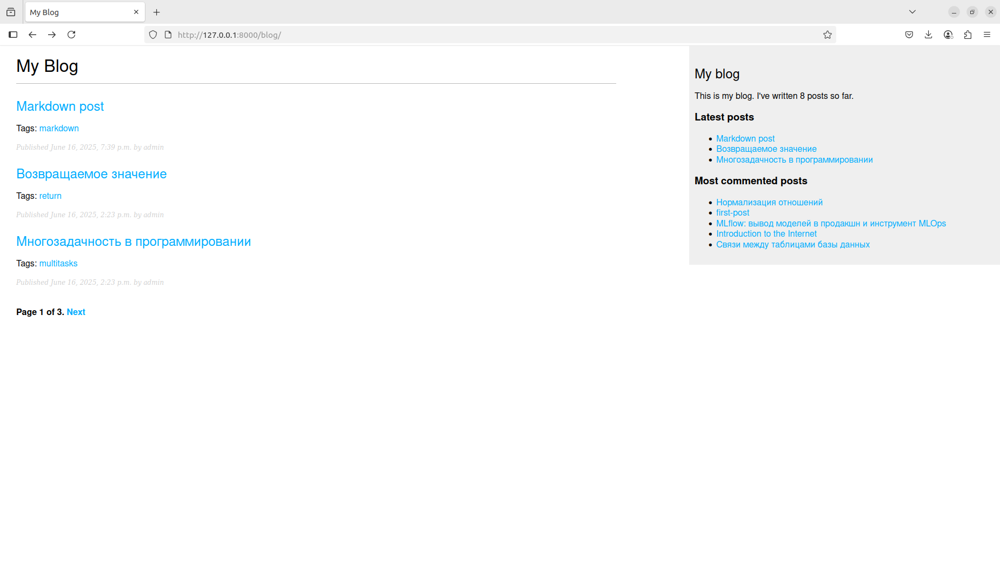
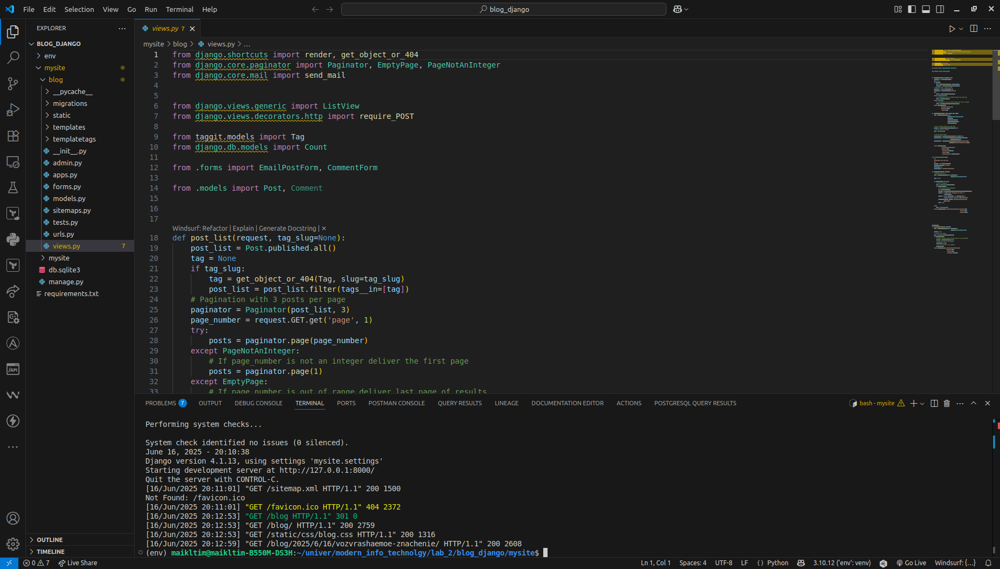
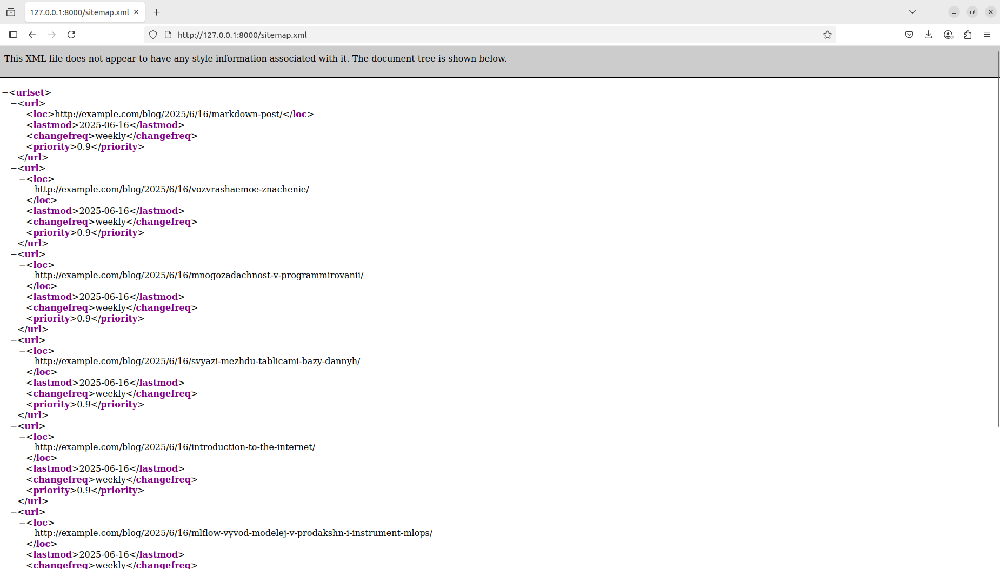

# Лабораторная работа № 2

## Интеллектуальный RSS-агент. Семантика и базы знаний


### Цели: Разработать Internet-агент (мультиагентную систему) в виде робота по сбору, доставке и показу в браузере или Win-приложении новостей из RSS-лент по ключевым словам, заданным пользователем.

> В простейшем варианте (оценивается стандартным количеством баллов) 
> агент должен показывать в браузере новости RSS-ленты по указанному URL-адресу

> Для выполнения лабораторной работы было разработано web - приложение (blog) на фреймворке Django







> показ в браузере новостей RSS-ленты по указанному URL-адресу



## Ответы на контрольные вопросы

1. **Понятие интеллектуального агента, мультиагентной системы, их типичные свойства**  
   **Интеллектуальный агент** — это автономная сущность, которая воспринимает окружающую среду через сенсоры, принимает решения на основе воспринятой информации и выполняет действия для достижения целей.  
   Типичные свойства:  
   - **Автономность**: способность действовать без прямого вмешательства человека.  
   - **Реактивность**: реагирование на изменения в среде.  
   - **Проактивность**: инициативное поведение для достижения целей.  
   - **Социальность**: взаимодействие с другими агентами.  
   - **Обучаемость**: адаптация на основе опыта.  

   **Мультиагентная система** — это совокупность интеллектуальных агентов, взаимодействующих друг с другом для решения задач.  
   Свойства:  
   - Кооперация или конкуренция между агентами.  
   - Распределенность задач и ресурсов.  
   - Гибкость и масштабируемость.  
   - Децентрализованное управление.

2. **Какие свойства интеллектуальных агентов были реализованы в вашей лабораторной работе?**  
   Без контекста конкретной лабораторной работы могу предположить типичные реализации:  
   - **Реактивность**: агент реагировал на изменения входных данных (например, обработка RSS-ленты).  
   - **Автономность**: агент автоматически выполнял задачи, такие как парсинг или анализ данных.  
   - **Социальность**: возможно, взаимодействие с другими агентами или системами (например, запросы к внешним API).  
   - **Обучаемость**: если применялись алгоритмы машинного обучения для классификации данных.  
   Для точного ответа уточните детали лабораторной работы.

3. **Что дают онтологии для семантического Web?**  
   Онтологии в семантическом Web обеспечивают:  
   - **Структурированное представление знаний**: описание понятий, их свойств и отношений в предметной области.  
   - **Интероперабельность**: унифицированный формат для обмена данными между системами.  
   - **Семантический поиск**: улучшение точности поиска за счет понимания смысла запросов и связей между данными.  
   - **Автоматизация вывода**: возможность извлечения новых знаний через логические правила.  
   Примеры: RDF, OWL.

4. **Что собой представляют метаданные в RSS-лентах?**  
   Метаданные в RSS-лентах — это структурированная информация, описывающая содержимое ленты и ее элементы.  
   Примеры:  
   - Для канала: `<title>`, `<link>`, `<description>`, `<pubDate>`, `<language>`.  
   - Для элементов (`<item>`): `<title>`, `<link>`, `<description>`, `<author>`, `<category>`, `<pubDate>`, `<guid>`.  
   Метаданные облегчают парсинг, категоризацию и агрегацию контента.

5. **Нарисуйте семантическую сеть RSS-ленты. Покажите в ней классы, свойства. Классифицируйте сеть по количеству отношений и по типу отношений.**  
   Семантическая сеть RSS-ленты может быть представлена следующим образом:  

   **Классы**:  
   - `Channel` (Канал)  
   - `Item` (Элемент)  
   - `Image` (Изображение, опционально)  

   **Свойства (отношения)**:  
   - `Channel` → `hasTitle` → строка (название канала).  
   - `Channel` → `hasLink` → URL (ссылка на сайт).  
   - `Channel` → `hasDescription` → строка (описание).  
   - `Channel` → `hasItem` → `Item` (связь канала с элементами).  
   - `Item` → `hasTitle` → строка (заголовок новости).  
   - `Item` → `hasLink` → URL (ссылка на статью).  
   - `Item` → `hasDescription` → строка (краткое содержание).  
   - `Item` → `hasPubDate` → дата (дата публикации).  
   - `Item` → `hasAuthor` → строка (автор, опционально).  
   - `Channel` → `hasImage` → `Image` (опционально).  
   - `Image` → `hasUrl` → URL (ссылка на изображение).  

   **Графическое представление (описание)**:  
   - Узлы: `Channel`, `Item`, `Image`.  
   - Ребра: свойства (`hasTitle`, `hasLink`, `hasItem` и т.д.).  

   **Классификация сети**:  
   - **По количеству отношений**:  
     Среднее количество отношений — около 10–15 (зависит от числа элементов `<item>`).  
   - **По типу отношений**:  
     - **Иерархические**: `Channel` → `Item` (один ко многим).  
     - **Функциональные**: `hasTitle`, `hasLink` (один к одному).  
     - **Атрибутивные**: свойства, такие как `hasDescription`, связывают узел с примитивным значением (строка, URL).  

   Для визуализации сети можно использовать инструменты вроде Protégé или Graphviz, но здесь описана структура текстом.

6. **Что такое база знаний? Как она формируется и заполняется?**  
   **База знаний** — структурированное хранилище фактов, правил и отношений, используемых для представления знаний в определенной области.  
   **Формирование**:  
   - Определение онтологии (модели предметной области: классы, свойства, отношения).  
   - Выбор формата хранения (RDF, OWL, графовые БД).  
   **Заполнение**:  
   - Ручной ввод экспертами.  
   - Автоматическое извлечение из структурированных данных (например, RSS-лент, баз данных).  
   - Парсинг неструктурированных данных с помощью NLP.  
   - Импорт из внешних источников (например, DBpedia, Wikidata).  

7. **Как добываются новые знания из базы знаний?**  
   Новые знания добываются через:  
   - **Логический вывод**: использование правил (например, «если A является B, а B является C, то A является C»).  
   - **SPARQL-запросы**: выборка данных и построение связей в RDF-графах.  
   - **Машинное обучение**: выявление скрытых закономерностей (например, кластеризация).  
   - **Рассуждения**: применение онтологических аксиом для генерации новых фактов.  
   Пример: из факта «RSS-лента A имеет категорию Technology» и правила «Technology подразумевает IT» выводится, что лента относится к IT.

8. **Где в RSS-ленте данные, а где знания? Чем отличаются языки запросов к базе знаний от языка SQL запроса к данным?**  
   - **Данные в RSS-ленте**:  
     Конкретные значения, такие как `<title>`, `<link>`, `<pubDate>`. Это сырые факты без интерпретации (например, `<title>Новая статья</title>`).  
   - **Знания в RSS-ленте**:  
     Семантические связи, извлеченные из данных, например, «эта статья относится к категории Technology» или «автор статьи связан с определенной организацией». Знания формируются через онтологии или правила.  

   - **Отличия языков запросов к базе знаний от SQL**:  
     - **SQL**:  
       - Работает с реляционными БД (таблицы, строки, столбцы).  
       - Синтаксис ориентирован на выборку данных: `SELECT * FROM table WHERE condition`.  
       - Нет поддержки семантических связей или вывода.  
     - **Языки запросов к базе знаний (например, SPARQL)**:  
       - Работают с графовыми структурами (RDF, триплеты: субъект–предикат–объект).  
       - Поддерживают семантические запросы: поиск по отношениям, классам, онтологиям.  
       - Пример: `SELECT ?item WHERE { ?item rdf:type rss:Item ; rss:hasCategory "Technology" }`.  
       - Возможность вывода новых знаний через онтологические правила.  

9. **Как микроданные помогают Google правильно распознавать семантику документа?**  
   Микроданные — это структурированные метаданные, встроенные в HTML с использованием стандартов, таких как Schema.org. Они помогают Google:  
   - **Понимать контекст**: указывают тип сущностей (например, статья, событие, продукт) и их свойства (автор, дата, цена).  
   - **Улучшать поиск**: предоставляют данные для rich snippets (например, рейтинги, даты событий в выдаче).  
   - **Связывать сущности**: создают семантические связи (например, автор статьи связан с организацией).  
   Пример:  
   ```html
   <div itemscope itemtype="http://schema.org/Article">
     <h1 itemprop="name">Заголовок статьи</h1>
     <span itemprop="author">Иван Иванов</span>
     <time itemprop="datePublished">2025-06-17</time>
   </div>
   ```  
   Google извлекает эти данные для точной классификации и представления контента в поисковой выдаче.

Если нужны дополнительные разъяснения или визуализация (например, диаграмма семантической сети), дайте знать!

