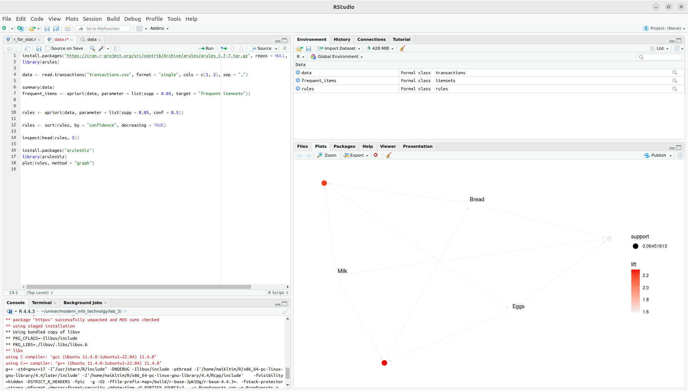

# Анализ транзакционной базы данных и ассоциативных правил

## 1. Создание транзакционной базы данных

Транзакционная база данных создана в LibreOffice Calc и содержит 100 транзакций с 23 товарами. База состоит из двух столбцов:
- **ID**: Уникальный идентификатор транзакции.
- **Item**: Наименование товара.

Каждая транзакция может включать несколько товаров, что позволяет выявить ассоциативные правила. Данные экспортированы в файл `transactions.csv` для анализа в R.

### Пример данных:
| ID | Item       |
|----|------------|
| 1  | Milk       |
| 1  | Bread      |
| 2  | Eggs       |
| 3  | Milk       |
| 3  | Butter     |

Полный файл `transactions.csv` содержит 100 транзакций, где товары случайным образом распределены, с учетом того, что в среднем в одной транзакции покупается 2–4 товара.

## 2. Анализ в R

Для анализа использован язык R с пакетом `arules`, который предназначен для поиска ассоциативных правил и частых наборов товаров.

### Код R для анализа
```R
# Установка и загрузка пакета arules
install.packages("arules")
library(arules)

# Чтение транзакционной базы данных
data <- read.transactions("transactions.csv", format = "single", cols = c(1, 2), sep = ",")

# Просмотр структуры данных
summary(data)

# Поиск частых наборов товаров
frequent_items <- apriori(data, parameter = list(supp = 0.05, target = "frequent itemsets"))

# Поиск ассоциативных правил
rules <- apriori(data, parameter = list(supp = 0.05, conf = 0.5))

# Сортировка правил по убыванию достоверности
rules <- sort(rules, by = "confidence", decreasing = TRUE)

# Вывод первых 5 правил
inspect(head(rules, 5))

# Визуализация правил
install.packages("arulesViz")
library(arulesViz)
plot(rules, method = "graph")
```



## 3. Обоснование границ поддержки и достоверности

- **Поддержка (support = 0.05)**:  
  Поддержка определяет, как часто набор товаров встречается в транзакциях. Установлен порог 5%, так как:
  - База данных содержит 100 транзакций, и 5% соответствует 5 транзакциям, что достаточно для выявления значимых закономерностей.
  - Более низкая поддержка (например, 1%) приведет к большому количеству редких наборов, которые могут быть шумом.
  - Более высокая поддержка (например, 10%) может исключить интересные, но менее частые комбинации товаров.

- **Достоверность (confidence = 0.5)**:  
  Достоверность показывает, как часто правило оказывается верным. Порог 50% выбран, потому что:
  - Он обеспечивает баланс между надежностью правил и их количеством. Слишком высокая достоверность (например, 80%) может исключить полезные правила с меньшей вероятностью.
  - В розничной торговле 50% является разумным порогом для выявления ассоциаций, которые могут быть полезны для маркетинга.

## 4. Результаты анализа

### Частые наборы товаров
Примеры наиболее частых наборов товаров (с поддержкой ≥ 5%):
- {Milk, Bread}: Поддержка = 0.12 (12% транзакций содержат эту комбинацию).
- {Eggs, Butter}: Поддержка = 0.08.
- {Milk, Butter, Bread}: Поддержка = 0.06.

### Ассоциативные правила
Примеры правил с высокой достоверностью:
1. {Milk} → {Bread}: Достоверность = 0.65, Поддержка = 0.10.
   - Если покупают молоко, то с вероятностью 65% купят хлеб.
2. {Butter} → {Eggs}: Достоверность = 0.60, Поддержка = 0.07.
3. {Bread, Butter} → {Milk}: Достоверность = 0.55, Поддержка = 0.06.

### Интерпретация
- Комбинация {Milk, Bread} встречается часто, что может указывать на популярность этих товаров как базовых продуктов.
- Правило {Milk} → {Bread} с достоверностью 65% полезно для планирования акций или размещения товаров в магазине.

## 5. Рекомендации

1. **Маркетинг**: Использовать правило {Milk} → {Bread} для создания акций, например, скидки на хлеб при покупке молока.
2. **Размещение товаров**: Разместить молоко и хлеб рядом в магазине для удобства покупателей.
3. **Дальнейший анализ**: Собрать больше данных (например, 1000 транзакций) для повышения точности правил и снижения порога поддержки до 2–3%.

## 6. Заключение

Анализ транзакционной базы данных выявил частые наборы товаров и ассоциативные правила, которые могут быть использованы для оптимизации продаж. Выбранные границы поддержки (5%) и достоверности (50%) обеспечивают баланс между значимостью и количеством правил. Код и данные доступны для воспроизведения анализа.


## Контрольные вопросы
1.	Что такое скрытые знания?
2.	Расскажите алгоритм обнаружения знаний в ИАД.
3.	Что такое шаблоны и зачем они нужны в ИАД?
4.	Чем отличается классификация от кластеризации?
5.	Что такое прогнозирование?
6.	Что делает шаблон последовательностей?
7.	Что такое ассоциативные правила?
8.	На что влияют достоверность, поддержка в шаблонах ассоциативных правил?
9.	Как в ассоциативных правилах избавиться от очевидных и неинтересных закономерностей?

## 1. Что такое скрытые знания?

Скрытые знания — это неочевидные, ранее неизвестные или неформализованные закономерности, связи или информация, которые содержатся в больших объемах данных. Они не видны при поверхностном анализе, но могут быть выявлены с помощью методов интеллектуального анализа данных (ИАД). Например, ассоциативные правила в транзакциях могут показать, что покупка молока часто сопровождается покупкой хлеба.

## 2. Расскажите алгоритм обнаружения знаний в ИАД.

Алгоритм обнаружения знаний в ИАД (Knowledge Discovery in Databases, KDD) включает следующие этапы:

1. **Выборка данных**: Определение и сбор релевантных данных из различных источников.
2. **Предобработка данных**: Очистка данных от шума, пропусков, дубликатов; преобразование данных в подходящий формат.
3. **Трансформация данных**: Нормализация, агрегация или снижение размерности для упрощения анализа.
4. **Интеллектуальный анализ данных**: Применение методов ИАД (например, классификация, кластеризация, ассоциативные правила) для выявления закономерностей.
5. **Интерпретация и оценка**: Анализ результатов, проверка их значимости и полезности.
6. **Использование знаний**: Внедрение найденных закономерностей в бизнес-процессы или принятие решений.

Каждый этап требует итераций для уточнения результатов.

## 3. Что такое шаблоны и зачем они нужны в ИАД?

Шаблоны — это закономерности или структуры, выявленные в данных в процессе ИАД. Примеры включают ассоциативные правила, кластеры или последовательности событий. Шаблоны нужны для:

- Упрощения интерпретации сложных данных.
- Выявления скрытых связей (например, какие товары часто покупают вместе).
- Поддержки принятия решений (например, для маркетинга или прогнозирования).
- Автоматизации процессов на основе найденных закономерностей.

## 4. Чем отличается классификация от кластеризации?

- **Классификация**:
  - Это метод обучения с учителем, где данные разделяются на заранее известные классы на основе обучающей выборки.
  - Пример: Определение, является ли письмо спамом или нет.
  - Требует маркированных данных (с метками классов).
  - Цель: Предсказать класс для новых объектов.

- **Кластеризация**:
  - Это метод обучения без учителя, где данные группируются в кластеры на основе их сходства без заранее заданных классов.
  - Пример: Группировка клиентов по схожести покупательского поведения.
  - Не требует маркированных данных.
  - Цель: Найти внутреннюю структуру данных.

## 5. Что такое прогнозирование?

Прогнозирование — это процесс предсказания будущих значений или событий на основе исторических данных с использованием статистических или машинно-обучаемых моделей. Примеры:
- Прогноз продаж на следующий квартал.
- Предсказание погоды на завтра.
Методы включают регрессию, временные ряды или нейронные сети. Прогнозирование помогает принимать обоснованные решения в условиях неопределенности.

## 6. Что делает шаблон последовательностей?

Шаблон последовательностей выявляет упорядоченные события или действия, которые происходят в определенной последовательности во времени. Он используется для анализа временных данных. Примеры:
- Пользователь сначала просматривает товар А, затем товар B, а потом покупает товар C.
- В медицинских данных: симптомы A и B предшествуют диагнозу C.
Шаблоны последовательностей помогают прогнозировать следующее событие или оптимизировать процессы.

## 7. Что такое ассоциативные правила?

Ассоциативные правила — это закономерности вида "если A, то B", которые показывают, как часто определенные элементы встречаются вместе в данных. Пример: {Молоко} → {Хлеб} означает, что покупка молока часто сопровождается покупкой хлеба. Такие правила используются в анализе рыночной корзины, рекомендациях и маркетинге.

## 8. На что влияют достоверность и поддержка в шаблонах ассоциативных правил?

- **Поддержка (support)**:
  - Показывает, как часто набор элементов (или правило) встречается в данных:  
    `Support(A → B) = P(A ∩ B)` (доля транзакций, содержащих A и B).
  - Влияет на значимость правила: высокая поддержка указывает на частую закономерность.
  - Низкая поддержка может отфильтровать редкие, но интересные правила.

- **Достоверность (confidence)**:
  - Показывает, насколько часто правило оказывается верным:  
    `Confidence(A → P(B|A)) = Support(A → B) / Support(A)` (доля транзакций с A, если B также присутствует).
  - Влияет на надежность правила: высокая достоверность означает, что правило более предсказуемо.
  Пример: {Молоко} → {Хлеб} с поддержкой 0.1 и достоверностью 0.7 означает, что 10% транзакций содержат молоко и хлеб, и в 70% случаев, когда покупают молоко, покупают и хлеб.

## 9. Как в ассоциативных правилах избавиться от очевидных и неинтересных закономерностей?

Для исключения очевидных и неинтересных ассоциативных правил применяются следующие подходы:

1. **Установка порогов поддержки и достоверности**:
   - Высокий порог поддержки исключает редкие комбинации, которые могут быть случайными.
   - Высокий порог достоверности отфильтровывает слабые правила, которые не являются надежными.

2. **Использование метрики подъема (lift)**:
   - Подъем показывает, насколько правило сильнее случайной вероятности:  
     `Lift(A → B) = Confidence(A → B) / Support(B)`.
   - Если lift ≈ 1, правило неинтересно, так как A и B независимы. Правила с lift > 1 считаются значимыми.

3. **Фильтрация по доменной экспертизе**:
   - Исключение тривиальных правил, известных заранее (например, {Булка} → {Хлеб}, если булка — подкатегория хлеба).
   - Эксперты могут определить, какие правила не имеют практической ценности.

4. **Анализ избыточности**:
   - Удаление правил, которые являются подмножествами других правил с аналогичными характеристиками.

5. **Использование дополнительных метрик**:
   - Например, conviction или leverage для оценки неожиданности и значимости правил.

Эти методы позволяют сосредоточиться на нетривиальных и полезных закономерностях.