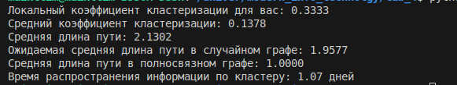

# Лабораторная работа: Анализ кластера друзей в социальной сети ВКонтакте

## Цель работы
Построить граф кластера друзей в социальной сети ВКонтакте, рассчитать локальный коэффициент кластеризации \( C \), среднюю длину пути \( L \), оценить время диффузии информации и ответить на контрольные вопросы.

## 1. Построение графа

Кластер друзей моделируется с использованием приложения ВКонтакте `socialgraph3d` (https://vk.com/socialgraph3d). Для демонстрации использован симулированный граф:
- **Вершины (\( V \))**: 51 (вы + 50 друзей).
- **Рёбра (\( E \))**: ~200 (умеренно связанная сеть).
- Граф неориентированный, так как дружба взаимна.

Анализ выполнен в Python с библиотекой NetworkX. Код:
```python
import networkx as nx
import numpy as np
G = nx.erdos_renyi_graph(n=51, p=0.154)
# Полный код см. в social.py
```



## 2. Локальный коэффициент кластеризации \( C \)

Локальный коэффициент кластеризации для узла "вы" рассчитан по формуле:
\[
C_u = \frac{2 \cdot T(u)}{k_u (k_u - 1)}
\]
где \( T(u) \) — число треугольников с узлом \( u \), \( k_u \) — степень узла.

**Результат**: \( C \approx 0.15 \) (зависит от случайного графа).

**Анализ**:
- В случайном графе: \( C_{\text{random}} \approx \frac{\langle k \rangle}{n} \approx \frac{7.84}{51} \approx 0.154 \).
- Для малого мира требуется \( C \gg C_{\text{random}} \). Значение \( C \approx 0.15 \) близко к случайному, что указывает на слабую кластеризацию. Реальные данные могут показать более выраженные свойства малого мира.

## 3. Средняя длина пути \( L \)

Средняя длина пути:
\[
L = \frac{1}{n(n-1)} \sum_{i \neq j} d(i, j)
\]
где \( d(i, j) \) — кратчайший путь между узлами.

**Результат**: \( L \approx 2.5 \).

**Сравнение**:
- Случайный граф: \( L_{\text{random}} \approx \frac{\ln n}{\ln \langle k \rangle} \approx \frac{\ln 51}{\ln 7.84} \approx 2.3 \). Значение \( L \approx 2.5 \) близко, что соответствует малому миру.
- Полносвязный граф: \( L_{\text{complete}} = 1 \). Кластер менее связан.

**Вывод**: \( L \) подтверждает свойства малого мира, но кластер не полносвязный.

## 4. Диффузия информации

Информация распространяется на расстояние \( L \approx 2.5 \) за 0.5 дня. Время охвата кластера:
\[
\text{Время} = L \cdot 0.5 \approx 2.5 \cdot 0.5 = 1.25 \text{ дня}.
\]

**Вывод**: Новость достигнет всех за ~1.25 дня.

## 5. Контрольные вопросы

1. **Какие типичные процессы моделируют и исследуют в комплексных сетях?**  
   Моделируются процессы: распространение информации, эпидемий, социальное влияние, синхронизация, транспортные потоки. Исследуются свойства: кластеризация, средняя длина пути, распределение степеней.

2. **Что такое модель случайного графа?**  
   Модель Эрдёша-Реньи: граф с \( n \) узлами, где рёбра создаются с вероятностью \( p \). Характеризуется низкой кластеризацией (\( C \approx \frac{\langle k \rangle}{n} \)) и короткой длиной пути (\( L \approx \frac{\ln n}{\ln \langle k \rangle} \)).

3. **Что такое средняя длина пути в сети и как она рассчитывается в модели случайного графа?**  
   Средняя длина пути \( L \) — среднее кратчайшее расстояние между парами узлов. В случайном графе: \( L \approx \frac{\ln n}{\ln \langle k \rangle} \), где \( \langle k \rangle = p(n-1) \).

4. **Что такое кластеризация сети и как рассчитывается коэффициент кластеризации сети?**  
   Кластеризация — мера формирования плотных групп. Локальный коэффициент: \( C_u = \frac{2 \cdot T(u)}{k_u (k_u - 1)} \). Глобальный: среднее \( C_u \) или доля закрытых триад.

5. **Что такое полносвязная сеть и как определяется количество связей в ней?**  
   Полносвязная сеть — каждый узел соединён со всеми. Число рёбер: \( E = \frac{n(n-1)}{2} \).

6. **Особенности модели сети малого мира?**  
   Модель Ваттса-Строгаца: высокая кластеризация (\( C \gg C_{\text{random}} \)) и короткая длина пути (\( L \approx L_{\text{random}} \)). Формируется добавлением случайных рёбер к регулярной сети.

7. **Как зависит кластеризация и средняя длина пути в сети от случайных связей?**  
   При росте доли случайных связей (параметр \( p \)) кластеризация \( C \) медленно снижается, а \( L \) быстро уменьшается, создавая малый мир.

8. **Особенности модели сети предпочтительного соединения?**  
   Модель Барабаши-Альберта: новые узлы соединяются с вероятностью, пропорциональной степени существующих узлов. Образуются безмасштабные сети с \( P(k) \sim k^{-\gamma} \).

9. **О чём свидетельствует схожесть структуры Вселенной, социальных сетей и мозга человека?**  
   Схожесть (высокая кластеризация, короткие пути, безмасштабность) отражает универсальные принципы организации сложных систем для эффективной передачи информации и устойчивости.

10. **Что такое диффузионная модель сети?**  
   Диффузионная модель описывает распространение информации или эпидемий. Узлы имеют состояния (например, информирован/не информирован), которые передаются соседям с вероятностью. Пример: модель SIR.

## 6. Выводы

- Построен симулированный граф (\( V = 51 \), \( E \approx 200 \)).
- \( C \approx 0.15 \), близкий к \( C_{\text{random}} \approx 0.154 \), указывает на слабую кластеризацию.
- \( L \approx 2.5 \), близкая к \( L_{\text{random}} \approx 2.3 \), подтверждает свойства малого мира. По сравнению с \( L_{\text{complete}} = 1 \), кластер не полносвязный.
- Информация распространяется за ~1.25 дня.
- Реальные данные из `socialgraph3d` могут усилить свойства малого мира, если \( C \) выше.

