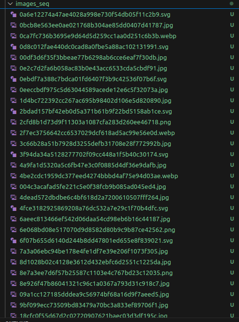
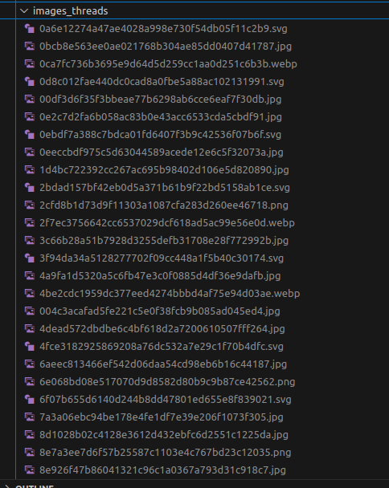

### Лбораторная работа № 1 

## Тема: Разработка многопоточных приложений.

### Цель: 
> Научиться писать и отлаживать приложения с продвинутыми элементами
> многопоточности и асинхронности на любом из высокоуровневых языков
> программирования и с использованием библиотеки OpenMP.


## Индивидуальные задания 2

> Написать консольное приложение одновременной загрузки данных с набора URL-адресов
> (список из не менее 10 адресов должен считываться из текстового файла). При старте и
> окончании загрузки с каждого адреса приложение должно вывести соответствующее
> сообщение на новой строке в консоли. Реализовать паттерн "Производитель/потребитель"
> (Producer/Consumer). N потоков занимаются загрузкой данных с URL-адресов и парсингом
> результатов, M потоков занимаются скачиванием изображений по всем найденным
> гиперссылкам и сохранением их в указанной директории.

## Однопоточная реализация:
> при помощи библиотеки request была реализована однопоточная реализация 
> создалась пака с фотографиями рапаршенных с 10 url адресов 




> вывод из консоли
```
[PAGE] Start https://www.mozilla.org
      [PAGE] Found 9 images on https://www.mozilla.org
      [IMG] Start https://www.mozilla.org/media/img/logos/mdn/mdn-plus-logo.c615b46ca4ce.svg
      [IMG] Downloaded https://www.mozilla.org/media/img/logos/mdn/mdn-plus-logo.c615b46ca4ce.svg to images_seq/f1bd448cd0a767ec53acf0d13ddbe87bed4e98ca.svg
      [IMG] Start https://www.mozilla.org/media/protocol/img/logos/firefox/monitor/logo.d97e5516f9e6.svg
      [IMG] Downloaded https://www.mozilla.org/media/protocol/img/logos/firefox/monitor/logo.d97e5516f9e6.svg to images_seq/f46339402cea921c80d1e60ae43b0e281d200d39.svg
      [IMG] Start https://www.mozilla.org/media/img/logos/thunderbird/logo-thunderbird.121e9c0fed45.svg
      [IMG] Downloaded https://www.mozilla.org/media/img/logos/thunderbird/logo-thunderbird.121e9c0fed45.svg to images_seq/096e20748b4b305616b6f429bdb33d67a31574f3.svg
      [IMG] Start https://www.mozilla.org/media/protocol/img/logos/firefox/relay/logo.d42a8b52e44c.svg
      [IMG] Downloaded https://www.mozilla.org/media/protocol/img/logos/firefox/relay/logo.d42a8b52e44c.svg to images_seq/923e0472514cb260dd0fbf83b6cef4e5abbf7237.svg
      [IMG] Start https://www.mozilla.org/media/protocol/img/logos/firefox/browser/logo.eb1324e44442.svg
      [IMG] Downloaded https://www.mozilla.org/media/protocol/img/logos/firefox/browser/logo.eb1324e44442.svg to images_seq/21a3fac494f327141782e8b405a8ec7d5a794fd2.svg
      [IMG] Start https://www.mozilla.org/media/img/logos/m24/lockup-black.f2ddba3f0724.svg
      [IMG] Downloaded https://www.mozilla.org/media/img/logos/m24/lockup-black.f2ddba3f0724.svg to images_seq/0a6e12274a47ae4028a998e730f54db05f11c2b9.svg
      [IMG] Start https://www.mozilla.org/media/img/logos/mozilla/ads/Mozilla_Ads_Logo.6ed26d0eac2b.svg
      [IMG] Downloaded https://www.mozilla.org/media/img/logos/mozilla/ads/Mozilla_Ads_Logo.6ed26d0eac2b.svg to images_seq/6f07b655d6140d244b8dd47801ed655e8f839021.svg
      [IMG] Start https://www.mozilla.org/media/protocol/img/logos/mozilla/vpn/logo.c648f487bfb8.svg
      [IMG] Downloaded https://www.mozilla.org/media/protocol/img/logos/mozilla/vpn/logo.c648f487bfb8.svg to images_seq/0ebdf7a388c7bdca01fd6407f3b9c42536f07b6f.svg
      [IMG] Start https://www.mozilla.org/media/img/logos/m24/wordmark-white.2d673bb5b33a.svg
      [IMG] Downloaded https://www.mozilla.org/media/img/logos/m24/wordmark-white.2d673bb5b33a.svg to images_seq/c90b2e70a2f648f126512466d86fc0a7fa432b3b.svg
[PAGE] Finished https://www.mozilla.org
[PAGE] Start https://www.openai.com
[PAGE] Error https://www.openai.com: 403 Client Error: Forbidden for url: https://www.openai.com/
Done
```


> Вторая программа выполняет запросы но уже параллельно при помощи библиотек: (threading, queue, requests); 
> создалась пака с фотографиями рапаршенных с 10 url адресов 



> вывод из консоли
```
[IMG-1] Downloaded https://stackoverflow.com/Content/Img/teams/teams-promo.svg?v=e507948b81bf to images_threads/67ecd307606a7d7fc8f76f438bc471c496f6e611.svg
[IMG-1] Start https://www.gravatar.com/avatar/8fe43b0eb121da5b5fc98943ae718308?s=32&d=identicon&r=PG&f=y&so-version=2
[IMG-0] Downloaded https://www.gravatar.com/avatar/22acc8a7ba3717b8fc20e4dd4d4c7bc9?s=32&d=identicon&r=PG&f=y&so-version=2 to images_threads/dfd9976746dd351503cff3e693a0f783c9168843.jpg
[IMG-0] Start https://www.gravatar.com/avatar/665b976c79d0c9c842b131a2df510c3c?s=32&d=identicon&r=PG
[IMG-1] Downloaded https://www.gravatar.com/avatar/8fe43b0eb121da5b5fc98943ae718308?s=32&d=identicon&r=PG&f=y&so-version=2 to images_threads/ee20e7a5daccb3fab1d8b0891ce2dfc1ecfaf2aa.jpg
[IMG-1] Start https://www.gravatar.com/avatar/006572ec62e34ed3ea57bd5d8afe17b9?s=32&d=identicon&r=PG&f=y&so-version=2
[IMG-2] Downloaded https://realpython.com/static/real-python-logo-primary.973743b6d39d.svg to images_threads/cbd8bed2f59f948cd352627cee28877902f25d34.svg
[IMG-2] Finished
[IMG-0] Downloaded https://www.gravatar.com/avatar/665b976c79d0c9c842b131a2df510c3c?s=32&d=identicon&r=PG to images_threads/cceba9318a6f4dc464ce4129d823ca7fa76872fa.jpg
[IMG-0] Finished
[IMG-1] Downloaded https://www.gravatar.com/avatar/006572ec62e34ed3ea57bd5d8afe17b9?s=32&d=identicon&r=PG&f=y&so-version=2 to images_threads/96f3197d1f9b0e4932d327d94721124b3ebb0e13.jpg
[IMG-1] Finished
[IMG-3] Error https://www.facebook.com/tr?id=2220911568135371&ev=PageView&noscript=1: ('Connection aborted.', ConnectionResetError(104, 'Connection reset by peer'))
[IMG-3] Finished
All images downloaded
Done
Elapsed: 8.305337067999972
```