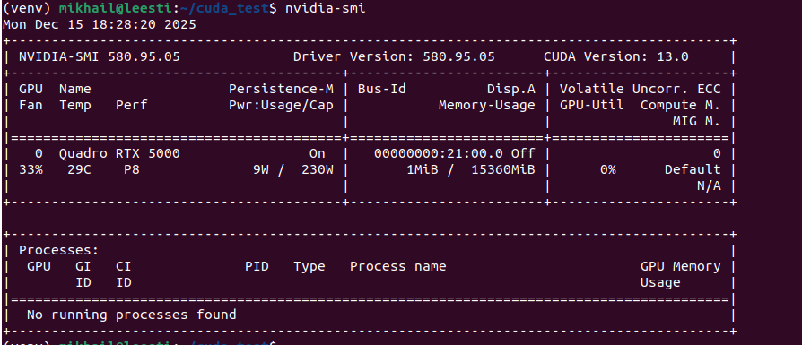
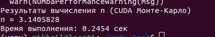

# Параллельные вычисления на GPU. Работа с CUDA.

## Написать CUDA-приложение для вычисления числа π методом Монте-Карло.

## Описание реализации

> Программа реализована на языке Python с использованием библиотеки Numba, позволяющей писать CUDA-ядра непосредственно на Python.

> Архитектура проекта

```
tree -L 2
.
├── config.py
├── cuda_kernel.py
├── images
│   └── 1.png
├── main.py
├── pi_calculation.py
├── __pycache__
│   ├── config.cpython-312.pyc
│   ├── cuda_kernel.cpython-312.pyc
│   ├── pi_calculation.cpython-312.pyc
│   └── utils.cpython-312.pyc
├── README.md
├── requirements.txt
└── utils.py


Проект состоит из нескольких модулей:

main.py — точка входа программы;

cuda_kernel.py — CUDA-ядро для генерации случайных точек и проверки попадания в круг;

pi_calculation.py — запуск CUDA-ядра и вычисление значения π;

config.py — параметры эксперимента;

utils.py — вспомогательные функции.

Для генерации случайных чисел на GPU используется генератор xoroshiro128p.
```

### Экспериментальная часть
> Вычисления были выполнены на мощном сервевре на работе.



> Параметры эксперимента:

  - Количество случайных точек: 10000000
  - Метод вычисления: Монте-Карло
  - Аппаратная платформа: GPU (CUDA)


> Результаты эксперимента

> В результате выполнения программы были получены следующие значения:

  - Приближённое значение числа π:
    π = 3.1405828

  - Время выполнения программы:
    0.2454 сек




> Полученное значение близко к математическому значению числа π (3.1415926),
> а погрешность объясняется вероятностной природой метода Монте-Карло.

### Анализ результатов


> Использование CUDA позволило значительно ускорить вычисления за счёт 
> параллельной обработки большого количества случайных точек. 
> Метод Монте-Карло показал хорошую масштабируемость при увеличении числа точек.
> Точность вычисления повышается с ростом количества итераций, однако это приводит к увеличению времени выполнения.

### Выводы

> В ходе выполнения лабораторной работы:

  - был реализован алгоритм вычисления числа π методом Монте-Карло;
  - изучены основы программирования с использованием CUDA в Python;
  - продемонстрированы преимущества параллельных вычислений на GPU;
  - получено приближённое значение числа π с высокой точностью за малое время выполнения.
  - Поставленная цель лабораторной работы была полностью достигнута.

### Используемые источники
> "Высокопроизводительные Python-приложения"  Миша Горелик, Йен Освальд
> "Теория Вероятностей и математическая статистика" В.Е.Гмурман

### Контрольные вопросы

1. Расшифруйте аббревиатуры CUDA и GPGPU.
   CUDA (Compute Unified Device Architecture) — программно-аппаратная платформа компании NVIDIA для выполнения параллельных вычислений 
   на графических процессорах.

   GPGPU (General-Purpose computing on Graphics Processing Units) — использование графических процессоров для решения задач общего назначения, 
   не связанных напрямую с обработкой графики.


2. Опишите вычислительную модель GPU.

> Вычислительная модель GPU основана на массовом параллелизме. Программа исполняется большим количеством потоков, 
  которые организованы в иерархическую структуру:
  - потоки (threads),
  - блоки потоков (thread blocks),
  - сетка блоков (grid).

> Каждый поток выполняет одну и ту же программу (ядро), но обрабатывает разные данные. 
> Такая модель называется SIMT (Single Instruction, Multiple Threads).

3. Опишите модель памяти GPU.
> GPU имеет иерархическую модель памяти:
  - Регистры — самая быстрая память, доступная одному потоку;
  - Локальная память — приватная память потока;
  - Shared memory — общая память для потоков одного блока;
  - Глобальная память — доступна всем потокам и хосту, но имеет высокую задержку;
  - Константная и текстурная память — оптимизированы для определённых типов доступа.

> Эффективное использование памяти существенно влияет на производительность CUDA-программ.

4. Как посмотреть CUDA-характеристики GPU?
> CUDA-характеристики GPU можно посмотреть с помощью команды:
```
nvidia-smi
```

> Также программно информацию о GPU можно получить через CUDA API или библиотеки,
  например cudaGetDeviceProperties или в Python с помощью numba.cuda.gpus.

5. Что входит в экосистему CUDA?
> Экосистема CUDA включает:
  - CUDA Toolkit (компилятор NVCC, библиотеки, инструменты);
  - CUDA Runtime и Driver API;
  - библиотеки (cuBLAS, cuFFT, cuDNN, Thrust);
  - средства отладки и профилирования (Nsight);
  - языковые расширения для C/C++, Python, Fortran;
  - документацию и примеры от NVIDIA

6. Чем отличаются декларации функций __device__, __global__ и __host__?

   - __host__ — функция выполняется на CPU и вызывается с хоста;

   - __device__ — функция выполняется на GPU и вызывается только из других GPU-функций;

   - __global__ — функция является CUDA-ядром, выполняется на GPU и вызывается с хоста.

7. Как выглядит типовая последовательность действий в CUDA-программе, и какие CUDA-функции при этом вызываются?

> Типовая последовательность:

    1. Выделение памяти на GPU (cudaMalloc);

    2. Копирование данных с хоста на устройство (cudaMemcpy);

    3. Запуск CUDA-ядра (kernel<<<grid, block>>>);

    4. Синхронизация (cudaDeviceSynchronize);

    5. Копирование результатов обратно (cudaMemcpy);

    6. Освобождение памяти (cudaFree).


8. Что такое «ворп»?

> Ворп (warp) — минимальная группа потоков (обычно 32), которые выполняются одновременно 
> на одном мультипроцессоре GPU. Все потоки ворпа исполняют одну и ту же инструкцию, что является основой модели SIMT.

9. Чем отличаются функции cudaMalloc и cudaMallocManaged?
   - cudaMalloc — выделяет память только на GPU, требуется явное копирование данных;
   - cudaMallocManaged — выделяет управляемую (unified) память, доступную и CPU, и GPU, с автоматической миграцией данных.

10. Какой механизм синхронизации потоков присутствует в CUDA?

> В CUDA используются следующие механизмы синхронизации:

  - __syncthreads() — синхронизация потоков внутри блока;

  - атомарные операции;

  - синхронизация устройств (cudaDeviceSynchronize);

  - синхронизация потоков через события (CUDA events).