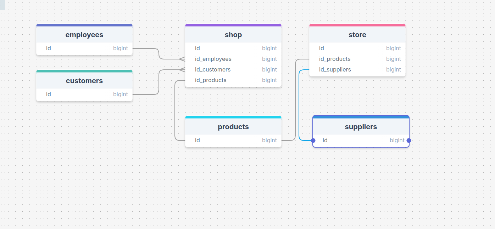

# СОСТАВЛЕНИЕ ПЛАНА РАЗРАБОТКИ ПРОЕКТА ИНФОРМАЦИОННОЙ СИСТЕМЫ

## Цель работы.

> Закрепление имеющихся знаний о моделях жизненного цикла ИС и способах их применения. Приобретение навыков составления планов разра-
> ботки ИС на основе разных моделей жизненного цикла.


## Знания, необходимые для выполнения лабораторной работы.

> Жизненный цикл (ЖЦ) информационной системы - непрерывный процесс от момента принятия решения о необходимости создания системы и
> заканчивается в момент её полного изъятия из эксплуатации.

> Модель жизненного цикла ИС - структура, описывающая процессы, действия и задачи, осуществляемые в ходе разработки, функционирования
> и сопровождения программного обеспечения в течение всей жизни ИС, от определения требований до завершения её использования.

> Прототип - версия ИС, предназначенная для демонстрации заказчику некоторых ключевых свойств будущего продукта. Создание прототипа
> позволяет вовлечь заказчика в разработку информационной системы в самом начале работы.

## Задание.

> Вариант индивидуального задания из приложения А определяет информационную систему, для создания которой необходимо составить план
> разработки на основе каскадной и спиральной моделей ЖЦ.

> В процессе выполнения лабораторной работы необходимо:

1. Подготовить исходные данные. Исходными данными являются: Общее описание некоторой ИС (назначение, область применения, решаемые задачи,
   технологические особенности реализации и внедрения). Ограничения и условия разработки (требования заказчика, возможности 
   команды разработчиков, сроки, бюджет проекта и т.д.).

2. Составить план разработки ИС для каскадного подхода: Составить эскизный план на основе каскадной модели ЖЦ. Для этапа «Анализ требований» 
   составить документ «Техническое задание» с подробным описанием функциональных требований к ИС.
   Для этапа «Проектирование» составить документ «Технический проект» с описанием проектных решений (архитектура системы, логическая
   структура БД, решения по реализации пользовательского интерфейса и т.д.). Для этапа «Тестирование» составить документ «План тестирования»
   с описанием методики тестирования и контрольных тестов. Для «Внедрение» — документ «План ввода ИС в эксплуатацию». Объединить календарный 
   план разработки и составленные документы в единый отчёт «Разработка ИС на основе каскадной модели ЖЦ».

3. Составить план разработки ИС для итеративного подхода: Разделить весь процесс создания и внедрения ИС на несколько итераций. На основе
   имеющихся  документов для каждой итерации составить отдельный комплект документов. Составить календарный план итеративной разработки ИС.
   Объединить план итеративной разработки и составленные документы в единый отчёт «Разработка ИС на основе спиральной модели ЖЦ».


## Контрольные вопросы

1. Жизненный цикл информационных систем. Этапы жизненного цикла.
2. Стандартные модели жизненного цикла.
3. Преимущества и недостатки каскадной модели жизненного цикла.
4. Каскадная модель с промежуточным контролем.
5. Итеративная модель жизненного цикла.
6. Спиральная модель жизненного цикла.

# Выполнениие Лабораторной работы № 1


## Информационная система торговой организации

### Исходные данные: 

```
Торговая организация ведет торговлю в торговых точках разных типов: (универмаги, ма-
газины, киоски, лотки и т.д.), в штате которых работают продавцы. Универмаги разде-
лены на отдельные секции, руководимые управляющими секций и расположенные, воз-
можно, на разных этажах здания. Как универмаги, так и магазины могут иметь несколько
залов, в которых работает определенное число продавцов, универмаги, магазины, киоски
могут иметь такие характеристики, как размер торговой точки, платежи за аренду, ком-
мунальные услуги, количество прилавков и т.д. Кроме того, в универмагах и магазинах
учет проданных товаров ведется персонифицированно с фиксацией имен и характери-
стик покупателя, чего в киосках и на лотках сделать не представляется возможным.
Заказы поставщику составляются на основе заявок, поступающих из торговых точек. На
основе заявок менеджеры торговой организации выбирают поставщика, формируют за-
казы, в которых перечисляются наименования товаров и заказываемое их количество,
которое может отличаться от запроса из торговой точки. Если указанное наименование
товара ранее не поставлялось, оно пополняет справочник номенклатуры товаров. На ос-
нове маркетинговых работ постоянно изучается рынок поставщиков, в результате чего
могут появляться новые поставщики и исчезать старые. При этом одни и те же товары
торговая организация может получать от разных поставщиков и, естественно, по различ-
ным ценам.
Поступившие товары распределяются по торговым точкам и в любой момент можно по-
лучить такое распределение.
Продавцы торговых точек ведут продажу товаров, учитывая все сделанные продажи,
фиксируя номенклатуру и количество проданного товара, а продавцы универмагов и ма-
газинов дополнительно фиксируют имена и характеристики покупателей, что позволяет
вести учет покупателей и сделанных ими покупок. В процессе торговли торговые точки
вправе менять цены на товары в зависимости от спроса и предложения товаров, а также
по согласованию передавать товары в другую торговую точку.
```
> Создать общую информационную систему, для упрощения работы сотрудников сети и руковдителей

## Ограничения и условия разработки

> требования заказчика:

1. Адреса и расположение торговых точек
2. ФИО продавцов и их график выходов на смену
3. График оплаты аренды, коммунальные платежи
4. Учет кем был продан товар (продовец)
5. Учет и фиксация имен и характеристик покупателей (Универмаги)
6. Общую систему учета оформления заявок на товар поставщику
7. Возможность поплнять справочник номенклатуры товаров
8. Учет поставщиков (добаление, удаление)
9. Учет всего товара, его распределение по точкам и премещение товара между точками

> сроки: 12 месяцев, при наличии команды разработчиков состоящей из (один фронтенд-миддл, 
> один бэкенд-миддл, один архитектор-тимлид, системный админстратор-девопс для насторйки инфраструктуры)

> бюджет зп на год - 5400000(фронтэнд, бэкенд, сис.админ - 100000, тимлид - 150000)
> проект будет разрабатываться локально


## Анализ требований

### Техническое задание


```
Общие сведения:

Рабочее название проекта "ShopApp"

Назначение и цели создания системы:

Создать общую информационную систему, для упрощения работы сотрудников сети и руковдителей

Требования к функциям (задачам), выполняемым системой:

1. Адреса и расположение торговых точек
2. ФИО продавцов и их график выходов на смену
3. График оплаты аренды, коммунальные платежи
4. Учет кем был продан товар (продовец)
5. Учет и фиксация имен и характеристик покупателей (Универмаги)
6. Общую систему учета оформления заявок на товар поставщику
7. Возможность поплнять справочник номенклатуры товаров
8. Учет поставщиков (добаление, удаление)
9. Учет всего товара, его распределение по точкам и премещение товара между точками

Требования к системе в целом:

Легка в освоении и использовании

Требования к надежности:

все основные системы должны дублироваться

Требования к безопасности:

максимальная защита данных

Требования по сохранности информации при сбоях:

частые бэкапы БД
```

### Проектирование

```
Разработка будет вестись на следующем стеке технологий:

Front-end - Reactjs
Back-end - Python Django
DB - PostgreSQL
Monitoring - prometheus grafana
Log - OpenSearch

Архитектура Системы:

Трехуровневая клиент-серверная архитектура
```
## логическая структура БД (Пример)



## решения по реализации пользовательского интерфейса (Пример)


## решения по реализации аддинской части (Пример)

