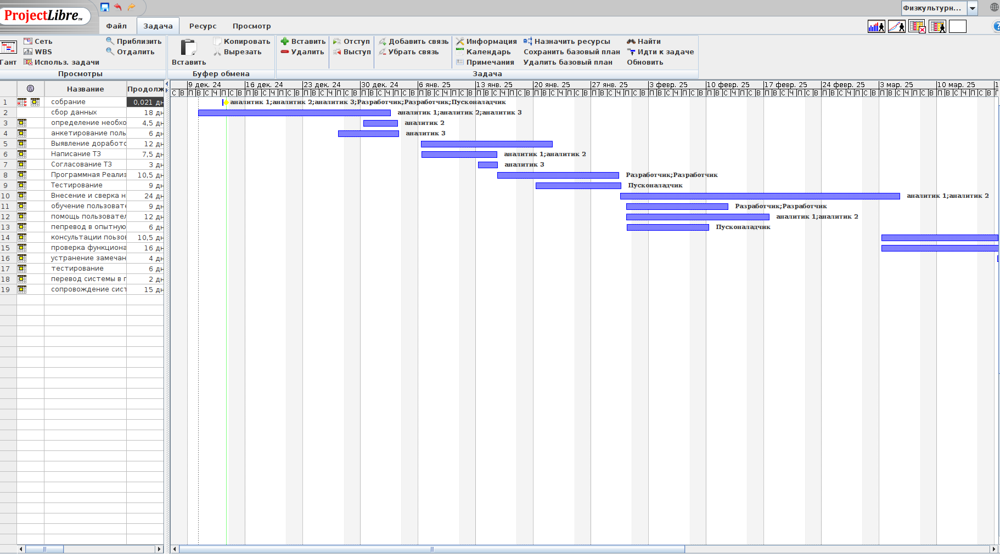
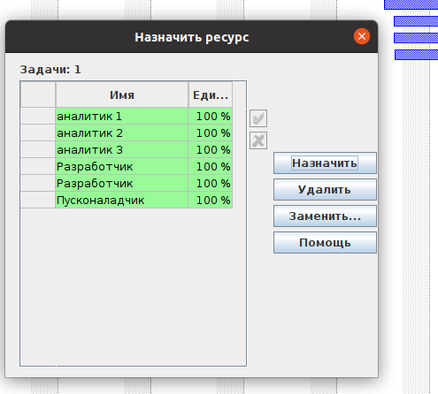
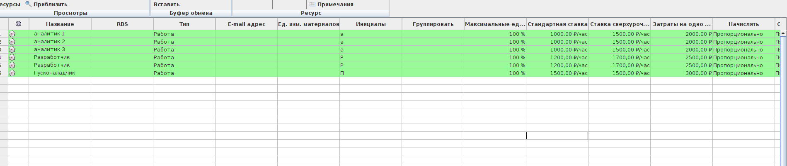
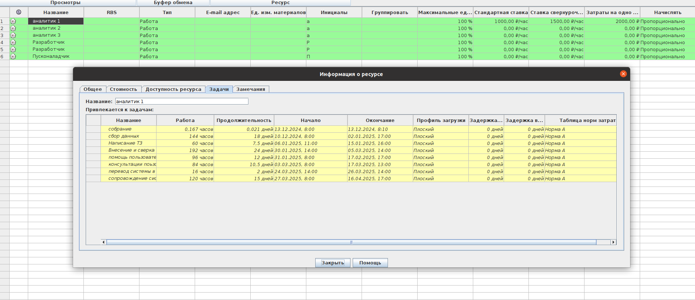
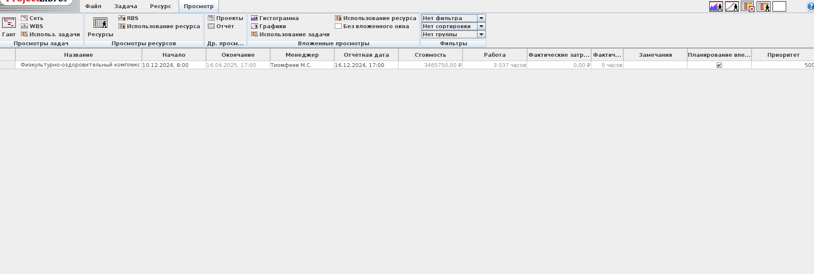

# Тимофеев М.С. Магистратура ИВТ 1 курс Заочное отделение

## Лабораторная работа № 2 

## Тема: 
### РАЗРАБОТКА ГРАФИКА ПРОЕКТА, ПЛАНИРОВАНИЕ РЕСУРСОВ И ЗАТРАТ С
### ИСПОЛЬЗОВАНИЕМ СИСТЕМЫ УПРАВЛЕНИЯ ПРОЕКТАМИ MS PROJECT (ProjectLibrary)

> Цель работы: Изучение методов планирования работ проекта и формирование связей между ними, 
> планирование ресурсов и затрат проекта. Приобретение навыков работы в системе 
> MS Project (ProjectLibrary) на примере создания проекта по внедрению корпоративной 
> информационной системы на промышленном предприятии.

## Задание

1. Согласно варианту задания (Приложение Б) создать новый проект, со-
   держащий название и другие ключевые сведения, начальную или конеч-
   ную дату и календарь проекта.

2. Создать список задач, организованный по суммарным и вложенным за-
   дачам.

3. Составить календарный план проекта, сформировав порядок выполнения 
   работ.

4. К проекту добавить трудовые ресурсы, определить графики работы,
   назначить задачам ресурсы.

5. Ввести и проанализировать сведения о затратах на ресурсы и задачи.

6. Изучить способы получения общих сведений о календарном плане, а
   также о методах управления представлениями и полями для просмотра
   нужных

7. Научиться искать ресурсы с превышением доступности и балансировать
   загрузку ресурсов.

# Проект

# Физкультурно-оздоровительный комплкекс

> Промышленный холдинг заключил договор о внедрении корпоративной информа
> ционной системы с вашей фирмой-разработчиком. Необходимо спланировать работы по
> автоматизации предприятий

### Имеется команда из следующих специалистов:
1. аналитики (3 человека)
2. програмисты (3 человека)
3. специалисты по внедрению (2 человека)

### Работы ведутся по графику 5 дней в неделю, 2 выходных дня по 8 часов + 1 час обед.

## Предварительный план
- Предпроектное обследование
- Разработка и утверждение ТЗ (технического задания)
- Старт внедрения системы
- Опытная эксплуатация
- Промышленная эксплуатация

## Предпроектное обследование 
- Сбор данных об особенностях хозяйственной деятельности предприятия (432 часа)
- Определение необходимого кол-ва автоматизированных рабочих мест (36 часов)
- Анкетирование работников-пользователей системы (48 часов)

## Разработка и утверждение ТЗ (технического задания)
- Выявление доработок системы (96 часов)
- Написание ТЗ (120 часов)
- Согласование ТЗ (24 часа)
- Программная реализация (168 часов)
- Тестирование (72 часа)

## Старт внедрения системы
- Внесение и сверканачальных данных (384 часа)
- Обучение пользователей работе с системой и их аттестация (144 часа)
- Помощь пользователям в работе с системой (192 часов)
- Перевод в опытную эксплуатацию (48 часов)

## Опытная эксплуатация
- Консультации пользователей (336 часов)
- Проверка функциональности системы, выявление замечаний (384 часов)
- Устранение замечаний (96 часов)
- Тестирование (48 часов)
- Перевод системы в промышленную эксплуатацию (48 часов)

## Промышленная эксплуатация
- Сопровождение системы (360 часов)

## для управления проектом будем сипользовать ProjectLibre

> Уточним понятие проекта

> Проект - временное предприятие, предназначенное для создания уникальных продуктов, услуг или результатов

## Список задач организованный по суммарным и вложенным задачам

1. Предпроектное обследование 20 дней

 - Сбор данных об особенностях хозяйственной деятельности предприятия (432 чел/час)
 - Определение необходимого кол-ва автоматизированных рабочих мест (36 чел/час)
 - Анкетирование работников-пользователей системы (48 чел/час)

2. Разработка и утверждение ТЗ - 20 дней

 - Выявление доработок системы (96 чел/час)
 - Написание ТЗ (120 чел/час)
 - Согласование ТЗ (24 чел/час)
 - Программная реализация (168 чел/час)
 - Тестирование (72 чел/час)

3. Старт внедрения системы 30 дней

 - Внесение и сверканачальных данных (384 чел/час)
 - Обучение пользователей работе с системой и их аттестация (144 чел/час)
 - Помощь пользователям в работе с системой (192 чел/час)
 - Перевод в опытную эксплуатацию (48 чел/час)

4. Опытная эксплуатация - 35 дней

 - Консультации пользователей (336 чел/час)
 - Проверка функциональности системы, выявление замечаний (384 чел/час)
 - Устранение замечаний (96 чел/час)
 - Тестирование (48 чел/час)
 - Перевод системы в промышленную эксплуатацию (48 чел/час)

5. Промышленная эксплуатация 15 дней

 - Сопровождение системы (360 чел/час)

## трудовые ресурсы

## сведения о затратах на ресурсы и задачи

# Контрольные вопросы

1. Какими представлениями плана проекта вы пользовались в ходе выпол-
   нения лабораторной работы?

2. В каких случаях вы использовали окна Сведения о задаче и Сведения о
   ресурсе?

3. Виды взаимосвязей между задачами проекта?
4. Каким образом можно отследить превышения доступности ресурса, рав-
   номерность использования ресурсов?

5. Каким способом формируются затраты на работы в MS Project?

6. Что обозначает термин «критический путь» и с помощью каких пред-
   ставлений MS Project можно его увидеть?

7. Каким образом формируются трудозатраты в проекте и как в MS Project
   их увидеть?

8. Опишите процедуру назначения ресурсов задачам проекта.

9. Каким образом добавить в график проекта новую задачу?

10. Каким образом добавить или скрыть столбец в MS Project?
