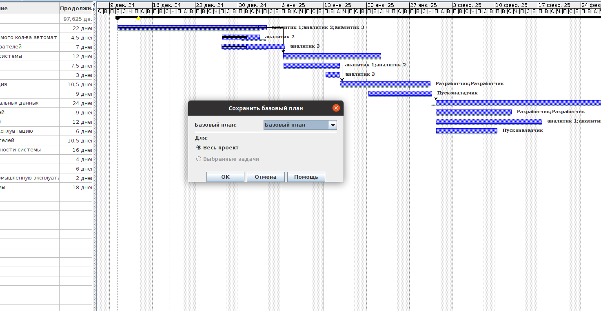
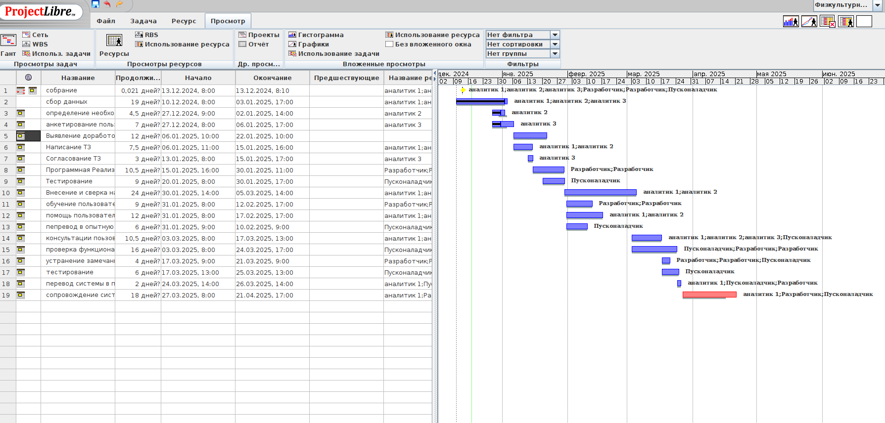
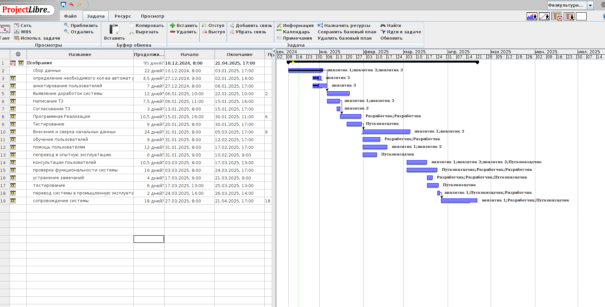
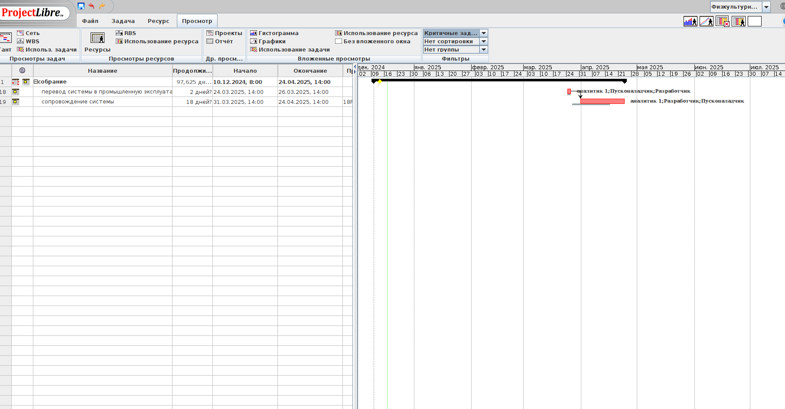
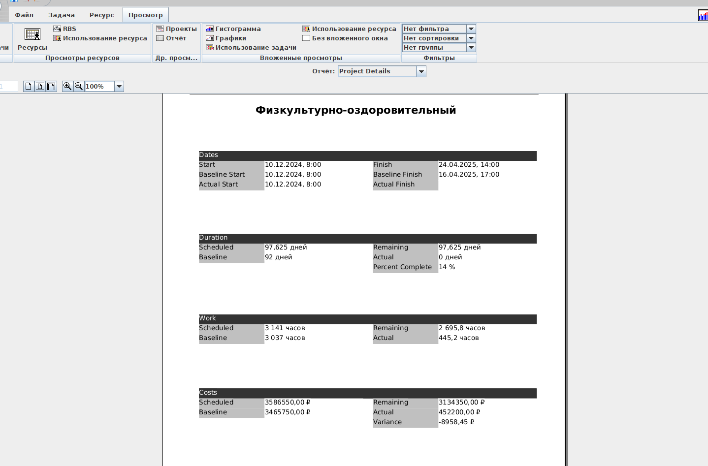
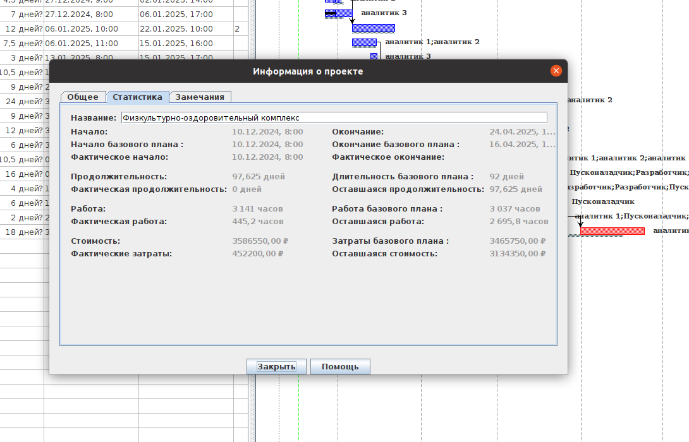

# Тимофеев М.С. Магистратура ИВТ 1 курс Заочное отделение

## Лабораторная работа № 3 

## Тема: 
### ОТСЛЕЖИВАНИЕ ХОДА ВЫПОЛНЕНИЯ РАБОТ И АНАЛИЗ
### СОСТОЯНИЯ ПРОЕКТА В MS PROJECT  (ProjectLibrary)

### Цель работы:

> Изучение способов отслеживания хода выполнения работ по проекту.
> Анализ состояния и оптимизации показателей, формирование отчетов про-
> екта по внедрению корпоративной информационной системы на промыш-
> ленном предприятии.

### Знания, необходимые для выполнения лабораторной работы

> Базовый план проекта представляет собой набор предварительных
> оценок, сохраненных после завершения и настройки плана проекта, но до
> начала проекта:

    - начальных и конечных дат
    - длительностей
    - трудозатрат

> В MS Project базовый план используется для отслеживания хода вы-
> полнения проекта. Базовый план включает исходные оценки, по которым
> можно отслеживать фактический ход выполнения проекта.

### Создание базового плана проекта.

> Для сохранения базового плана проекта следует выполнить следую-
> щие действия.

    - Выполнить команду Проект-Свойства-Задать базовый план-Задать       базовый план.
    - В открывшемся диалоговом окне достаточно установить переключа-
    тель Задать базовый план и выбрать в списке, расположенном под
    этим переключателем, значение Базовый план. Каждому из базовых
    планов соответствуют значения полей Базовая длительность, Базо-
    вое начало, Базовое окончание, Базовые затраты, Базовые трудо-
    затраты с соответствующими индексами.

> Сохраненный базовый план создает основу для сравнения текущего
> состояния проекта с запланированным на весь период выполнения проекта.
> Это действие является обязательным и важно для того, чтобы обеспечить
> возможность эффективного управления проектом.

### Отслеживание хода выполнения работ

> MS Project содержит ряд форм представлений для, предназначенных
> для записи информации о ходе выполнения проекта.

    • Панель инструментов Отслеживание (Задача-Планирование).
    • Диаграмма Ганта с отслеживанием.
    • Диалоговое окно Сведения о задаче, вкладка Общие, % завер-
        шения.
    • Поля процента завершения и его же по трудозатратам.
    • Статистика по проекту (Проект-сведения по проекту-Стати-
        стика).
    • Таблица Отслеживание (Вид-Данные-Таблицы.)

> В ходе анализа плана проекта нужно оценить, насколько установлен-
> ные длительности задач реалистичны и, соответственно, можно ли уло-
> житься в срок, выполняя работы. После того, как длительность задабудет
> скорректирована, мы проанализируем план с обновленными длительно-
> стями задач и определим, можно ли выполнить работу по проекту в отве-
> денный срок.

### Анализ критического пути проекта.

> Критический путь - это задача (или последовательность задач), опре-
> деляющая дату окончания проекта. Если увеличить длительность задачи  
> лежащей на критическом пути, то длительность проекта тоже увеличиться, 
> а если уменьшить ее длительность, то и длительность проекта тоже уменьшиться.

> MS Project «умеет» определять время, на которое можно задержать ис-
> полнение задачи без увеличения длительности проекта. Эта величина хра-
> нится в поле Общий временной резерв. Если эта величина меньше или
> равна нулю, то задача считается критической. MS Project также относит к
> критическим те задачи, которые имеют ограничения типа Фиксированное
> начало, Фиксированное окончание, Как можно позже, в проектах, пла-
> нируемых от даты начала и Как можно раньше в проектах, планируемых
> от даты окончания. Кроме того, критическими считаются задачи, дата окон-
> чания которых превышает дату крайнего срока или совпадает с ней.

> Для просмотра и анализа критического пути необходимо перейти в
> представление Диаграмма Ганта с отслеживанием или в представление
> Сетевой график. Следует обратить внимание на то, что сокращение дли-
> тельности критических задач может сделать критическими другие задачи.

> Для сокращения длительности задачи можно применить несколько
> методов:
    • Сократить объем работы;
    • Добавить ресурсы для ускорения выполнения работы при выпол-
    нении объема;
    • Можно разбить задачу на подзадачи, выполняемые одновременно
    разными сотрудниками.

### Метод освоенного объема. Управление финансовыми ресурсами в ходе реализации проекта.

> Управление финансовыми ресурсами в ходе реализации проекта осно-
> вывается на сопоставлении отчетных данных о затратах, а также о ходе и
> результатах выполнения задач с показателями базового плана. Особое вни-
> мание при этом должно уделяться отклонениям от планов, обоснованию не-
> обходимых решений и доведению их до всех участников проекта.

> MS Project обеспечивает пользователю возможности достаточно серь-
> езно анализа отчетных данных, затрат и потребности в финансовых ресур-
> сах на основании данных графика. Для этой цели предназначены показатели
> Затраты и Фактические затраты, определенные в базе данных для задач,
> ресурсов и назначений. Они представляют собой плановые и фактические
> затраты, разность между которыми храниться в поле Отклонение по стои-
> мости. Для сравнительного анализа фактических и плановых затрат важно
> значение поля Базовые затраты, которое может быть задано пользователем
> или вычисляется автоматически при сохранении базового плана. При сохра-
> нении базового плана такие поля формируются автоматически для каждой
> задачи, для каждого ресурса и для каждого назначения. Кроме этих показа-
> телей MS Project обеспечивает возможность использования для анализа со-
> стояния проекта и прогноза его показателей так называемой методики
> освоенного объема.

> Методика освоенного объема исходит из того, что в любой момент
> для проекта или любой его части должна определяться система трех основ-
> ных показателей, характеризующих текущее состояние проекта.

- Базовая стоимость запланированных работ (БСЗР) - плановые за-
  траты на предусмотренные утвержденным планом работы; в MS Project
  вычисляются аналогично рассмотренному ниже показателю примени-
  тельно к текущей дате на основании, предусмотренной базовым планом
  готовности по формуле:
1. БСЗР=Базовый % завершения * базовые затраты

> Для использования такого показателя предварительно должен быть
> сохранен базовый план с определением в нем всех нужных для вычисления
> показателей.

- Фактическая стоимость выполненных работ (ФСВР) - величина фактических 
  затрат на фактически выполненные задачи (для рассматриваемого элемента проекта), 
  вычисленная на основании значения поля Фактические трудозатраты, установленных 
  значений Стандартная ставка и Ставка сверхурочных, а также фиксированных затрат
  Фиксированные затраты. Величина ФСВР автоматически вычисляется программой
  по мере изменения перечисленных показателей. Показатель носит накопительный 
  характер и вычисляется с учетом распределения объемов работ по времени.

- Базовая стоимость выполненных работ (БСВР) - оценка плановой ве-
  личины затрат, предусмотренных в плане для фактически выполненных
  задач проекта на заданный момент времени.
2. БCВР=% завершения * Базовые затраты

> Этот показатель вычисляется на основании показателя Базовые за-
> траты, и поэтому предварительно должен быть сохранен базовый план. По-
> казатель БСЗР вычисляется по всем задачам проекта с учетом распределе-
> ния фактических объемов работ по времени. Показатель БСВР удобно ис-
> пользовать для сравнения с показателем ФСВР, это позволяет выявить от-
> клонения фактических затрат от плановых.

> Перечисленные выше основные показатели освоенного объема могут
> вычисляться для любого интервала времени или с даты начала проекта до
> даты отчета проекта.

> На основании перечисленных выше трех основных показателей в про-
> цессе анализа освоенного объема вычисляются следующие показатели, ко-
> торые можно считать производными:

- Отклонение по стоимости (ОПС)
3. ОПС=БСВР-ФСВР
- Отклонение от календарного плана (ОКП)
4. ОКП=БСВР-БСЗР

> Положительные значения показателя ОКП определяют опережение по
> отношению к базовому графику, а отрицательные - отставание от этого графика.

- Индекс отклонения стоимости (ИОС)
5. ИОС=БСВР/ФСВР
> Этот показатель часто служит для прогнозирования полной величины
> затрат проекта.
- Индекс отклонения от календарного плана (ИОКП)
6. ИОКП=БСВР/БСЗР

> Этот показатель часто используют для прогнозирования срока завершения проекта.
> Методика освоенного объема позволяет вычислить предварительную
> оценку по завершении (ПОПЗ), как прогноз полных затрат по проекту с ис-
> пользованием следующей формулы:

> ПОПЗ=ФСВР+(БП3-БСЗР)/ИОС
> где:
> К1 - коэффициент выполнения;
> БПЗ - бюджет по завершении или оценка плановой стоимости проекта.

> Реальный опыт управления показал, что уже при достижении проектами 
> готовности порядка 15% значение показателя К1 стабилизируется и,
> как правило, уже не изменяется.

> К1=1/ИОС=ФСВР/БСВР

> Для просмотра расчетов показателей проекта по методике освоенного
> объема необходимо воспользоваться таблицей Освоенный объем. Все по-
> казатели рассчитаны автоматически и хранятся в базе MS Project.

> Для анализа таких показателей можно использовать экранные формы,
> включая в таблицу поля, а также отчеты группы Затраты.

> Для анализа отклонений фактических затрат от плановых в сопоставлении
> с данными о ходе выполнения задач проекта рекомендуется использовать
> таблицу Затраты. Содержащиеся в этой таблице поля позволяют выявить 
> задачи, для которых отклонение затрат от плановых требует особого внимания.

> После того, как проект начал выполняться, руководитель должен с
> определенной периодичностью предоставлять отчеты руководству и заказчику
> о ходе выполнения проекта. MS Project содержит набор готовых отчетов и 
> предлагает возможности по созданию собственных отчетов.

### Стандартные отчеты.

> Отчет - это средство предоставления проектных данных, предназначенных
> для распечатки. В MS Project входит набор отчетов, которые можно
> использовать в готовом виде или настроить. Диалоговое окно выбора отчета
> можно выбрать с помощью команд Проект-Отчеты - Отчеты.

> Обзорные отчеты. Большинство отчетов этой группы, как и все отчеты других
> групп повторяют одно из представлений с включенным фильтром. Но в этой 
> группе есть два уникальных отчета Сводка по проекту и Рабочие дни.

> Отчеты о текущей деятельности предназначены для получения
> информации о задачах проекта: задачах, которые еще не начались, скоро
> начнутся, должны начаться, исполняются, завершились или запаздывают
> относительно базового плана.

> Отчеты о затратах. Отчеты о затратах предназначены для анализа
> финансовой стороны проектного треугольника. С их помощью можно про-
> смотреть график движения средств по проекту, информацию о бюджете
> проекта, список ресурсов и задач с превышением бюджета и определить
> освоенный объем проекта.

> Отчеты о назначениях. Позволяют анализировать назначения проекта. 
> С их помощью можно просмотреть назначения ресурсов, в том числе
> сохраняя связь назначений с календарным планом, распечатать список задач
> для ресурса и определить ресурсы с превышением доступности.

> Отчет по загрузке. Отчетов по загрузке всего два, и они являются
> аналогами одноименных диаграмм - Использование задач и Использование ресурсов. 
> С их помощью можно определить какие задачи выполняет ресурс в определенный 
> день и сколько часов запланировано на выполнение задачи.

## Задание

1. Сохранить базовый план (БП) проекта внедрения КИС предприятия
   согласно своему варианту из приложения Б.
2. Поставить произвольный процент завершения для задач проекта.
3. Проанализировать текущее состояние проекта по отношению к БП.
4. Определить Критический путь проекта.
5. Сформировать отчеты, демонстрирующие основные текущие показа-
   тели и по БП, величину отклонения от базовых показателей.
6. Используя Методику освоенного объема, определите «отклонение от
   календарного плана» и «отклонение по стоимости»

## Сохранить базовый план (БП) проекта внедрения КИС предприятия согласно своему варианту из приложения Б.

## Поставить произвольный процент завершения для задач проекта.

## Проанализировать текущее состояние проекта по отношению к БП.

## Определить Критический путь проекта.

## Сформировать отчеты, демонстрирующие основные текущие показатели и по БП, величину отклонения от базовых показателей.

## Используя Методику освоенного объема, определите «отклонение от календарного плана» и «отклонение по стоимости»

## Контрольные вопросы

1. Перечислите все возможные варианты проставления процента завер-
   шения работ в проекте.
2. Возможно ли проставить процент завершения суммарной задаче?
3. Какие методики анализа проекта по длительности вам известны?
4. Какие методики анализа проекта по стоимости вам известны?
5. С помощью какого отчета можно получить сведения о ресурсе и рабо-
   тах, на выполнение которых он назначен.
6. В чем разница в данных Фактических и Базовых.
7. Возможно ли пересчитать бюджет базового плана проекта?

### Перечислите все возможные варианты проставления процента завершения работ в проекте.

> В Microsoft Project существует несколько способов проставления процента завершения работ в проекте:
1. Ввод значения напрямую:
 - Вставить столбец "% завершения" и ввести значение от 0 до 100.
 - На вкладке "Задача" использовать кнопки с предустановленными процентами завершения.
2. Через окно "Сведения о задаче":
 - Дважды кликнуть на задаче и ввести процент завершения на вкладке "Общие".
3. Автоматический расчет на основе длительности:
 - Ввести фактическую длительность в столбец "Фактическая длительность".
 - Указать оставшуюся длительность в столбце "Оставшаяся длительность".
4. Использование функции "Обновить задачи":
 - На вкладке "Задача" нажать "Пометить по графику - Обновить задачи".
 - Ввести фактическое начало, фактически отработанную длительность или откорректировать оставшуюся длительность.
5. Обновление проекта целиком:
 - На вкладке "Проект" использовать функцию "Обновить проект".
 - Выбрать вариант установки процента завершения (от 0 до 100 или только 0 и 100).
6. Через поле "% завершения по трудозатратам":
 - Ввести значение в это поле, что повлияет на расчет процента завершения задачи.
7. Создание пользовательского поля для расчета планового процента выполнения:
 - Использовать "Настраиваемые поля" для создания формулы расчета планового процента выполнения

### Возможно ли проставить процент завершения суммарной задаче?

> Существует несколько способов установить процент завершения для суммарной задачи:
1. Через поле "% завершения":
 - Вставьте столбец "% завершения" и укажите в нем значение от 0 до 100.
 - На вкладке "Задача" в блоке "Изменение" нажмите на соответствующую кнопку процента выполнения

2. Через окно "Сведения о задаче":
 - Дважды кликните на суммарной задаче.
 - На вкладке "Общие" в поле "Процент завершения" укажите значение
3. Через показатели длительности:
 - Установите фактическую длительность задачи в столбце "Фактическая длительность".
 - Укажите количество дней, необходимых для завершения задачи, в столбце "Оставшаяся длительность"

> Важно отметить, что процент завершения определяет, какая часть длительности потрачена и сколько 
> времени понадобится еще23. Microsoft Project может автоматически рассчитывать процент завершения 
> на основе фактической длительности

### Какие методики анализа проекта по длительности вам известны?
> Существует несколько методик анализа проекта по длительности, которые можно использовать в MS Project:
1. Метод PERT (Program Evaluation and Review Technique): Позволяет определить ожидаемую продолжительность 
   работ на основе трех вероятностных оценок времени - оптимистической, наиболее вероятной и пессимистической

2. Анализ отклонений: В MS Project можно использовать представление "Диаграмма Ганта с несколькими планами" 
   для сравнения базовых планов с фактическим выполнением2. Ключевые столбцы для анализа:
 - Базовая длительность
 - Фактическая длительность
 - Отклонение по длительности
 - Базовая дата окончания
 - Фактическое окончание
 - Отклонение окончания

3. Параметрическая оценка: Использует статистические или нормативные данные об операциях и ресурсах.
 - Этот метод учитывает специфику строительного производства

4. Метод GERT (Graphical Evaluation and Review Technique): Позволяет учитывать риск изменения состава работ 
   при наступлении определенных событий или по результатам выполнения предшествующих работ

5. Метод имитационного моделирования Монте-Карло: Используется для более сложного анализа рисков и неопределенностей в проекте

> В MS Project длительность задачи вычисляется как общий период активного рабочего времени между запланированным началом и окончанием задачи. 
> Это поле является ключевым для планирования и отображается на диаграмме Ганта.

### С помощью какого отчета можно получить сведения о ресурсе и работах, на выполнение которых он назначен.

> В MS Project для получения сведений о ресурсе и работах, на выполнение которых он назначен, можно использовать отчет "Сводка по назначениям". 
> Этот отчет предоставляет подробную информацию о назначениях ресурсов на задачи проекта, включая трудозатраты

> Чтобы воспользоваться этим отчетом:
1. Перейдите в представление "Сводка по назначениям"
2. В столбце "Трудозатраты" вы увидите объем работ, на которые назначен каждый ресурс
3. Здесь же можно указать или изменить объем задействования ресурса в проекте

> Кроме того, для получения детальной информации о конкретном ресурсе и его назначениях можно использовать следующие инструменты:
1. Лист ресурсов - показывает общий список всех ресурсов проекта
2. Форма ресурсов - позволяет просматривать и редактировать информацию о каждом ресурсе
3. Окно "Сведения о задаче" - отображает назначенные ресурсы для конкретной задачи

> Эти инструменты в совокупности позволяют получить полную картину использования ресурсов в проекте и их назначений на конкретные работы.

### В чем разница в данных Фактических и Базовых.
> В Microsoft Project фактические и базовые данные служат разным целям и отражают различные аспекты проекта:

> Фактические данные
> Фактические данные отражают реальное выполнение проекта:
   - Показывают объем работы, уже выполненной ресурсами
   - Обновляются по мере выполнения проекта
   - Включают фактические трудозатраты, длительность и даты начала/окончания задач

> Базовые данные
> Базовые данные представляют собой утвержденную версию плана проекта:
   - Служат эталоном для сравнения с фактическим ходом выполнения
   - Остаются неизменными после утверждения, если не производится их намеренное обновление
   - Используются для анализа отклонений в сроках, стоимости и загрузке ресурсов

> Ключевые различия

1. Изменчивость: Фактические данные постоянно обновляются, базовые остаются стабильными
2. Назначение: Фактические показывают текущий статус, базовые служат для сравнения
3. Время создания: Базовый план создается до начала проекта, фактические данные появляются в процессе выполнения

> Использование обоих типов данных позволяет эффективно отслеживать прогресс проекта и выявлять отклонения от первоначального плана

### Возможно ли пересчитать бюджет базового плана проекта?

> Нет, пересчитать бюджет базового плана проекта в MS Project после его сохранения не рекомендуется. После сохранения базовых показателей 
> вы по-прежнему можете изменять базовые бюджетные затраты, однако это не приводит к автоматическому пересчету полей базовых бюджетных затрат

> Целью сохранения базового плана является создание "моментального снимка" плана проекта в определенный момент времени. 
> Изменение базовых значений может нарушить целостность информации и привести к вводящим в заблуждение выводам при анализе отклонений

> Вместо пересчета базового плана рекомендуется:

1. Сравнивать поля "Базовые бюджетные затраты" и "Бюджетные затраты" для анализа отклонений.
2. Использовать представления "Использование задач" или "Использование ресурсов" для просмотра изменений в бюджетных затратах.
3. При необходимости внесения значительных изменений лучше создать новый базовый план, а не изменять существующий.

> Таким образом, хотя технически возможно изменить значения базового плана, это не рекомендуется делать для сохранения точности анализа проекта