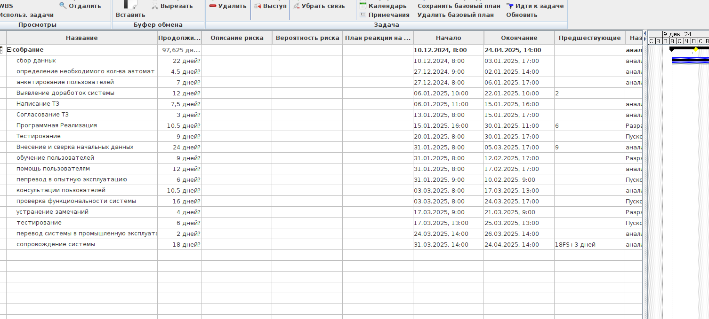
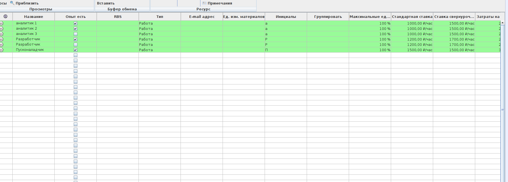
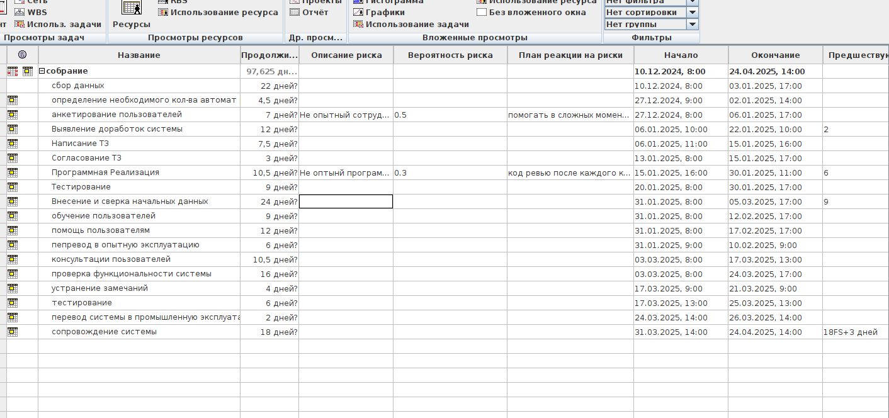

# Тимофеев М.С. Магистратура ИВТ 1 курс Заочное отделение

## Лабораторная работа № 4

## АНАЛИЗ РИСКОВ В ПРОЕКТЕ ПРОЕКТИРОВАНИЯ И ВНЕДРЕНИЯ ИНФОРМАЦИОННОЙ СИСТЕМЫ ПРЕДПРИЯТИЯ, И СТРАТЕГИЯ СМЯГЧЕНИЯ ВЛИЯНИЯ РИСКОВ НА ПРОЕКТ

### Цель работы: 

> Изучение способов выявления рисков в проекте и разработка плана
> реакции на риски в системе MS Project(ProjectLibre) на примере проекта
> по внедрению
> корпоративной информационной системы на промышленном предприятии.

### Знания, необходимые для выполнения лабораторной работы

1. Основы владения пакетом MS Project(ProjectLibre).
2. Представление об анализе рисков в проектировании и внедрении ИС.

### Задание

1. Добавить три текстовых поля и переименовать их в: Описание риска,
   Вероятность риска, План реакции на риски.
2. Создать таблицу Риски и поместить в нее созданные поля.
3. Выполнить анализ проекта на предмет рисков, которые могут возник-
   нуть, и поместить данную информацию в соответствующие поля.

### Контрольные вопросы
1. Перечислите виды рисков, которые могут возникнуть в вашем про-
   екте.
2. С помощью каких инструментов MS Project можно выявить некото-
   рые риски?
3. С какой целью предлагается создать таблицу «Риски» и поместить в
   нее созданные текстовые поля?
4. Как влияют на выполнение проекта риски невыполнения заданий в
   срок исполнителями.
5. Как влияют на выполнение проекта риски изменения требований за-
   казчика?
6. Как влияют на выполнение проекта риски финансовой нестабильно-
   сти заказчика?

###  Добавить три текстовых поля и переименовать их в: Описание риска, Вероятность риска, План реакции на риски.

### Создать таблицу Риски и поместить в нее созданные поля.

### Выполнить анализ проекта на предмет рисков, которые могут возникнуть, и поместить данную информацию в соответствующие поля.

### Контрольные вопросы

1. Перечислите виды рисков, которые могут возникнуть в вашем про-
   екте.

> В моем проекте имеется два не опытных сотрудника, что может привести к задержкам в задачах, 
> где они задействованы 

2. С помощью каких инструментов MS Project можно выявить некоторые риски?

> С помощью анализа рисков. Анализ рисков состоит из нескольких этапов. Сначала нужно 
> определить возможные риски. Затем для каждого из них нужно определить стратегию 
> смягчения влияния риска на проект, то есть действия, предпринимаемые для 
> предотвращения риска или в случае осуществления риска для того, чтобы проект 
> был успешно завершен. 

> Риски определяются для трех аспектов проекта: расписания, ресурсов
> и бюджета. Так выявляются события, осуществление которых может помешать 
> завершить проект в срок или создать нехватку ресурсов или денег в
> определенный момент его выполнения. Если при определении риска становиться
> ясно, как уменьшить его, то нужно сразу же вносить соответствующие 
> изменения в план проекта.

3. С какой целью предлагается создать таблицу «Риски» и поместить в
   нее созданные текстовые поля?

> Создание таблицы «Риски» с текстовыми полями имеет несколько целей, связанных с эффективным 
  управлением проектами и минимизацией негативных последствий:

   - Идентификация и классификация рисков: Таблица помогает систематизировать потенциальные риски, 
     указывая их название, источник (внутренний или внешний), вероятность возникновения, последствия 
     и степень влияния на проект

   - Оценка рисков: Включение текстовых полей для вероятности и последствий позволяет оценить уровень 
     риска (например, низкий, средний или высокий) и его критичность для проекта. Это упрощает визуализацию 
     и приоритизацию рисков с использованием матриц или других инструментов

   - Разработка стратегий управления: Таблица включает графу для действий в случае реализации риска. 
     Это позволяет заранее определить меры по снижению вероятности риска, минимизации его воздействия 
     или полной ликвидации последствий

   - Назначение ответственности: Указание ответственных лиц за управление каждым риском обеспечивает 
     контроль и своевременное реагирование на возникающие проблемы

   - Мониторинг и актуализация: Таблица служит инструментом для регулярного обновления информации о 
     рисках, что особенно важно для долгосрочных проектов, где вероятность и последствия могут меняться со временем

> Таким образом, таблица «Риски» помогает структурировать процесс управления рисками, улучшить подготовленность 
  команды к непредвиденным ситуациям и снизить потенциальные убытки.

4. Как влияют на выполнение проекта риски невыполнения заданий в
   срок исполнителями.

> Риски невыполнения заданий в срок исполнителями могут оказать существенное 
> негативное влияние на выполнение проекта в целом. Рассмотрим основные аспекты этого влияния:

> Финансовые потери: Задержки в выполнении заданий неизбежно приводят к увеличению затрат на проект. 
> Масштаб роста затрат зависит от стадии проекта, на которой происходят задержки.

> Нарушение целостности: Срыв сроков отдельных заданий может нарушить целостность проектных решений 
> и поставить под угрозу весь проект

> Эффект домино: Задержка на одном этапе проекта может привести к смещению сроков последующих этапов, 
> что особенно критично для проектирования, происходящего в начале проекта

5. Как влияют на выполнение проекта риски изменения требований заказчика?

> Изменения требований заказчика могут оказать значительное влияние на выполнение проекта, затрагивая несколько ключевых аспектов:

> Влияние на проектный треугольник
   - Сроки: Изменения требований часто приводят к увеличению сроков выполнения проекта
   - Бюджет: Новые или измененные требования могут вызвать перерасход средств
   - Содержание: Изменения могут привести к расползанию границ проекта, что влияет на его масштаб и качество

> Последствия для проекта
   - Нарушение планирования: Изменения требуют пересмотра планов и графиков, что может дезорганизовать работу команды
   - Снижение качества: При попытке уложиться в первоначальные сроки и бюджет с новыми требованиями может пострадать качество продукта
   - Увеличение рисков: Незапланированные изменения повышают вероятность ошибок и проблем в реализации

6. Как влияют на выполнение проекта риски финансовой нестабильно-
   сти заказчика?

> Риски финансовой нестабильности заказчика могут оказать существенное негативное влияние на выполнение проекта. 
> Рассмотрим основные аспекты этого влияния:

> Финансовые последствия
   - Задержки платежей и финансирования
     Финансовая нестабильность заказчика может привести к задержкам или прекращению финансирования проекта. 
     Это создает серьезные проблемы для исполнителя, который может столкнуться с нехваткой средств для 
     продолжения работ, закупки необходимых материалов и оплаты труда сотрудников.

   - Увеличение кредитного риска
     Возрастает вероятность того, что заказчик не сможет выполнить свои финансовые обязательства частично или полностью. 
     Это может привести к убыткам для исполнителя проекта и поставить под угрозу его собственную финансовую стабильность.

> Влияние на ход проекта
   - Нарушение сроков реализации
     Из-за финансовых трудностей заказчика могут возникнуть задержки в принятии решений, согласовании этапов работ и 
     предоставлении необходимой информации. Это приводит к срыву сроков выполнения проекта и может потребовать пересмотра графика работ.
   - Снижение качества
     В условиях финансовой нестабильности заказчик может попытаться сократить расходы, что может негативно сказаться на качестве 
     используемых материалов, технологий или привлекаемых специалистов1. Это ставит под угрозу качество конечного результата проекта.

> Стратегические риски
   - Изменение приоритетов заказчика
     Финансовые трудности могут привести к пересмотру стратегических целей заказчика. В результате проект может потерять 
     свою актуальность или быть существенно изменен, что потребует дополнительных ресурсов и времени на адаптацию

   - Риск прекращения проекта
     В крайнем случае, финансовая нестабильность заказчика может привести к полной остановке проекта. Это создает 
     серьезные риски для исполнителя, особенно если он уже вложил значительные ресурсы в реализацию проекта