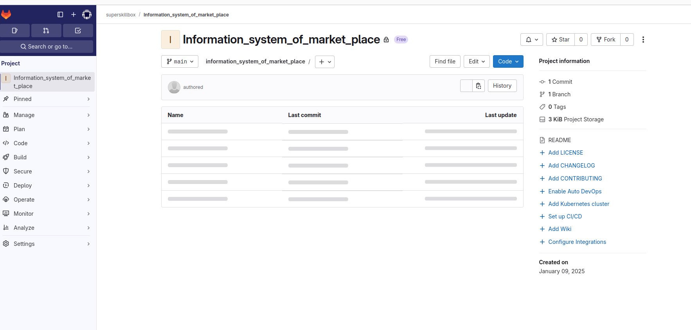
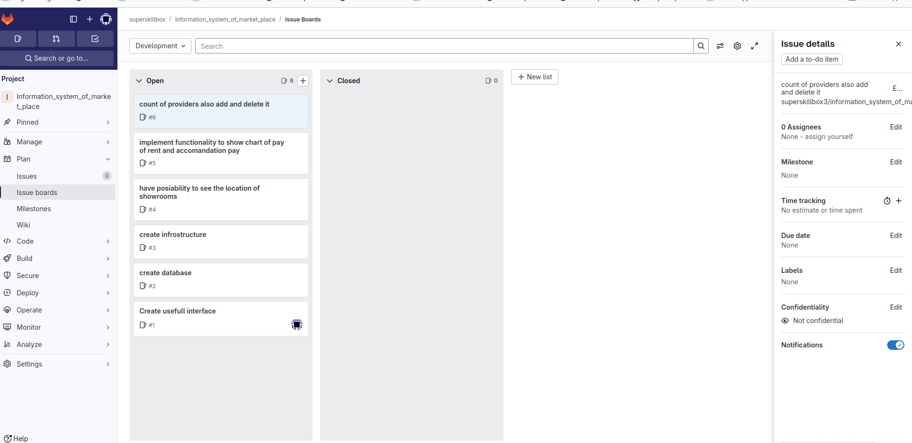

# Тимофеев М.С. Магистратура ИВТ 1 курс Заочное отделение

## Лабораторная работа № 5

### РАЗРАБОТКА ТРЕБОВАНИЙ К ПРОГРАММНОМУ ПРИЛОЖЕНИЮ ПО МЕТОДОЛОГИИ SCRUM

### Цель работы

> Создание проекта и подключение к Team Foundation Server. 
> Разработка первоначального списка пользовательских требований.

> Так как Team Foundation Server это продукт microsoft, а 
> у нас linux то управление будем вести в gitlab.
> gitlab позволяет автоматизировать разработку, а так же планировать задачи,
> и отслеживать их.

## Задание

1. Изучить теоретический материал.
2. Для разрабатываемого проекта (Приложение А) создать первоначаль-
   ный список пользовательских требований, которые будет содержать
   рабочий элемент.

### Контрольные вопросы

1. Приведите основные отличия гибких методов от прогностических.
2. Опишите кратко роль Владелец продукта.
3. Опишите кратко функциональность User Story.
4. Какие роли используются в методологии Scrum.
5. Как связаны Agile и Scrum?
6. Какие инструменты используются в Visual Studio для организации ко-
   мандной работы?

## Создание проекта 

## Создать первоначальный список пользовательских требование

