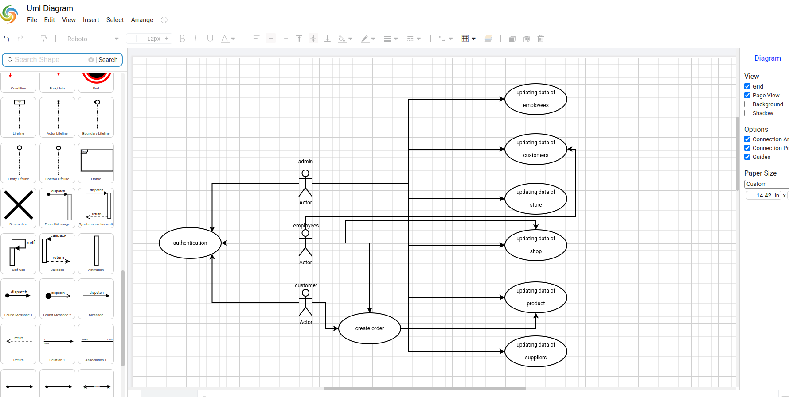
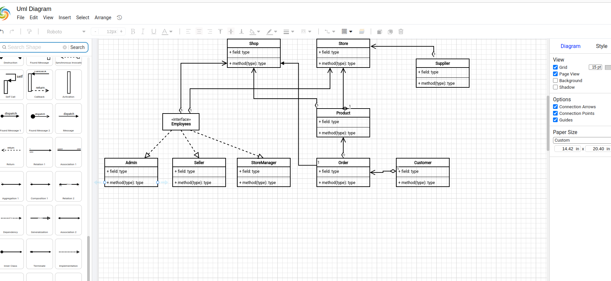

# Тимофеев М.С. Магистратура ИВТ 1 курс Заочное отделение

## Лабораторная работа № 6

## СОЗДАНИЕ ПРОЕКТА МОДЕЛИРОВАНИЯ ПРОГРАММНОГО ПРИЛОЖЕНИЯ

### Цель работы: 
> Получить практические навыки архитектурного проектирования программных
> приложений при разработке схем вариантов использования UML и схем классов UML

### Знания, необходимые для выполнения лабораторной работы
> В роли Скрам Мастера (Scrum Master) студент отслеживает прогресс
> команды при помощи резерва спринта, отмечая статус всех задач в спринте.
> (Моделирование функциональности и классов приложения)
> После разработки первоначального списка пользовательских требований,
> которые являются содержанием рабочего элемента, целесообразно обсудить
> зафиксированные в проекте требования с заинтересованными лицами. 
> При проведении обсуждения пользовательских требований к программному 
> продукту целесообразно представить заинтересованным лицам не только 
> текстовую документацию, но графический материал, который более наглядно
> отображает пользовательские требования. Для этого используются UML-диаграммы.
> Владелец продукта, выполняя роль архитектора, для подготовки графических
> диаграмм может использовать возможности Visual Studio по архитектурному моделированию.
> Вначале создадим пустое Решение Visual Studio, в которое будем добавлять проекты,
> связанные с программным продуктом - ProjectTeachingLoadOfTeachers.

## Разработка схемы классов

> Моделирование сущностей программной системы проводят с помощью схемы классов UML.
> Схема классов, создаваемая на начальных этапах проектирования программного продукта,
> позволяет предварительно проанализировать сущности программной системы и их связи
> на достаточно высоком уровне абстракции. Добавим в проект моделирования схему классов UML.

## Задание

1. Изучить теоретический материал.
2. Для проекта (прил. А) разработать схему вариантов использования.
3. Для разрабатываемого проекта разработать схему классов.

## Контрольные вопросы

1. Основные элементы языка UML. Нотация и ее элементы.
2. Общая структура языка UML. Сущности. Отношения. Диаграммы.
3. Диаграмма вариантов использования. Ее назначение, использование.
4. Диаграмма деятельности. Ее назначение, использование.
5. Диаграмма состояний. Ее назначение, использование.
6. Диаграмма кооперации. Ее назначение, использование.
7. Диаграмма компонентов. Ее назначение, использование.

### Для проекта (прил. А) разработать схему вариантов использования.

### Для разрабатываемого проекта разработать схему классов.

