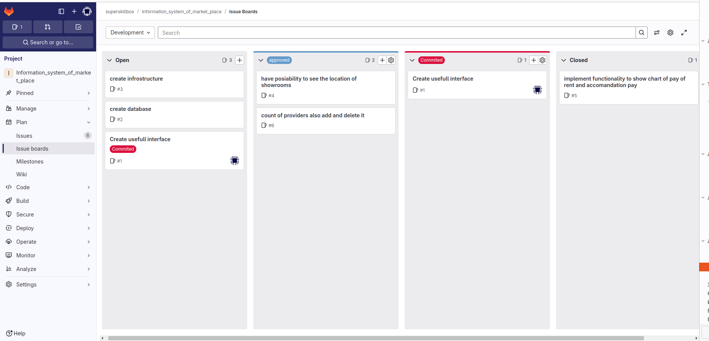

# Тимофеев М.С. Магистратура ИВТ 1 курс Заочное отделение

## Лабораторная работа № 7

## ПЛАНИРОВАНИЕ ИТЕРАЦИЙ SCRUM

### Цель работы: 

> Получить практические навыки планирования итераций

## Знания, необходимые для выполнения лабораторной работы

> Планирование спринта проводят на собрании по планированию. 
> На собрании владелец продукта обсуждает с командой проекта пользовательские 
> описания функциональности (Элементы задела работы продукта «product backlog»),
> устанавливают приоритеты рабочим элементам, формируют список работ спринта 
> (Задел работы спринта), определяют задачи для реализации пользовательских 
> описаний функциональности, проводят оценку сложности реализации задач или 
> трудозатрат и распределяют задачи между исполнителями.
> Результатом собрания должно быть определение цели спринта, условий приемки
> и перечень работ спринта. Цель спринта определяет состав тех
> работ по проекту, которые выполнит команда по окончанию спринта, то
> есть какие пользовательские требования будут реализованы. Условия приемки
> должны определять четкое понимание того, что означает готовность
> каждого рабочего элемента. Перечень работ спринта определяет набор
> пользовательских требований и задач, включенных в текущий спринт (Задел работы спринта). 

### Оценка объема/сложности элементов работы

> После согласования с заинтересованными лицами пользовательских требований, 
> схем вариантов использования и классов необходимо сформировать перечень 
> работ для первого спринта. Владелец продукта, совместно с командой проекта, 
> оценивает Элементы задела работы продукта и назначают им приоритеты.
> Оценки элементов работы необходимы для определения того, сколько
> команда можем выполнить работ в спринте. Оценка объема/сложности элементов
> работы является абстрактной метрикой, которая отражает мнение
> членов команды относительно трудностей реализации конкретных элементов работы.
> Для оценки Элементов задела работы продукта можно использовать метод покера 
> планирования. В методе покера планирования каждый член команды предлагает 
> свою оценку объема/сложности работ и в процессе обсуждения команда должна 
> прийти к общей, согласованной оценке. В покере планирования каждый член команды 
> имеет набор карточек с числами. Числа представляют оценку объема/сложности работы
> для рабочего элемента. В большинстве случаев карточки покера планирования представляют
> собой последовательность чисел Фибоначчи (1, 2, 3, 5, 8, 13 и т.д.).
> При оценке конкретного элемента работы члены команды одновременно показывают выбранные
> ими карточки с определенным числом. Те члены команды, которые показали самую высокую и
> самую низкую оценку, объясняют свой выбор. После текущего обсуждения команда проекта проводит
> следующий раунд покера планирования и так далее, пока не будет выведена оценка, с которой 
> все согласятся. Основная цель методики покера планирования - инициировать обсуждение объема/сложности
> элементов работы для уяснения общего понимания того, что означает готовность Элемента задела работы продукта.
> В случае если оценка объема/сложности элементов работы очень высокая, то это говорит о том, 
> что для данной работы неясна реализация и по ней необходимо собрать дополнительную информацию или
> провести исследование возможности реализации.

> Приоритеты Элементам задела работы продукта устанавливаются исходя из соображений целесообразной
> последовательности этапов разработки проекта и уровня проработанности пользовательских требований. 
> Для Элементов задела работы продукта будем устанавливать приоритет 10, если их не собираемся включать 
> в текущий спринт. Для Элементов задела работы продукта, которые планируем включить в текущий спринт,
> установим приоритет 1, также назначим этому рабочему элементу исполнителя и установим состояние Зафиксировано.
>  Состояние рабочего элемента Зафиксировано означает, что данный элемент включен в текущий спринт и
> не подлежит изменению в спринте.

### Оценка трудозатрат
> При планировании затрат времени на выполнение задач команда проекта делает оценки необходимого 
> времени с учетом объема/сложности элементов работы. Затраты времени планируются в часах и 
> добавляются к описанию задач

> Следует отметить, что члены команды добровольно берут на себя обязательства выполнить работу 
> в течение спринта. Прежде чем это сделать команда должна проанализировать требуемые временные
> затраты и временной ресурс команды. Команда никогда не должна брать на себя обязательства 
> выполнить работу, которую, по мнению её членов, она выполнить не может.

## Задание
1. Изучить теоретический материал.
2. Провести оценку сложности элементов работ метод покера планиро-
   вания (деловая игра).
3. Установить приоритеты рабочим элементам.
4. Для рабочих элементов, включенных в текущий спринт, определить
   задачи.
5. Провести оценку трудозатрат для задач спринта.
6. Распределить задачи спринта между членами команды.

## Контрольные вопросы

1. Дайте определение понятию Спринт.
2. Поясните использование Product backlog и Sprint backlog.
3. В чем заключается польза графика использования задач?
4. В чем заключается роль Team Scrum?
5. Что такое доска проекта?
6. Как устанавливаются приоритеты элементам задела работы продукта?

## Выполнение

1. Изучить теоретический материал.

2. Провести оценку сложности элементов работ метод покера планиро-
   вания (деловая игра).

> Метод покера планирования (Planning Poker) представляет собой эффективный инструмент 
> для оценки сложности задач в Agile-разработке. Он позволяет командам более точно прогнозировать 
> время и усилия, необходимые для выполнения различных задач, и включает в себя элементы игры, 
> что делает процесс более увлекательным и вовлекающим.

> Основные этапы метода 

1. Выбор задачи: Команда выбирает задачу из бэклога, которую необходимо оценить. 
   Задача должна быть четко сформулирована, чтобы все участники понимали, что требуется сделать

2. Сбор команды: Все члены команды собираются вместе, чтобы обсудить задачу. Каждый участник 
   получает колоду карт с числами, которые представляют оценку сложности задачи

3. Оценка: Участники одновременно выбирают карты и показывают их. Это позволяет получить 
   независимые оценки и избежать влияния мнения других участников

4. Обсуждение: Если оценки участников существенно различаются, команда обсуждает причины расхождений. 
   Это обсуждение может выявить скрытые риски и сложности задачи

5. Повторение: Процесс повторяется до тех пор, пока команда не придет к единой оценке

> Преимущества метода

- Вовлеченность команды: Все участники активно участвуют в процессе оценки, что способствует более полному учету всех аспектов проекта.
- Обнаружение рисков: Обсуждения помогают выявить потенциальные проблемы на ранних стадиях.
- Увлекательный формат: Игровой элемент делает процесс менее формальным и более мотивирующим для участников

> Недостатки метода

- Субъективность оценок: Оценки могут зависеть от личного опыта участников, что иногда приводит к искажению результатов
- Время на обсуждение: При большом количестве задач или разногласиях в команде процесс может занять много времени, что снижает общую продуктивность

> Заключение

> Метод покера планирования является мощным инструментом для оценки сложности задач в рамках Agile-проектов. 
> Он сочетает в себе элементы игры и командного взаимодействия, что делает его эффективным для выявления 
> реальных трудозатрат и рисков. Однако важно помнить о возможных недостатках, таких как субъективность 
> оценок и временные затраты на обсуждения.

3. Установить приоритеты рабочим элементам.
4. Для рабочих элементов, включенных в текущий спринт, определить
   задачи.
5. Провести оценку трудозатрат для задач спринта.
6. Распределить задачи спринта между членами команды.

